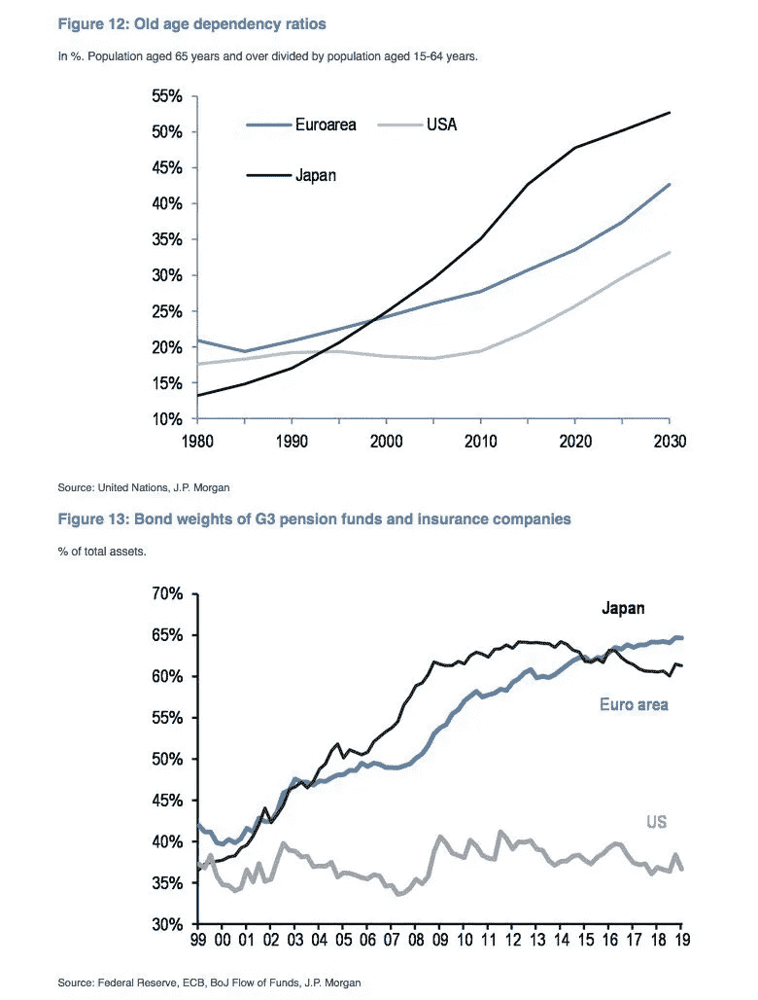

# 美国政府和 100 年期美国国债的潜在投资者都获得了较高的净正面分数

> 原文：<https://medium.datadriveninvestor.com/high-net-positive-scores-for-both-us-government-and-prospective-investors-in-100-year-us-treasuries-b5523b015a47?source=collection_archive---------4----------------------->

在发行者和投资者的利益出现罕见趋同的情况下，美国有很大的机会最终将国债收益率曲线延长至一个世纪。我最近写道，鉴于联邦债务不断增加，美国的财政回旋余地相对较小。然而，全球对久期风险的强烈偏好，使得这个超级大国发行的“无风险”债券能够在市场上发行长达 100 年的债券。

正如我发布过几次的奥地利 100 年主权债券图表所示，投资者对资产负债表稳健的国家的超高期限债券有着强烈的需求。尽管美国联邦债务正在达到令人担忧的水平，但美元作为世界储备货币的独特地位将很容易让美国延长其债务期限，如果它有希望选择这样做的话。

延长美国收益率曲线将有利于公共和私人部门的长期思考和规划。当然，某些西欧国家和日本的利率比美国低得多是有结构性原因的，这显然需要为迅速缩水的奥地利 100 年期国债支付可观的溢价。

届时，全球投资者将有一个(据推测流动性相对较高的)选择，押注利率与超高持续时间的顺风趋同，以实现有意义的价格升值。因此，我毫不怀疑全球对美国“世纪债券”的需求会很强劲。美国政府将从延长其债务期限中获益。

***一些来自更低更长环境的许多可能的反响***

我可能会用更多的篇幅来讨论持续延长低利率环境可能带来的越来越多的影响。虽然它不会永远持续下去，而且很可能会在我们大多数人最意想不到的时候结束，但我越来越相信，我们并没有处于它的晚期。仍然有很多怀疑。如果这确实是一个泡沫，我会把当前的时刻比作后来成为“TMT 泡沫”的 ***网景*** IPO 的余波

奥地利 100 年期债券是一个有意义的异常值，在这一切结束之前，将有大量债券发行来满足超高的久期需求。尽管全球银行目前正遭受低利率环境的影响，但拥有有意义的投资银行业务的银行将通过发行长期债券的承销费来抵消部分痛苦。

下面的摩根大通研究图表(via @schuldensuehner)显示了三个关键经济领域的人口老龄化如何变化，其中日本的老年抚养比最高。这影响了养老基金和保险公司对债券投资的需求水平。这种“被控制的”投资者基础肯定是三大经济区债券之间结构性收益率差异的一个因素。不过，我个人认为，美国利率仍有空间逐渐向其它发达经济体的水平靠拢。

***关键公司的首席财务官可能会“挤进”更多的投资***

在最近的文章中，我写到了首席财务官(CFO)的变化，以及我称之为“挤入”现象的出现。8 月 15 日(请看*目前的利率环境对股票来说很棒！*)中，我详细讨论了权益成本的计算，这是加权平均资本成本(WACC)的一部分，用于股票估值的贴现现金流(DCF)模型。

此外，随着债务成本持续下降，这也显著降低了 WACC。作为一种融资选择，股票对发行者来说仍然相对昂贵。我认为(正如我在 8 月 15 日的文章中提出的问题)，股票风险溢价应该继续从当前水平下降。随着收益率曲线进一步延伸至更长的期限，企业(从信用评级最高的企业开始)也将获得额外的融资灵活性。首席财务官将有越来越多的机会大幅降低公司的 WACC，从而帮助创造价值。

能够更长远地思考和行动将让最聪明的首席财务官批准更多的项目。因此，更长时间的低利率(同时增加了某些风险)带来了新的机会，在我看来，将把我们从全球衰退的风险中拯救出来。