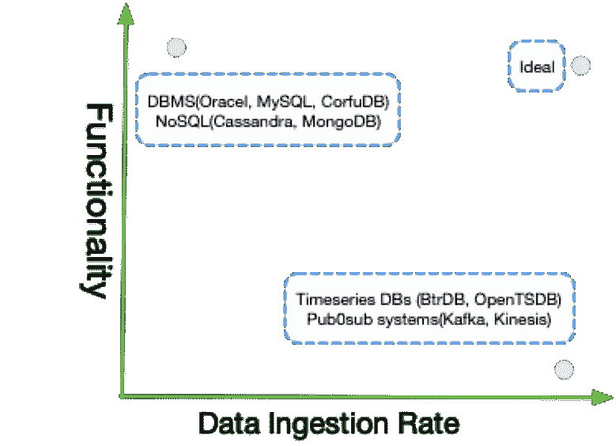
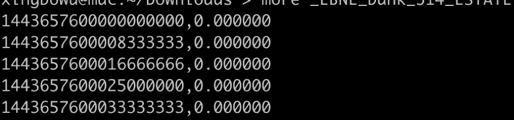
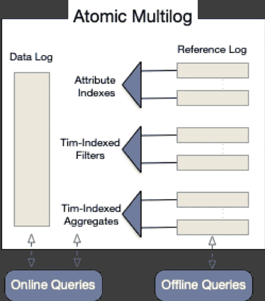
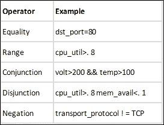
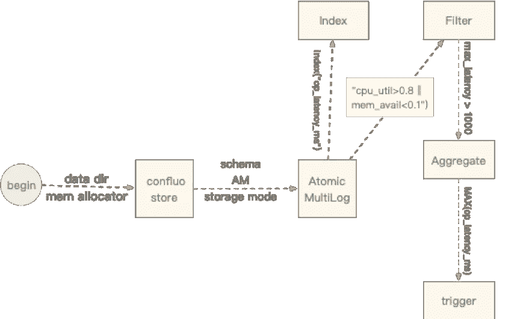
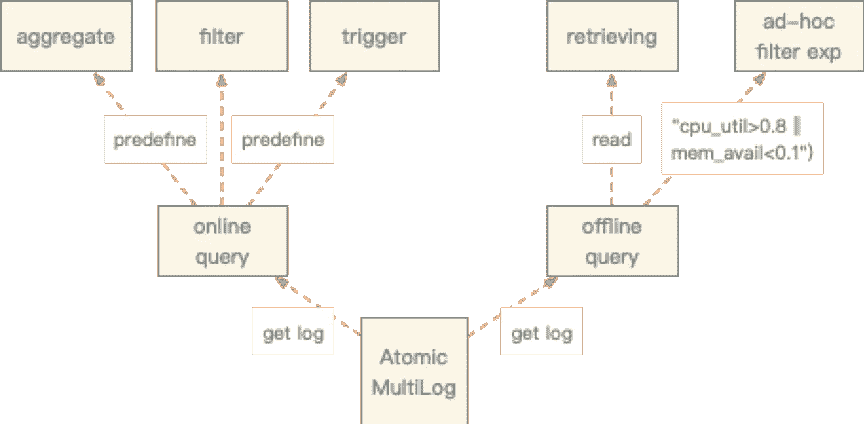
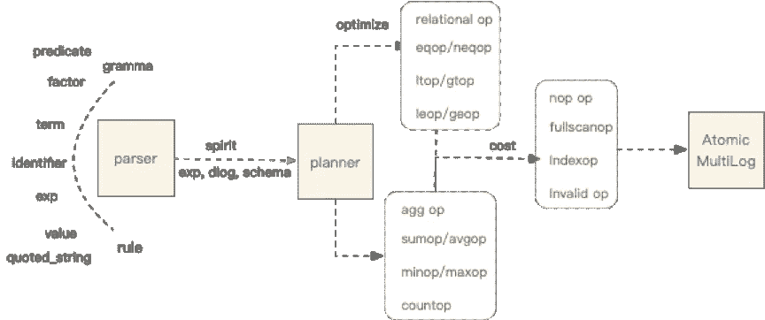
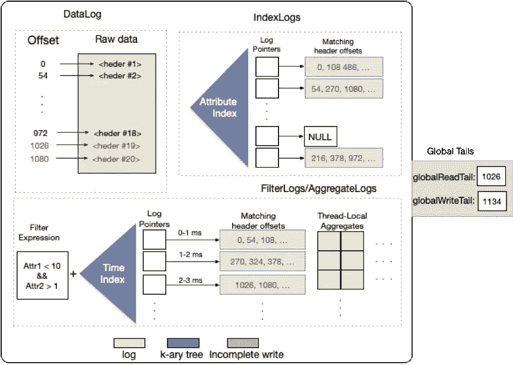

# 使用来自 RISElab 的 Confluo 进行高速查询

> 原文：<https://medium.datadriveninvestor.com/high-speed-querying-with-confluo-from-riselab-445bed3f7f9a?source=collection_archive---------6----------------------->

## Confluo 如何帮助解决高速写入、低延迟在线查询和低开销离线查询的挑战


# 挑战

越来越多的应用可以在很多场景下每秒采集数千万个数据点，比如终端物联网网络监控、智能家居、数据中心等。收集的数据用于在线查询显示、监控、离线根本原因分析和系统优化。这些场景需要高速写入、低延迟在线查询和低开销离线查询。然而，现有的数据结构几乎不能满足这些要求。一些数据结构侧重于高速写入和简单查询，而另一些则侧重于复杂查询，如即席查询、离线查询和物化视图。这些数据结构增加了维护负担，降低了写入性能。



Confluo 旨在解决这些挑战。

[](https://www.datadriveninvestor.com/2019/01/25/why-data-will-transform-investment-management/) [## 为什么数据将改变投资管理|数据驱动的投资者

### 有人称之为“新石油”虽然它与黑金没有什么相似之处，但它的不断商品化…

www.datadriveninvestor.com](https://www.datadriveninvestor.com/2019/01/25/why-data-will-transform-investment-management/) 

# 先决条件和典型应用场景

Confluo 能同时解决几个挑战，是因为它在一些特定场景下做了一些取舍。一个典型的场景是遥测数据。



遥测数据具有以下重要特征:

*   一次性写入:追加数据；没有更新和删除
*   固定长度类型
*   并发方案中没有事务；仅保证原子性

基于这些数据特性，Confluo 实现了一种创新的数据结构，以支持高吞吐量和在线或离线查询。

# 特征

Confluo 是为实时监控和数据流分析场景而设计的，例如网络监控和诊断框架、时序数据库和发布/订阅消息系统。Confluo 的主要功能包括:

1.  数百万个数据点的高吞吐量并发写入；
2.  毫秒级的在线查询；
3.  使用最少 CPU 资源的即席查询。

# 实施概述

Confluo 中的基本存储抽象是原子多日志(以下简称为“AM”)，它依赖于两项关键技术:

*   AM 是无锁并发日志的集合，存储原始数据、聚合统计数据和物化视图。每个日志记录并发读/写:writeTail 和 readTail。
*   现代 CPU 硬件支持的一组原子指令用于更新日志:AtomicLoad、AtomicStore、FetchAndAdd 和 CompareAndSwap。

AM 在接口上类似于数据库表。因此，应用程序需要使用预先指定的模式创建 AM，并写入符合该模式的数据流。然后，应用程序在原子 MultiLog 上创建索引、过滤器、聚集和触发器，以实现各种监控和诊断功能。



# Confluo 数据类型系统

*   Confluo 使用严格的类型化系统。
*   原始数据类型:BOOL、CHAR、SHORT、INT、LONG、FLOAT、DOUBLE 和 STRING。

```
{
 timestamp: ULONG,
 op_latency_ms: DOUBLE,
 cpu_util: DOUBLE,
 mem_avail: DOUBLE,
 log_msg: STRING(100)
 }- Confluo also requires each record to have an 8-byte timestamp. If an application does not assign write timestamps, Confluo internally assigns one.
- The metric data is of double and string types.
```

*   自定义数据类型。在自定义数据类型定义了属性字段、通过相应的接口注册并通过相应的接口获得引用之后，该数据类型可以用作模式的成员，并且附加数据以及类似过滤器和触发器的操作将开箱即用。

# 写

*   创建用于存储数据的存储文件
*   用指定的模式创建 AM。AM 有三种存储模式:内存、持久和持久松弛。
*   IN_MEMORY:所有数据都完全写入内存。
*   持久:每次写入时，原始数据都保存在辅助存储中。
*   DURABLE_RELAXED:原始数据缓冲在内存中，只是定期持久化。
*   在 AM 上执行基本操作。为 AM 定义索引、筛选器、聚合和触发器。
*   添加索引。应用层可以为每个度量创建 K-d 树索引。
*   添加过滤器。过滤器由关系和布尔运算符以及过滤器指标组成。



*   添加聚合:该操作适用于过滤后的记录聚合，如 SUM、MIN、MAX、COUNT 和 AVG。
*   添加触发器:触发器是一个布尔条件，适用于对结果集的操作，例如，MAX(latency_ms) > 100。



# 询问

Confluo 中的查询可以是在线的，也可以是离线的，区别在于在线查询需要预定义的规则，而离线查询则不需要。

*   离线查询主要用于诊断分析。如果已经定义了 fExpressio，直接查看 FilterLog。否则，使用 IndexLog 查询原始数据。
*   实时流查询主要用于实时监控和警报，需要预定义的规则。例如，可以通过定义触发器来实现警报，如警报规则总和(pktSize)>1GB。



*   解析器:Spirit 用于实现语法解析。Spirit 可以灵活地处理符合 EBNF 语法规范的小型数据模型。Confluo 定义了几个语法规则，包括 exp、term、factor、predicate、identificate、value 和 quoted_string。
*   执行计划:解析器生成表达式后，使用查询调度器生成执行计划，作为响应->过滤器->索引。Confluo 有一个简单的内置评估器，它根据粗略的成本计算来决定是使用索引还是全扫描。



# 存档和压缩数据

除了原始数据，Confluo 还需要存储索引、预定义过滤器和聚合等对象。因此，这增加了存储开销。这个问题可以通过将一些数据归档到冷设备来解决。目前，支持三种数据归档方法:定期归档、强制归档和分配器触发归档(基于内存)。

*   定期归档默认情况下，如果归档处于打开状态，归档程序将每 5 分钟定期运行一次。后台存档管理任务定期检测为 AM 日志配置的大小。一旦超出限制，数据日志、索引日志和过滤器日志将被归档到 cold 设备并存储在那里。
*   强制存档。无论是否为特定的多日志打开了存档，用户都可以通过调用接口来强制存档。该接口支持完全归档和基于偏移量的增量归档。
*   分配器触发的存档(基于内存)。如果定期归档器跟不上写入压力，并且达到了系统的最大内存，分配器将会阻塞，直到 Confluo 提供更多可用内存。达到预定义的阈值后，内存分配将被阻止，直到所有 am 都作为冷数据归档。
*   编码。默认情况下，LZ4 压缩算法用于 HeaderLog，Delta 压缩算法用于 IndexLogs 和 FilterLogs。解压缩由底层引擎完成，引用计数用于避免归档线程和读取线程之间的并发访问。

# 核心技术

原子多重对数

原子多重日志是整个系统的核心。原子多重日志主要包括数据日志、索引日志、过滤日志、聚合日志和描述如何通过单个原子操作更新整个日志集合的日志。



*   DataLog 由两部分组成:偏移和原始数据点。偏移量是原始数据的唯一标识符。
*   IndexLog 是 DataLog 的索引，并通过使用基数树来组织索引，基数树是一种类似于字典的通用数据结构。例如，在监控场景中，可以共享 IP 地址和网络地址的许多前缀。
*   FilterLog 存储由时间和索引过滤器的窗口以及根据基数树的窗口划分的原始数据的偏移。
*   与其他日志类似，AggregateLog 基于时间片对聚合进行索引。因为 AggregateLog 需要先写后读，所以设计了一个线程本地对象集合来确保安全访问。

# 集成方法

Confluo 是一个开源的 C ++项目。Confluo 有两种模式:

*   它可以作为嵌入式依赖数据库，支持在线和离线分析。
*   它可以作为一个独立的服务来公开 RPC 接口通信。

# 摘要

RISELab 发布的 Confluo 的核心创新在于其数据结构:原子多重日志。Confluo 支持高速并发读写。一个内核可以运行 1，000 个触发器和 10 个过滤器。Confluo 的一个优秀的能力是，新硬件上的原子操作和无锁日志可以支持实时、离线和快速写入。

*作者:焦贤*

# 原始资料

[](https://www.alibabacloud.com/blog/high-speed-querying-with-confluo-from-riselab_595167?spm=a2c41.13239877.0.0) [## 使用来自 RISElab 的 Confluo 进行高速查询

### 阿里巴巴云器 2019 年 7 月 31 日 163 By 焦贤越来越多的应用可以收集数千万个数据点…

www.alibabacloud.com](https://www.alibabacloud.com/blog/high-speed-querying-with-confluo-from-riselab_595167?spm=a2c41.13239877.0.0)