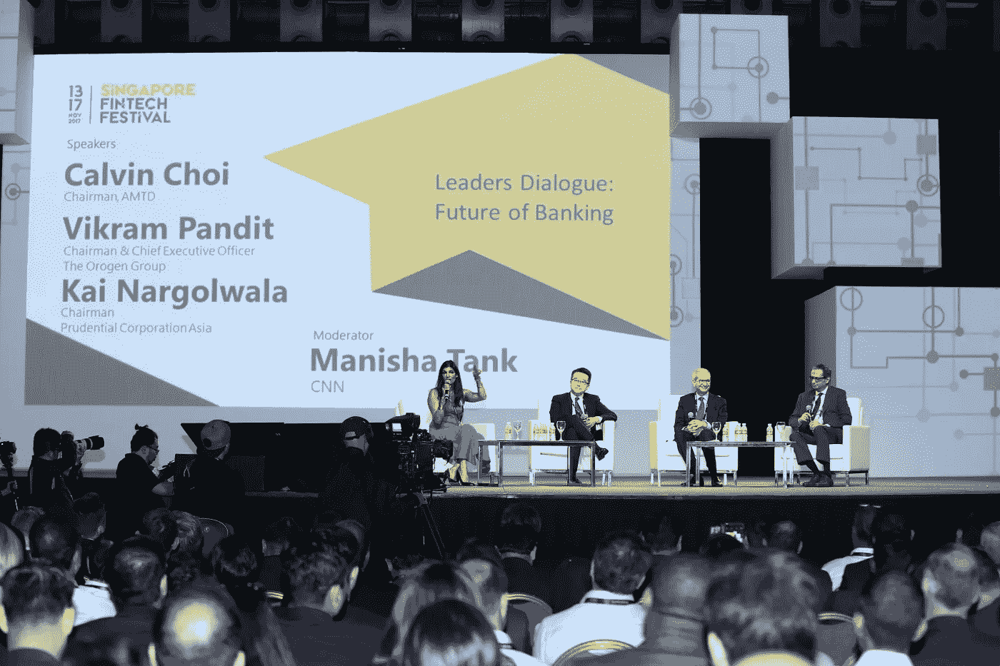

# 2018 年金融科技周的亮点

> 原文：<https://medium.datadriveninvestor.com/highlights-of-fintech-week-2018-5c48addec526?source=collection_archive---------32----------------------->

Fintech Week

全球金融科技周的最新动向显示出了巨大的潜力。金融科技作为一个正在许多国家掀起风暴的新兴行业，肯定正在通过像阿布扎比全球市场、大华银行公司、Accrelist Ltd、addivasiapte Ltd .等顶级公司寻找新的方法来重塑自己并满足大众需求。今年，多个国家举办了金融科技周或金融科技节；新加坡两周前刚刚完成了自己的测试。

尽管活动本身不在新加坡举行，但背后的*中心焦点*仍然是*的全球焦点。*任何地方的所有受众的大规模、广泛接触始终是任何主要企业寻求的主要目标，在这里也不例外。Red Hat 现任总裁吉姆·怀特赫斯特出席了演讲，并对所有寻求推进金融科技令人兴奋的未来的人给予了鼓励。他同样分享了他对开源的角色的看法，因为它与东南亚国家联盟(东盟)网络的金融包容性有关。

Fintech 会议和展览以及全球 Fintech Hackcelerator 演示日是该节日最令人难忘的两项活动。它们令人难忘，因为它们是所有展览、会议和其他类型的特别活动中出席人数最多的。此外，AI in Finance Summit、Fintech Workshops、Innovation Lab Crawl 和 Fintech Awards 讨论了机器策略在 Dapps、智能手机应用等领域的作用，以此作为一种手段，将现代人工智能的精华融入物联网、加密等所有事物的主流协议中。

因此，上周在新加坡举行的活动对许多人来说是一个巨大的转折点，但这只是其中之一。事实上，香港、哥本哈根、硅谷、波士顿、纽约和其他几个主要的全球中心也将举办金融科技周，你应该去离你最近的地方看看。它们都倾向于吸引来自世界其他地方的主要参展商。

# 几家顶级公司

迄今为止，*参加这些全球活动的一些最著名的金融科技公司如下:*

*[12CM](http://www.12cm.co.kr/en/12cm/)*

*12CM 的 USP 是区块链的实施，以及分布式分类帐税收汇款和融资，更不用说个人财富和金融发展战略。它与风险资本家和其他形式的企业家合作，争取加密令牌化和更多。它举办了几次展览。*

*[主动智能私人有限公司](https://www.active.ai/)*

*这家企业出席活动的目的是激发一个因素，改变人们日常看待其核心 USP 的方式，即人工智能，该组织恰当地指出，如果正确使用，它是人类的真正福祉。*

*[Actico 私人有限公司](https://www.actico.com/en)*

*与 Active Intelligence 有着相似目标和业务结构的类似公司，Actico 的 USP 卷入了*银行基础设施的增加…*将该元素加入到混合物中；因此，该组织还为众多客户处理所有公司财务、银行解决方案，甚至税务财产信息。欺诈检测和企业信用合规是其最强的两项服务。在其最近的金融科技周演示中，它还谈到了大数据和学习机器，以及它们通过最佳人工智能充分实现的潜力。*

*[阿尔法金融科技](http://alphafin.tech/)*

*Alpha Fintech，原名 Alpha Payments Cloud，以其灵活的 API 平台而自豪(该平台包含完全后端基础设施，极具成本效益)，这是其主要卖点，更不用说该公司独特的银行基础设施设置了。它的展台不容错过。它是其特定专业领域中解决这两个因素的少数机构之一。此外，响应代码、账单甚至数据流都可以归入一个单独的供应商管理门户，从而提供更强大的供应商功能。*

*[阿尔法钱包](https://alphawallet.com/)*

*Alpha WALLET 以一种全新的方式吸引了区块链和分布式账本，主要讨论了非中介代币购买背后的关键重要性&通过分散块进行网络交易。它希望为投资者和资本战略家提供多种方式来激励他们对硬币的投资。*

# *接下来去哪里？金融科技本身的未来，在新加坡和其他地方…*

*《海峡时报》最近报道称，仅去年一年，新加坡的金融科技融资就超过了 2.29 亿美元。这使它成为所有东盟国家中最高的。许多人现在认为这个美丽的国家是所有金融增长的真正“热点”，尤其是在其地理区域内。其他消息来源同样描述了这样一个事实，新加坡金融管理局甚至已经先行一步，仅在未来五年内就将超过[2 . 25 亿](https://jumpstartmag.com/the-future-of-fintech-innovation-in-singapore/)美元的存款用于新加坡金融科技的发展。商业正以前所未有的速度蓬勃发展，有些人甚至考虑称新加坡*为世界上最大的金融中心之一。**

*此外，这个国家已经拥有超过 400 家声誉良好的金融科技公司，还有很大的发展空间。同样有趣的是新加坡所在的地区，它位于印度、中国和东南亚其他地区的正中间，金融和技术已经成为一个逐年显著增长的商业领域。供应和需求确实令人担忧，但这是好的方面；正如许多专家同样指出的那样，在未来五年内，那里有可能出现无数新的部门。此外，同一消息来源指出，金融科技在全球*爆炸性扩张的巨大潜力，总而言之，是无限的，特别是在像区块链这样的行业，这涉及到大规模的分散化。**

# *最后的想法*

*总体而言，最成功的年度金融科技周仍有待确定。随着这种规模的重大事件在全球各地发生，特别是在 2018 年，当*金融科技以前所未有的方式* *起飞时，*对于任何新的或经验丰富的分析师、当前或潜在的投资者、商人和企业家来说，这都是一个好的一年。金融科技世界仍将迎来激动人心的时刻，随着纽约金融科技周、伦敦金融科技周、新加坡金融科技节、波士顿金融科技周等年度活动的举办，未来看起来充满了希望。*