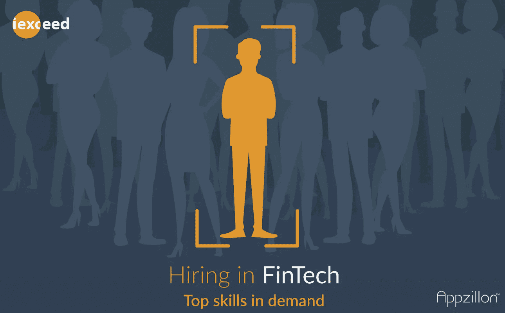

# 金融科技领域的招聘:顶级技能供不应求

> 原文：<https://medium.datadriveninvestor.com/hiring-in-fintech-top-skills-in-demand-58f75f5b17be?source=collection_archive---------11----------------------->

现在，对具备特殊技能的人才的需求越来越大，这些技能能够应对快速数字化转型带来的变化。这种需求要求多学科技能的融合，即所谓的“全栈式量化”

根据 NASSCOM 的估计，未来几年，全球和印度金融科技行业将迅速扩张，预计到 2020 年，市场规模将翻一番，达到 24 亿美元。多种因素推动了这一增长，其中主要因素是精通技术的客户的期望不断提高、电子商务活动不断增加以及智能手机的积极渗透。所有这些都导致了金融科技领域新趋势的出现。现在，对具备特殊技能的人才的需求越来越大，这些技能能够应对快速数字化转型带来的变化。

这种需求要求多学科技能的融合；**现代编程语言、人工智能(AI)、机器学习(ML)、区块链*和数据隐私*** 除了银行和会计的基本功能知识之外，也是需要的技能。根据加州大学伯克利分校哈斯商学院(Haas School of Business——University of California Berkeley)的说法，这种技能组合被称为 ***【全栈 quant】***，指的是能够编码并拥有金融概念和统计工作知识的人才。

# 金融科技领域所需的技能

在 YES Bank 为《印度金融科技机会评论》( IFOR)报告进行的工作过程中，发现印度 600 家金融科技公司的现有人才库仍然缺乏行业目前所需的技能，特别是对复杂的金融和统计模块的深刻理解。因此，组织正在寻找能够将 AI、ML 和 NLP 的概念与其他概念(如应用数学、统计学和概率等)相结合的候选人。尽管人工智能和自然语言处理在印度发展成主流概念仍需要时间，但从数字化产生的大量数据中获得洞察力的数据科学知识也是同样强烈的需求。对于编程，需求在于与编程语言相关的技能，如 SWIFT、Kotlin、Python、R、Java 和 C++，以及操作系统工具，如 Windows、Linux 和 Unix，以及全栈开发能力。

最后，随着旨在提高数据处理透明度和客户数据安全性和完整性的新法规的出台，预计对熟悉最新法规的 ***数据安全*** 专家的需求将会激增。

# 展望金融科技的未来

如今最受欢迎的金融科技技能之一往往仍然是 **ML** ，因为它有助于提供更好的金融解决方案，而无需持续的人工干预或协助。万事达卡(Mastercard)和支付宝(Alipay)等全球金融公司已经通过收购人工智能和人工智能技术提供商进入该领域，预计印度金融科技领域也将有类似的合作伙伴关系。

**区块链技术**是推动金融科技行业增长的另一个重要因素，几家公共和私人银行和金融机构已经在使用该技术运行试点项目。这些努力都旨在提高流程效率和透明度。因此，也需要能够处理分布式分类账和优化财务活动的区块链技术专家。

如今的金融科技公司更加意识到需要招聘合适的人才来帮助他们进步。作为在数字时代取得成功的一种手段，重新掌握技能被认为是现有劳动力中的一个重要问题。因此，今天该领域的重点是让人们学习新的编程语言，理解复杂的金融模块，利用数据科学，并利用人工智能优化运营。鉴于金融科技公司以数据为中心的本质，全栈量化成为常态只是时间问题。

## [维杰·克里希南](https://www.peoplematters.in/author/vijay-krishnan?utm_source=story_footer&utm_medium=author_link&utm_content=Vijay+Krishnan&utm_campaign=author_track&utm_term=click)

Vijay Krishnan 是 i-exceed Technology Solutions 的人事管理总经理。