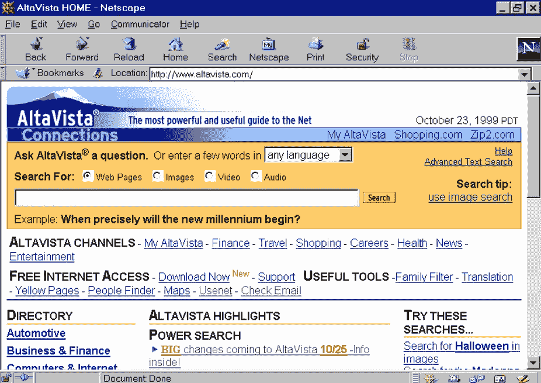

# 网络烦事史:验证码

> 原文：<https://medium.datadriveninvestor.com/history-of-annoying-things-on-the-internet-captcha-e2027c5aa4ba?source=collection_archive---------8----------------------->

验证码开始成为我们作为用户在互联网上的日常体验的一部分的时间并不长，它们被认为是互联网上最令人讨厌的事情之一。CAPTCHA 是**C**completely**A**automated**P**public Turing**T**est 告诉**C**computers 和 **H** umans **A** part。

这项发明被两个不同的团队声称拥有。在 1997 年由 Altavista 的工程师，以避免机器人执行重复的行动，并添加网站到他们的搜索引擎。该团队研究了一台兄弟打印机的指令，该打印机刚刚提出了 OCR 扫描的想法。他们检查了属性以执行高质量的 OCR 扫描，团队颠倒了指令，并建立了一个算法来生成低质量的，难以理解的 OCR 扫描，但对人类来说足够好的图像。

Altavista, the mostpoerful and useful guide to the Net!

由 Louis von Ahn、Manuel Blum、Nicholas J. Hopper 和 John Langford 组成的第二个团队也声称拥有这项发明，并在 2003 年发表了一篇关于 CAPTCHA 的学术论文。通过将发明转让给在先专利解决了争议，在先专利描述了所有功能，甚至没有将它们作为验证码提及。

验证码被认为是一个反图灵，因为机器正在向人类提交测试。图灵测试是艾伦·图灵在 1950 年创造的一项测试，旨在观察机器是否能够复制人类行为，擅长他定义的“模仿游戏”。最初的测试是一个人分析两种不同的行为，一种由机器执行，另一种由另一个人执行。如果人类看不出任何不同，测试就通过了。

我们每天都听到关于人工智能在所有领域的伟大应用的新闻，机器能够做不可思议的事情，解决不可思议的任务。那么从机器的角度来看，是什么参数让 CAPTCHA 难以理解呢？

验证码测试基于三个不同的方面:不变的识别、分段和上下文。

首先是识别所有不同图案和形状的字符的能力。第二是能够将一个字符从另一个字符重叠中分离出来，赋予不同的形状和感觉，并与背景分离。最后一点是根据上下文做出决定的能力。对于人类来说，这些能力代表着非常简单的事情，而根据其发明者的说法，可以解决这些问题的机器可以用于解决尚未解决的人工智能难题。

验证码技术演变为重新验证码，于 2009 年被谷歌收购。事实是，谷歌努力保持机器的低费率解决方案。每当一个团队宣布验证码解决方法的演示时，谷歌就会发布一个新的更新，以防止他们在之前几天获得高分。乔纳森·威尔金斯和查德·胡克曾在 2009 年和 2010 年遇到过这种情况。2012 年，一个名为 DC949 的团队获得了 99.1%的解决验证码的比率，而随着谷歌的更新，这一比率下降到了 60%左右。

但是验证码给人类带来了什么结果呢？人类有 60%到 80%的验证码识别率。为视力障碍者发布的音频验证码的比率低至 10%，如果你以前从未听过它们，它们很可能是在地狱深处录制的。所以实际上机器比人类有更好的表现。

即使有一些程序可以很好地抵御验证码，但大多数垃圾邮件实际上是颠倒了人类和机器人最初的角色。机器人对单词进行分析，并将其提交给工资率非常低的国家的真人农场，一旦分析完毕，就会返回给机器人，然后由机器人完成注册。人类解决 100 万个验证码的成本在 1000 美元左右，这比投资程序更划算。有趣的是，如今人工智能越来越像人类，而人类也越来越像机器人一样被使用，因为这样更划算。

基本上，除了互联网的普通用户，每个人都可以通过验证码获得高分。但是验证码并不总是无用的..

RE-CAPTCHA 的最初用途之一是将古代图书馆的书籍数字化。在这些书中，文字或页面条件使得 OCR 很难分析单词和随之而来的数字化，所以谷歌通过验证码向人类提交这些单词。验证码中的两个单词中有一个实际上不是验证，而是一个无法解释的单词。

就我个人而言，我很不擅长验证码，每次我遇到困难的时候，我都会随便用一些不好的单词。我真的很期待有一天，一个学生会被要求用我的验证码朗读一首数字化的诗歌，并被要求分析“月亮看起来像个傻瓜！”。回到我们身边…

当图书数字化项目结束时，谷歌开始看到使用 re-CAPTCHA 来训练其自动驾驶汽车和改进谷歌地图的机会，方法是向这些项目提供用户在解谜时提交的汽车、街道标志、树木和公民号码的图像，这在谷歌上引起了一些关于无偿人类劳动的道德问题。重新验证码的另一个有利可图的用途是通过文字实现广告。

最近，re-CAPTCHA 在 no-CAPTCHA re-CAPTCHA 中再次发展，使用浏览器数据作为光标移动和一系列其他“秘密”数据来分析移动，并检测它是否是由机器人提交的，只有在用户被怀疑是机器人的情况下才需要图像验证。对于一项大部分时间都毫无意义的技术来说，这是迄今为止最好的权衡。这是一个正在敲打验证码的机器人。