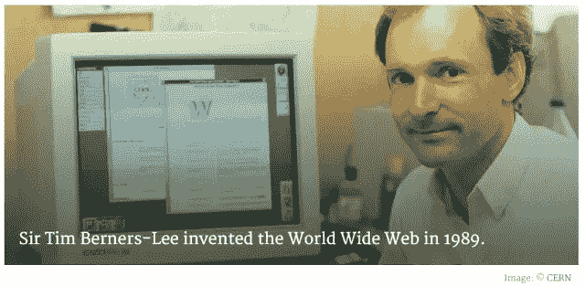

# 网络的历史

> 原文：<https://medium.datadriveninvestor.com/history-of-the-web-6fdfa860295?source=collection_archive---------0----------------------->

蒂姆·伯纳斯·李先生是英国计算机科学家。他出生在伦敦，他的父母是早期的计算机科学家，研究最早的计算机之一。

蒂姆爵士从小就对火车感兴趣，他的卧室里有一个铁路模型。何[回忆](http://www.w3.org/People/Berners-Lee/Kids.html):

*“我做了一些电子设备来控制火车。后来我对电子产品比对火车更感兴趣。后来，当我上大学时，我用一台旧电视机做了一台电脑。*

从牛津大学毕业后，伯纳斯-李成为了瑞士日内瓦附近的大型粒子物理实验室 CERN 的一名软件工程师。来自世界各地的科学家使用它的加速器，但蒂姆爵士注意到他们在共享信息方面有困难。

*“在那个年代，不同的电脑上有不同的信息，但你必须登录到不同的电脑上才能获取。此外，有时你不得不在每台电脑上学习不同的程序。蒂姆说:“通常去问人们什么时候在喝咖啡会更容易些。”。*

蒂姆认为他找到了解决这个问题的方法，而且他认为这个方法还有更广泛的应用。数以百万计的计算机已经通过快速发展的互联网连接在一起，伯纳斯-李意识到他们可以利用一种叫做超文本的新兴技术来共享信息。

1989 年 3 月**，蒂姆在一份名为*[***信息管理:提案***](http://info.cern.ch/Proposal.html)*的文件中描绘了他对未来互联网的愿景。信不信由你，蒂姆最初的提议没有立即被接受。事实上，他当时的老板[迈克·森道尔](http://bullarchive.web.cern.ch/bullarchive/9930/art2/Text_E.html)在封面上注明了*“模糊但令人兴奋”*的字样。网络从来就不是 CERN 的正式项目，但是迈克在 1990 年 9 月设法给了蒂姆时间来研究它。他开始使用 NeXT 电脑工作，这是史蒂夫·乔布斯的早期产品之一。****

******参考文献:******

****https://webfoundation.org/about/vision/history-of-the-web/****

*****原载于 2018 年 1 月 8 日*[*【mrobalinho.blogspot.com*](http://mrobalinho.blogspot.com/2018/12/history-of-web.html)*。*****