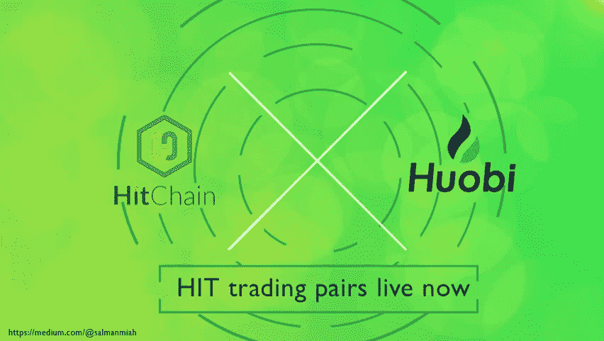
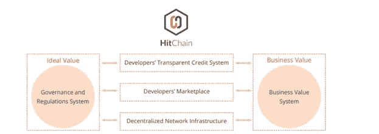
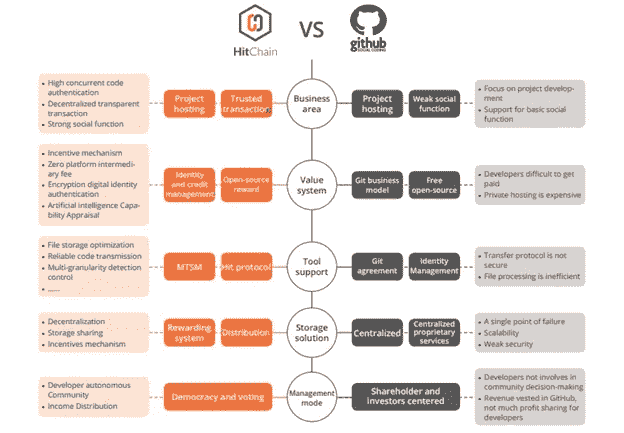

# HitChain|一款创新的新 DAO，开发者站在最前沿

> 原文：<https://medium.datadriveninvestor.com/hitchain-a-innovative-new-dao-with-developers-at-the-forefront-9f79b03984d0?source=collection_archive---------2----------------------->

HitChain 是一个基于区块链技术的新的全球去中心化自治组织，其名称源自 Git 和区块链。这是一个完全强调回报开发者的项目，旨在培养一个分散自治的**区块链开发者社区。**该项目雄心勃勃，希望通过应用区块链技术，最终超越作为主要开源平台的 GitHub，创造出更具生产力、更民主、更自主的开源环境。

# 现有的开源生态系统问题🔧

开源生态系统的当前结构中的问题是各种各样的，并且已经流行了一段持续的时间。全球的开发人员正在将他们的血、汗、泪，坦率地说，他们的心和灵魂倾注到这些项目中，这些项目在当前的现代技术经济中对软件负有实质性的责任。尽管付出了巨大的努力，所有开发人员想要的回报是帮助保持这些项目的繁荣并不断改进它们。他们的努力可以说是**去中心化志愿主义**的集体展示，真正代表了区块链科技正在努力实现的精神。

在她 2016 年的开创性报告中，题为*[***‘道路与桥梁:我们数字基础设施背后看不见的劳动***](https://www.fordfoundation.org/library/reports-and-studies/roads-and-bridges-the-unseen-labor-behind-our-digital-infrastructure/) ***，* Nadia Eghbal** ，不仅全面分析了开源所面临的挑战，还发出了号召，鼓励开源用户更加关注**经济**，并发布了所需关键行动的清晰分类🙌🏻。*

## ***集权***

*尽管代码是可访问的并且有些免费，但大部分代码仍然是专有的，因为这样的开发者经常不得不签署协议并放弃对他们代码的权利。这种由主要参与者(通常是苹果或英特尔这样的公司)主导的情况在整个开源环境中很常见。大量的开放源码项目将不会有一个持续的分布式社区围绕着它们，它们依赖于单一的公司来获得财政支持，并根据它们的路线图来实现目标👀。拥有一个大型代码库的开源许可并不是一个项目长期可持续性的基础，尤其是当大量的信息归单一公司所有的时候。知名科技公司的整合是一个需要密切评估的问题:**少数公司可能最终拥有所有重要的开源代码**。分布式和**分散的版权所有权**将有助于减轻这些风险。*

## ***不公平**🙁*

*从结构上来说，开源的最大优势——它对民主的渴望——也导致了它的弱点。许多项目通常是一个公共代码库，有来自不同人群的定期贡献。没有明显的法律结构，或明确的所有者和领导者。这导致公司使用开源系统，但不为其做出贡献。开发人员通常是从事开源项目的个人或小团体，他们鼓励其他开发人员在业余时间为他们所使用的东西做出贡献。开放源码只有在人们回馈的情况下才能生存，如果公司或其他用户没有回报地不断获取，这将极大地阻碍其可持续性的机会。如果不注意维护和开发，项目和软件系统将会陷入困境并消失。*

## ***中止***

*当综合上述问题以及其他问题，如开发人员的倦怠和无效的知识保护，每年大量开源生态系统的过时是一个主要问题。许多项目因为缺少开发人员而变得过时。当承认维护和开发新代码需要巨大的努力时，开发人员离开的问题以及那些代码没有被更新和消失是一个真实的可能性👎。*

> *“要么人类是非理性的，要么他们不仅仅追随金钱。显然我在这里还有另一个动机。这是爱的劳动。如果我想的话，我可以明天就完成这个项目，但我已经做了 5 年了，我不想看到这种情况发生。”*

# *谁是搭车人，他们的解决方案是什么？*

*HitChain 的发布以开发者的利益为中心。它旨在真正解决前面提到的问题，并在一个**分布式自治组织(DAO)** 内与区块链开发者社区建立一个现状。根据 HitChain 托管协议和 Hit 协议，使用 HitChain 平台的开发者的成果将得到认可和补偿。任何贡献和使用 HitChain 平台的人都将被视为社区成员，因此无需持有 HIT 令牌即可获得资格。正如其白皮书中所述，HitChain 的目标是:*

1.  *世界上最大的软件开发协作平台*
2.  *以分散形式保存的产品*
3.  *自动知识产权保护*
4.  *开发商的综合技术信用体系*
5.  *开发者作品的货币化*
6.  *交易历史是透明和独立的*
7.  *自治社区*

**

*HitChain 旨在通过解决开发者社区中最突出的问题来实现他们的目标；不受阻碍的代码开发、知识产权保护、代码分发保护以及与开发者作品相关的任何交易的透明度。通过结合 Git 协议和区块链技术，他们的目标是建立一个平台，该平台有一套完善的规则来解决开发人员的担忧。HitChain 平台将由四个重要组件组成:*

*1.Hitchain 加密货币基础设施*

*2.搭便车基础设施*

*3.希钦发展和贸易社区*

*4.搭车申请*

*目前，Git 是软件开发中最重要的代码管理协议。GitHub、GitLab 等主要开源生态系统都是通过 Git 协议实现的；然而，它受到诸如大文件支持和对大规模小文件的缓慢访问等基本弱点的阻碍。*

*希钦计划引进**默克尔树**🌳文件处理作为 GitHub 独特缺陷的解决方案。将通过不可信来源检索默克尔树根。然后，将通过可信来源检查默克尔树，并且如果默克尔树受损，则 HitChain 将从不同来源获得另一个默克尔树，直到接收到可信的默克尔树。*

**

*HitChain 最近宣布了他们在火币网的首次上市。HitChain 在 ***上标注了自己的第一个全球上市日【火币全球】*** *【交易对】* ***，HIT/BTC*** *和****HIT/ETH****，从****8 月 3 日*** *起发售。* [***参加希捷全球上市请点击此链接进入*** *。*](https://www.hbg.com/en-us/topic/invited/?invite_code=946q3) *火币还将促成一个****‘搭车交易战役奖励前 50’****。8 月 3 日* ***10:00 至 8 月 9 日 10:00(GMT+8)****，前 10 万名登陆火币全球的 HT 持有者将获得每人 100 HIT 的空投。总计 1000 万点击量将空投，数量有限。空投的代币将在以后发放到火币账户*💊*。**

# *👍🏼我为什么要投资？*

*除了 HitChain 试图解决的突出问题及其高度熟练的流程之外，HitChain 还成立了一个经验丰富、知识渊博的团队，并为其提供建议。其中包括:*

## ***李江***

***微软中国的董事长、董事、创始人或 HitChain，现任 CTO。他在国际 IT 领域有着良好的关系，在业内建立了深厚而密切的关系网。在区块链这个课题上，他有云计算和开源生态系统的经验。是 HitChain 战略的总体监管者，负责尝试说服全球开发者加入 HitChain 社区。***

## ***李昂***

*希钦基金会的主任和英特尔的开源专家。是中国第一个被认可的 **APAC** 工程师。他曾在多家全球软件公司担任过许多技术职务；将负责 HitChain 内开源系统的建设。*

*除了这两位成员之外，团队的其他成员将由具有 Telexistence、OSChina 和 IBM 背景的全球开源老手和专家组成。*

*除了这个改编团队，他们的顾问还包括:*

## ***贾田***

*他目前是 Cortexlabs.ai 的首席科学家，也是比特币的早期采用者。拥有分布式系统专业，也是国内第一个比特币基金 Bitfund 的首席科学家。是 Zerocoin 的早期支持者，后来成为了 **Zcash。***

## ***马浩博***

*Aelf 的创始人和区块链行业的专家。现为中国电子学会区块链专家委员会、中国联合会区块链专家委员会委员。*

*田和马都是专家顾问，经验丰富，在中国业界享有盛誉。此外，还有其他几位顾问，他们在金融投资、管理和计算机科学领域拥有丰富的经验和知识。拥有如此优秀的顾问只会进一步激发希钦的成功潜力。*

# *机构支持🏛*

*在现代区块链环境中，取得积极成功的一个要素往往是通过机构投资获得有利的支持，而希钦非常好地拥有几家知名机构提供支持。其中包括:*

## ***比特大陆***

*全球最大的比特币挖矿公司。对加密货币挖矿芯片有绝对的主导权；世界上最赚钱的公司之一。*

## ***火币资本***

*火币集团的投资部门。Huobi Pro 目前是交易量排名第四的交易所。*

## ***OK 区块链资本***

*OKEX 的投资部门。一个非常著名的加密交易所，目前交易量排名第三；以前是第一名。*

## ***德雷珀龙***

*蒂姆.德雷珀的投资基金。作为硅谷一名非常著名和成功的投资者，他在主流圈子里因对比特币的超级看涨立场和超过 10 亿美元的净资产而闻名。*

*如此有影响力的组织在加密领域的参与表明，HitChain 是一个许多人寄予厚望的项目。也是很多应该 [**通过火币参与的项目。**](https://www.hbg.com/en-us/topic/invited/?invite_code=946q3)*

*技术人员最近调查了 HitChain 智能合约的源代码，发现了一个复杂但防弹的代码；简单地举例说明“法典”就是“法律”的别名。除此之外，在 HitChain 在 GitHub 上公开发布他们的源代码之后，它受到了世界各地开发人员的好评，在全球范围内获得了 342 颗星，并获得了来自 15 个贡献者的 718 次提交🏆。*

*✅In **我的**个人观点，值得投资 hitchain 吗？毫无疑问，这个团队在开源生态系统中解决了一个非常严重但显然暴露不足的问题，值得称赞。许多开发人员正在离开，大公司正在慢慢巩固他们对编码项目的影响。这与区块链科技试图实现的目标背道而驰。然而，尽管对正在解决的问题有积极的态度，并且对他们的源代码有非常乐观的反应，但是这个项目缺乏社区宣传。社区和团队不活跃，社交渠道的关注者很少。但是，这可能意味着团队现在更专注于开发技术，并且在拥有强大的发布基础后，最有可能计划营销推广。他们的技术非常清晰和熟练，而团队在各个方面都有很好的经验。因此，从个人的角度来看，这将是一个我会投资的项目🤘。*

****免责声明:*** *请仅将此信息作为我的* ***自己的*** *意见，在任何情况下都不应视为财务建议。在做任何决定之前，请记住****DYOR****。**

*♂️你好，我叫萨尔。*如果你觉得这篇文章很有用，并且想看我的其他作品，请一定要鼓掌并关注我的* [*中！*T32*😎*](https://medium.com/@salmanmiah)*