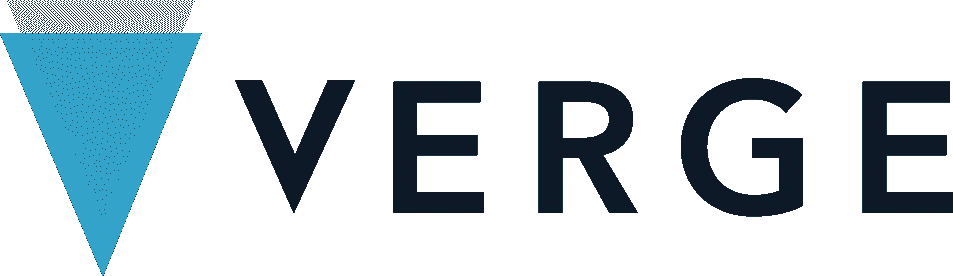
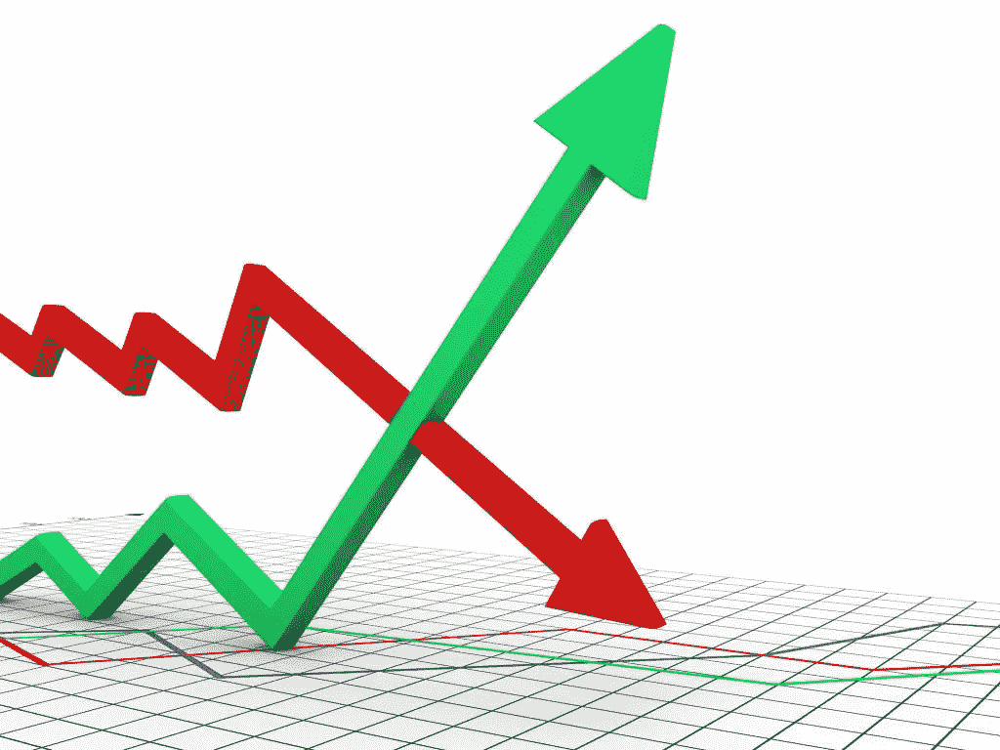
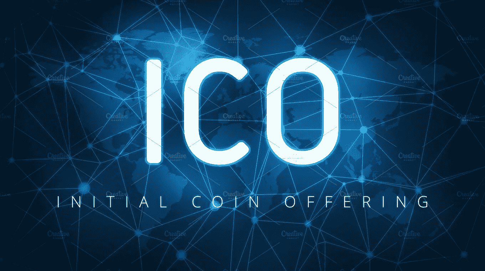

# Hodl，贸易还是 ICOs？

> 原文：<https://medium.datadriveninvestor.com/hodl-trade-or-icos-15d9be0f8af0?source=collection_archive---------5----------------------->

关于你是否应该交易或持有你的加密货币，有许多不同的观点。你该怎么办？

这两种策略都有利弊，取决于货币和你的策略。

有些人日内交易，有些人持有他们所有的东西，而有些人两者都做。

就我个人而言，我两样都做。如果我坚定地相信一个项目，我会不顾市场变化而去做。事实上，如果我的一项主要 hodl 投资价格下跌，我倾向于利用这一优势买入更多。

然而，另一方面，我使用一些货币来“翻转”并获利，以使我能够更多地投资于我的主要领域。

了解你的起点和终点是很重要的。将加密市场与股票等传统市场的交易进行比较。如果你能在传统市场赚 10%-20%，你可能做得很好。

随着最近所有的加密炒作，人们期望比这高得多的百分比回报，如果他们不能立即看到它们，他们就会抛售并放弃它。

在加密中获得高百分比的短期收益在某些情况下有点用词不当。

关键是要自己做研究，相信自己的信念。随着密码市场如此不稳定；今天的红色很容易成为明天的绿色，反之亦然。在错误的时间买卖是如此容易，因此追着你的尾巴试图限制损失。此外，你将创造更多的损失，而不是收益，只有你运气好，你才会脱颖而出。为此，你需要一个策略。

对于我的主要目标，我确定了一些可靠的货币/项目，它们具有长久性和可持续性，可以经受时间的考验，不管竞争如何。他们必须解决现实世界的问题，或者提高任何特定领域的效率。我试着避开“我也是”的项目。虽然他们可能会有短期收益，但很可能其他人会提出更好的想法，可能会让你的投资黯然失色。

我的策略是将我的长期持有视为我投资的支柱，同时利用不太为人知的项目和代币的炒作为我带来优势。例如，随着《边缘》进入色情行业而引起的炒作造成了巨大的炒作，硬币的价值大幅增加。理论上，你可以在 PornHub 宣布之前或之后买入 Verge，然后高价卖出获利。

然后，你可以利用这些利润，购买 Tether(或另一种货币)，等待市场下跌，并购买更多的长期持有的股票。

这只是如何利用上升趋势市场和下降趋势市场来获利的一个例子。下降趋势也可能是投机取巧，而且肯定不是一些人认为的那种灾难。

在最近的熊市中，我们目睹了越来越多的恐慌和 FUD 效应(恐惧、不确定和怀疑)。人们(包括鲸鱼)，抛售他们的投资以退出市场。

在我看来，这有很多因素，包括鲸鱼出售大量股份，以及人们没有长期或短期战略。再加上他们通过 FOMO 进入市场(害怕错过)，他们在寻找即时收益，当没有实现时，他们抛售并逃跑，担心留在市场会增加他们的损失。在加密领域有很多绵羊，一旦他们看到市场下跌，他们就会跟风，使糟糕的情况变得更糟。

聪明的投资者欢迎下跌趋势，等待时机抓住低价，加大投资。

像任何市场一样，如果你计划好，有合理的策略，你可以在上涨和下跌趋势中找到机会。只要确保你了解市场，消除情绪，保持头脑清醒，确保你对市场的两端都有策略——上涨和下跌。

除了交易现有货币之外，投资 ico 也是一种选择。

ico(首次公开募股)是一种很好的盈利方式，前提是所提供的交易具有吸引力。是的，许多 ico 一上市就抛售，但如果你设法获得不错的折扣或奖金(有时两者都有)，你就能获得高收益。

ico 的风险更大，但回报也更高。

很难证明投资于公开销售的 ICO 是合理的，因为提供的折扣和奖金可能不会使其冒风险。但是，如果加入 ICO 池，您可以利用售前优势。

ICO 池允许多个投资者将其投资集中到一个更大的金额中。这通常足以满足 ICO 预售的最低购买要求。

这样，虽然你可能只投资了一小部分，但你仍然可以得到全额折扣和奖金，使它更有吸引力。

所以，不要回避 ICOs。如果你已经做了自己的研究，并且相信这个项目是可行的，不是一个骗局，并且将来会成功，你很可能会投资一些能给你带来长期收益的东西。

我参与的一些 ICO 池包括:

[**Keith Crypto Pools**](https://t.me/Officiallykeith)—*由 Keith Wareing 经营，他是一位德高望重的加密专家，也是一个受欢迎的 YouTuber，拥有多年的经验和投资成功项目的良好记录。主要使用推荐代码和 URL。*

[**ICO 狗社区**](https://t.me/ICO_DOG_POOL)**——*还有一个* [*网站*](https://www.icodog.io/) *发布 ICO 评论、内幕信息和详细的研究分析。***

****——*一个由 Crypto Jack 经营的受欢迎的泳池，一个非常知名和受信任的 YouTuber。*****

****永远记住，你不能什么都投资。这取决于你是否能越过 YouTube、博客和电报小组上的大肆宣传，以务实的态度看待每一项潜在投资。是的，你需要一点运气。你的一些投资会繁荣，其他的可能会失败，所以分散到不同的加密领域是很重要的。****

****比如说。你可以将 50%的资金投资于比特币、以太币和莱特币等成熟的货币。然后 25%投资于不太知名的硬币，这些硬币显示了未来的前景，25%投资于 ico。****

****无论你决定什么，确保你能负担得起，如果你失去了一切，你不会变得一贫如洗。只投资你能承受的损失。****

****在交易所使用购买订单限制，以确保你以正确的价格购买，如果没有达到限制，也不会感到不安。如果你想成为一个成功的交易者，你会有其他的机会，并且必须有耐心。****