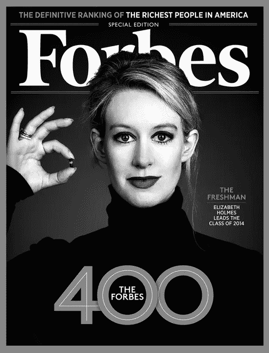

# 福尔摩斯和福布斯:痴迷于创始人财富的代价

> 原文：<https://medium.datadriveninvestor.com/holmes-forbes-the-cost-of-obsessing-over-a-founders-wealth-8e6bc10387dc?source=collection_archive---------0----------------------->

Forbes.com

《福布斯》最近声称，医疗保健初创公司 Theranos 的创始人兼首席执行官伊丽莎白·霍姆斯的净资产为零，此前她的公司因误导投资者和董事会成员而成为美国证券交易委员会[刑事调查的焦点](http://www.bloomberg.com/news/articles/2016-04-18/theranos-is-under-investigation-by-sec-u-s-attorney-s-office)，最近[宣布其关键专利技术 Edison](http://www.wsj.com/articles/theranos-voids-two-years-of-edison-blood-test-results-1463616976) 的测试无效。几家媒体立即加入了《福布斯》对福尔摩斯净资产的激烈重估，大肆宣扬她已经从英雄变成了小人物。

显然，一滴微小的水滴试图改变太多。

不管福尔摩斯值不值一分钱，很明显，福布斯和其他专注于科技行业的出版物更关心公司的天文估值及其首席执行官各自的净资产，而不是这些公司是否对其他人产生真正的社会影响。

在这个具体案例中，围绕伊丽莎白·霍姆斯净资产状况的关注是不健康的，其代价是忽略了以下几点:**一、那些受到无效测试结果影响的人；**二、**受严格监管行业的颠覆性创新风险。**

对于那些受到 Theranos 召回 1%血液检测结果影响的人，几乎没有报道。[从彭博，我们了解到受影响患者的不便和不信任:](http://www.bloomberg.com/news/articles/2016-06-03/theranos-says-only-1-of-results-affected-some-doubt-tests)

> 尽管他的报告说他的大部分结果是准确的，但彭蒂宁在电话采访中说，他很难对这一点有信心。
> 
> “我觉得我需要复习所有那些测试。”

其他接受过 Theranos 验血的病人，他们的医生建议他们重新验血，以防万一。一些人不仅仅停留在让其他实验室重做他们的血液工作上——一名亚利桑那州居民已经对帕洛阿尔托公司提起诉讼，寻求集体诉讼地位。

> “成千上万的病人可能得到了不正确的血液检测结果，接受了不必要的或潜在有害的治疗，和/或被剥夺了寻求可治疗疾病治疗的机会……”

这起诉讼凸显了被 Theranos 误导的患者面临的潜在问题——误诊的情况、开出的药物不当，甚至基于这些测试结果的潜在健康保险问题。

Theranos 受影响的客户正在处理所有这些破坏性的问题，我不禁要问:**为什么没有更大规模的实质性讨论，围绕医疗保健、金融和保险等受到严格监管的行业的颠覆性创新的风险？**

一个原因可能是，我们不可能完全理解或准确评估一家初创公司在任何严格控制的商业领域可能产生的影响。然而，我们仍然应该试图理解任何新兴公司进入这些受监管市场可能产生的后果，因为它们的战略将围绕现有的监管制度建立。**我不想让人觉得我不鼓励任何新兴的创业公司进入监管严格、官僚化的行业**——这不是这部分讨论的目的，也不是我在特定市场维持特定现状的目标。

我之前提出的问题的目的是了解**风险资本家和科技记者如何看待一家公司进入一个受到严格监管的行业的潜在风险，以及最终这种衡量的风险如何分别影响他们对所述初创公司的资助和报道**。从我作为阅读新闻的另一个人的有限视角来看，我不禁得出这样的结论:风险资本家更关注初创公司通过设法规避这些降低特定公司在该市场的利润和效率的法规而可能产生的潜在回报。科技记者也是一样——他们更关心成为下一个脸书或优步的首席记者，而不是向这些初创公司和广大公众提出关于在这些严格控制的空间创新的风险的问题。

这并没有让其他人无罪——我们对谁将从下一次创业中致富的痴迷胜过了需要向这些雄心勃勃、富有创新精神的企业家提出的关键问题——他们的创业会给整个人类带来积极的好处吗？或者他们的冒险是为了某几个人的进步，而我们其余的人得到剩下的东西？

*这篇文章最初发表在 LinkedIn 上。*