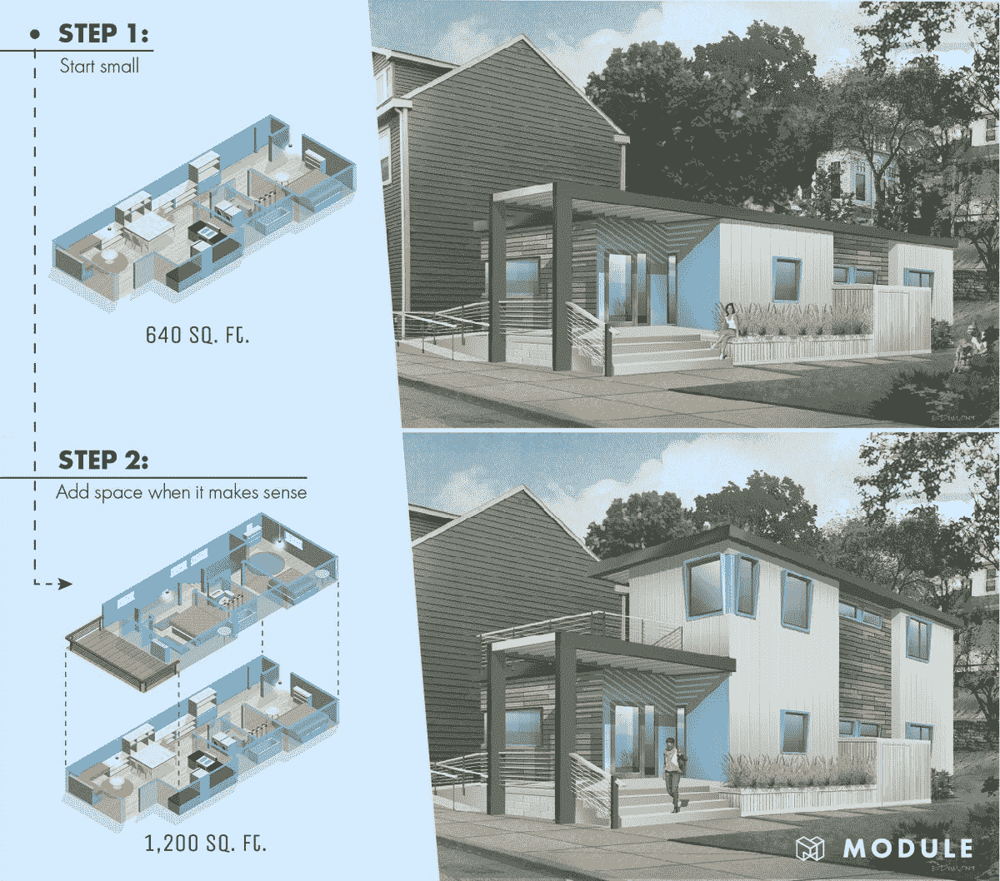
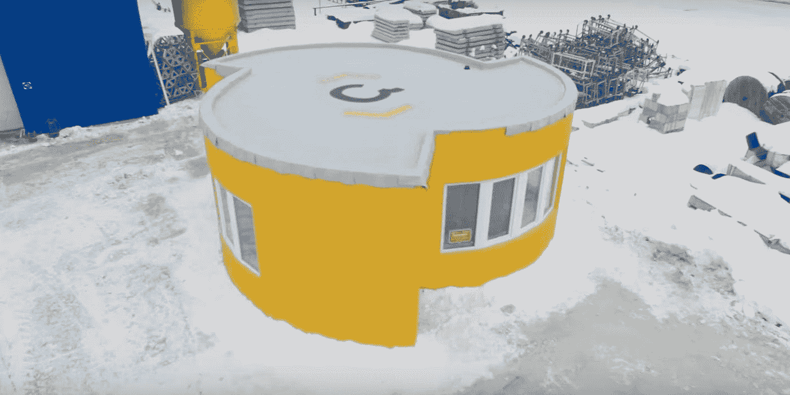

# 无家可归:永远存在的问题

> 原文：<https://medium.datadriveninvestor.com/homelessness-the-ever-present-problem-46e636cdea2e?source=collection_archive---------9----------------------->

回家。是你每天下班/放学回家的地方。这是你睡觉的地方。这是你和你关心的人共度时光的地方。是的，甚至是有 wifi 的地方。你可能无法想象没有家的生活，但对于大约 1.5 亿人来说，这是他们的现实。

# 为什么人们无家可归？

导致无家可归的首要原因是负担能力。一栋普通的房子要花费 50 万美元，外加每年的抵押贷款(费用)和所有其他费用，比如水、暖气/冷气、食物等等。每周工作 40 小时的平均工资是 5.5 万美元。抵押贷款价格预计会上涨，而工资预计会保持不变。看到问题了吗？如果没有他人或银行的经济援助，人们的收入不足以买得起房子。

造成无家可归的第二个原因是就业。许多无家可归的人都没有工作，那么他们如何支付房子的费用呢？一旦他们失去工作，他们试图找到一份新的工作，但这个过程往往需要时间。当支付账单时，你没有太多的时间，所以一旦他们错过了太多的付款，他们就会被赶出家门。因为他们现在没有房子，他们没有地方洗澡、做饭或换衣服，所以他们变得不卫生，工作机会也消失了。如果他们有亲戚/朋友的话，他们被迫和他们住在一起，或者露宿街头。这成为一个许多人无法逃脱的循环。

 [## 为什么包容性财富指数比 GDP 更能衡量社会进步？-数据驱动…

### 你不需要成为一个经济奇才或金融大师就能知道 GDP 的定义。即使你从未拿过 ECON 奖…

www.datadriveninvestor.com](https://www.datadriveninvestor.com/2019/03/08/why-inclusive-wealth-index-is-a-better-measure-of-societal-progress-than-gdp/) 

导致无家可归的第三个原因是缺乏服务，在较贫穷的国家更是如此。一项特别有影响力的服务是医疗保健服务，如医院和诊所。人们生病了，因为他们没有地方去接受治疗，他们就一直生病。这导致他们不去工作，忘记支付，导致他们失去工作和房子。

导致无家可归的第四个原因是自然灾害。当地震/飓风/洪水/火灾发生并摧毁房屋时，许多人没有钱修理他们的房子，最终流落街头或住在半毁/临时搭建的房子里。一些人获得贷款来修理他们的房子，但通常无法还清贷款，最终失去了他们的房子。

# **当前解决方案**

一家目前致力于解决无家可归问题的公司是 Module。他们设计的房子可以重新布置，当你需要更多空间时可以添加进去。因为你买的是小房子，所以它们比普通房子便宜，对低收入人群来说是好事。如果那个人变得更加经济稳定，他们可以通过增加另一个房间来扩大房子。另外，通过增加一个你可能不需要的房间，你可以把它租出去以获得更多的收入。

另一家致力于解决无家可归问题的公司是 Ori。Ori 的房子很小，但是有可以移动/折叠/收起的家具，给你需要的空间。它们比市场上的大多数房子都便宜，尽管它们很小，但它们会让你觉得因为移动的家具而有了更多的空间。一个缺点是，如果说露西想躺在床上，但乔想用桌子，人们可能不会去，因为床的下面可能是桌子。要了解更多关于 Ori 房屋的信息，请观看这段简短的[视频](https://www.youtube.com/watch?time_continue=11&v=1aN1OAMO_x4)。

全景利益集团也致力于通过 pod 住房解决无家可归问题。他们为无家可归的人建造大约 160 平方英尺的房子。这些房子堆叠在一起，这样就可以把很多房子放在一个区域，很像公寓，但更小。住房还包括解决就业和服务问题的工作安排和心理健康服务。他们真正为无家可归者提供了更好的生活。

一家正在崛起的解决无家可归问题的公司是 Apis Cor。他们是第一家 3D 打印房屋的公司。这些房子的成本要低得多，而且可以在 24 小时内打印出来。它们为无家可归者提供廉价住所，几乎可以在任何地方打印。它们几乎是圆形的，可以抵御自然灾害。由于它们可以制造得如此之快，它们在自然灾害后的修复中也很有效。要了解更多关于 Apis Cor houses 的信息，请观看这个[视频](https://www.youtube.com/watch?v=xktwDfasPGQ)。

我希望你喜欢这篇文章，现在知道更多关于无家可归和当前的解决方案。要了解更多关于无家可归者的情况，或者了解你可以如何提供帮助，请访问[人类家园](https://www.habitat.ca/)了解更多。

请在评论中让我知道你对这篇文章的想法，这样我可以在未来改进其他人。