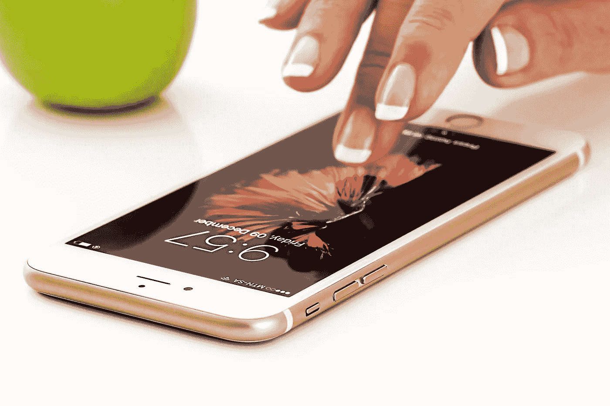

# 因 iPhone 11 荣誉拖住苹果

> 原文：<https://medium.datadriveninvestor.com/honor-trolling-apple-due-to-iphone-11-70d3dc2ad34f?source=collection_archive---------14----------------------->

## 用户爱安卓智能手机什么？在大多数情况下，原因只有一个——旗舰 iPhone 机型的价格高。不，当然，有时有意识形态的家伙不吃面包——让一些东西悬置或定制，但大多数人选择 Android 是因为可用性。

Image by [Steve Buissinne](https://pixabay.com/users/stevepb-282134/?utm_source=link-attribution&utm_medium=referral&utm_campaign=image&utm_content=1894723) from [Pixabay](https://pixabay.com/?utm_source=link-attribution&utm_medium=referral&utm_campaign=image&utm_content=1894723)

印度代表办公室 Honor 在其 Twitter 页面上发布了一张有趣的图片，显然是为了配合新 iPhone 的发布。在它上面，中印创意描绘了一个由三部分组成的操作灯，看起来非常类似于 11 Pro 和 11 Pro Max iPhone 中摄像头的位置。为了达到歌唱的效果，图片上还添加了题词“Kidews ”,故意把字母“I”写得更低，这样就不会有人怀疑这个笑话指的是苹果的创新。

# 卖肾换 iPhone

蛋糕上的樱桃是短语 iHad Kidews 的意思。意思是“我没有肾了。“这不仅仅是一个笑话，而是一个发生在 2010 年的真实案例。后来，17 岁的王善坤决定卖掉自己的肾来买 iPhone 4。

很快就找到了买主，并向范出价 3000 美元，他不假思索地答应了。毕竟，不是每天你都有机会卖掉你没有花那么多钱买的东西。

也许 Honor 的玩笑有些严厉，但在王卖肾近 10 年后，这个故事已被认为是一个毫无道理的例子。

 [## 苹果会成为新的网飞吗？数据驱动的投资者

### 有可能。然而，该公司肯定会与大公司竞争。许多人不得不看到这一天的到来…

www.datadriveninvestor.com](https://www.datadriveninvestor.com/2019/02/15/will-apple-be-the-new-netflix/) 

毕竟，在此期间，iPhone 的价格不仅没有变得更便宜，甚至还提高了价格。在他们的背景下，即使是售价在 500-600 美元的旗舰荣誉机，看起来也是一个更理性的选择，至少值得考虑。

## 竞争对手如何掠夺苹果

总的来说，似乎 Android 智能手机制造商不仅在竞争最好的设备，还在竞争对苹果的最佳诱惑。然而，远非总是如此，这场比赛给出了预期的结果。有一个例子，三星决定为其智能手机做广告，强调他们没有像 iPhone X 那样的小鸡，他们自己也没有被剥夺苹果当时的旗舰产品不再拥有的耳机插孔。

结果，仅仅一年后，韩国人删除了一则诽谤性广告，并发布了一款带有镂空显示屏、没有迷你插孔的 Galaxy Note 10。还有什么比这更可悲的呢？

# Honor 解释了其智能手机如此可靠的原因

随着中国一线智能手机制造商在品牌中的崛起，移动技术“质量差”的概念已经作为一个类别消失了。现在已经不可能肯定地说一个品牌的设备一定比另一个品牌的质量高。

好吧，如果不同的品牌在相同的工厂订购品牌设备的组装，质量会有什么不同呢？然而，Honor 决定在竞争对手的背景下脱颖而出，不仅是其智能手机的突破性特征，也是其高可靠性。

> 为了提高品牌机器的可靠性，Honor 制定了新的质量保证标准。为了消除智能手机某些组件的非自愿故障，该公司的工程师扩大了测试范围，包括非常意想不到的测试。

# 智能手机的体验

例如，根据新标准，所有 Honor 智能手机都必须开机和关机 1 万次，唤醒和进入睡眠 10 万次，持续按下电源按钮 2 万次，另外按下音量调节按钮 5 万次。此外，Honor 通过分别连接和禁用充电线和耳机 10 次和 5 千次来测试 USB 端口和 3.5 mm 连接器的强度。

通过这种方式，制造商希望避免这些部件在运行过程中出现故障，并保护用户免于申请更换。

但最严格的测试是指纹扫描仪和触摸显示器，作为质量检查程序的一部分，指纹扫描仪被迫识别测试者 20 万次，触摸显示器必须毫无困难地进行 80 万次触摸。此外，在极高和极低的温度和压降条件下检查机器。

# 最可靠的智能手机

> 只有少数 Honor 智能手机仍在接受所有这些测试。据该公司代表称，只有 Honor 20 线受到如此苛刻的测试。

事实是，它最初的设计考虑到了增加的可靠性要求，因此制造商可以确保这些小工具将经受住它们所经受的测试，因此，在最负责任的时刻不会让它们的所有者失望。