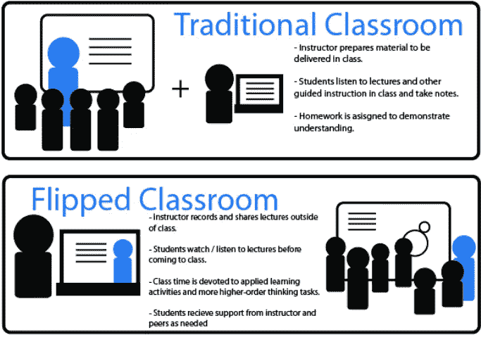

# 表彰在 STEM 及其他领域有特殊需求的学习者

> 原文：<https://medium.datadriveninvestor.com/honoring-learners-with-special-needs-in-stem-and-beyond-36adcc16f99c?source=collection_archive---------4----------------------->

## 纳斯卡阿玛尼·威廉姆斯的励志故事

Image: Getty / Student Engaging With Teacher On Laptop

*作者:* [*安德鲁·b·劳普*](https://medium.com/u/d8c8d333927a?source=post_page-----36adcc16f99c--------------------------------)*/*[*@ stem CEO*](https://twitter.com/stemceo)

大多数 17 岁的孩子都兴奋地拿到驾照，以获得一点自由。对于阿玛尼·威廉姆斯来说，驾驶与其说是一种仪式，不如说是一种激情。2017 年首次亮相[纳斯卡赛道](https://www.racing-reference.info/driver/Armani_Williams)。

阿玛尼也有自闭症谱系障碍(ASD)。在一次采访中，威廉姆斯称他最大的挑战是沟通和社交。像许多自闭症患者一样，他说他有时会被感觉处理问题困扰。一条尖叫嘈杂的赛道似乎无法应对，他的研究也很复杂——但他学会了退后一步评估周围的环境，在网上搜索他需要帮助解决的问题，并主动与他人合作以避免误解。

 [## 为什么包容性财富指数比 GDP 更能衡量社会进步？-数据驱动…

### 你不需要成为一个经济奇才或金融大师就能知道 GDP 的定义。即使你从未拿过 ECON 奖…

www.datadriveninvestor.com](https://www.datadriveninvestor.com/2019/03/08/why-inclusive-wealth-index-is-a-better-measure-of-societal-progress-than-gdp/) 

阿玛尼还指出，自闭症不仅仅是缺陷，他还将自己在方向盘后数小时集中注意力的能力归功于强烈的专注，这通常是自闭症患者的特征。[根据孤独症代言人](https://www.autismspeaks.org/what-are-symptoms-autism)的说法，患有孤独症的个体可能会表现出不同程度的感觉处理挑战、社交情感困难和言语语言缺陷的组合，从而影响功能性交流。如果没有足够的支持和干预，这些挑战可能会严重影响健康、学习和技能的获得。

Image: Getty + NASCAR via Mike Tedesco/ Armani Williams *K&N Pro Series West at Evergreen Speedway*

**STEM 针对有特殊需求的学生**

当阿玛尼和我有机会在一次当地领导活动中初次接触时，他启发我利用我作为一名教育工作者的经验，深入思考如何为有特殊需求的学生提高科学、技术、工程和数学(STEM)的可及性。我一直热衷于为所有人带来 STEM 的公平竞争环境，但迄今为止，我的大部分工作都专注于 STEM 教育中的社会经济和性别不平等。当然，这是一个有价值的目标，但如果我们不将有特殊需求的学生纳入我们的努力，以确保每个孩子都获得 STEM 成功的坚实背景，那将是我们的失职。

我相信患有自闭症和其他挑战的学生可以在大学水平的机械工程(阿玛尼目前的激情)等复杂领域茁壮成长。但是，我们如何确保所有的学生都得到他们脱颖而出所需要的支持呢？

**让 STEM 更具包容性**

我认为，我们应该探索许多方法来适应课堂上有特殊需求的学生，这些策略中的许多可以重叠，以帮助有特殊需求的学生更容易掌握 STEM 科目。

**成长心态:**改变 STEM 课堂的语言和奖励制度，以认可勇气和面对失败时不断尝试解决问题的能力，这是 2017 年*教育科技* [采访文章](https://edtechmagazine.com/k12/article/2017/10/how-tech-can-help-students-disabilities-thrive-stem-education)中探讨的一个概念。毕竟，科学方法都是关于实验的，唯一失败的实验是你没有从中吸取教训的实验。表扬孩子的努力而不是成就是开始建立成长心态的好地方，这对那些以不同方式学习的人来说是有益的。

**动手实践:**我所见过的最好的 STEM 教学提供了大量真实世界的机会来观察作用力，以及用日常物品进行实验以了解事物如何工作的方法。无论是通过提供编码机会还是走出去探索自然，有形的学习都可以让 STEM 为所有学生带来活力——但它在帮助那些以不同方式学习的人内化抽象概念并培养更深层次的兴趣方面可能特别有价值。

翻转课堂:如果学生被送回家练习他们并不完全理解的概念，家庭作业对他们来说可能是一场真正的斗争。然而，在翻转课堂中，背景信息以视频或文章的形式提前给出，以便在家阅读。学生可以带着问题来学校，然后在老师的直接指导下将新概念付诸实施——这种支持对于学习方式不同的学生来说，在理解方面会产生巨大的差异。

Image: ResearchGate via Alessandra Giglio / Flipped Classroom: A Graphical Definition

**拥抱技术:**正如 *EdTech* 采访中所讨论的，设计良好的学习应用程序可以通过提供有针对性的个性化练习，让有特殊需求的学生更容易接触到 STEM 课程。语音转文本软件可以让写作变得更容易，这样即使学生的写作技能或精细动作技能落后，他们也可以在 STEM 中蓬勃发展。文本阅读器和视频课程也可能帮助有阅读困难的学生跟上进度，并确保学习困难不会影响 STEM 的成功。

**规律的运动和灵活的课程计划** : [保持自我调节](https://www.ncbi.nlm.nih.gov/pmc/articles/PMC3719386/)和[专注](https://newsinhealth.nih.gov/2014/09/focusing-adhd)对于有特殊需求的孩子来说可能是典型的挑战——尽管坐立不安几乎是普遍现象。这意味着所有的学生都可以从课间休息中受益(正如 MiddleWeb 所描述的那样)，并有机会在教室里走动以改变节奏。在课堂上保持学习中心和差异化活动的灵活性和创造性可以帮助每个人参与进来。通过为所有人提供最常见的便利，而不是让他们变得特别，你可以规范不同的学习风格，为成功做好准备，并减少耻辱。

Image: Motorsports Tribune via Luis Torres / Armani Williams’ #34 Racecar

**最后一圈**

当我了解阿玛尼时，我清楚地意识到，很容易假设我们知道自闭症患者是什么样子，或者有特殊需求的学生有什么能力。然而，事实上，没有单一类型的学生有特殊需要。每个人都是一个个体，既有独特的优势，也有全方位的挑战。我相信作为教育者，我们的工作是支持所有学生，确保他们得到成长所需的一切。

要做到这一点，我们首先需要消除一些围绕 ASD 等挑战的污名。我相信这些学生不能在 STEM 或其他学术科目上取得成功是一个神话。阿玛尼就是一个例子；关于自闭症患者的另一个视角，我强烈推荐关于网飞的系列*非典型*。它出色地将人类的面孔置于一种尚未被很好理解的状态，但如果我们要成功地让 STEM 教育真正普及，就必须做到这一点。

Image: Mediapunch + Shutterstock / Atypical Cast at PaleyFest LA

*本文最初发表于 2019 年 2 月 26 日的《福布斯社区之声》。*

[Andrew B. Raupp](https://medium.com/u/d8c8d333927a?source=post_page-----36adcc16f99c--------------------------------) 是创始人/执行董事 [@stemdotorg](https://twitter.com/stemdotorg) 。*“通过健全的政策&实践使科学、技术、工程和数学(STEM)教育民主化……”*