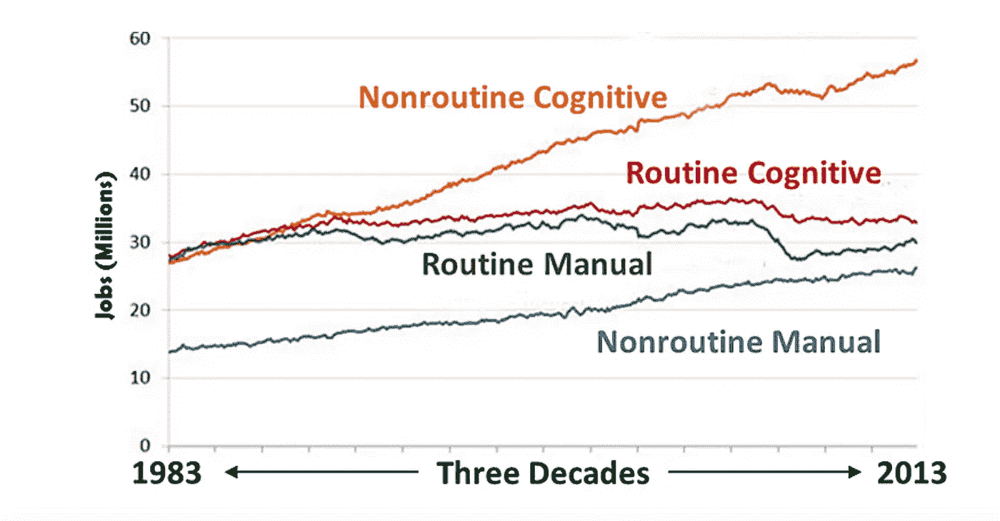

# 马到自动驾驶汽车→人类到人工智能(上)

> 原文：<https://medium.datadriveninvestor.com/horses-to-self-driving-cars-humans-to-ai-part-i-2b579f57c667?source=collection_archive---------48----------------------->

Source: US Population Survey; Federal Reserve Bank of St. Louis.

两个世纪前，我们就“机器问题”进行了辩论，这是一场由机器接管人类工作而引发的争论。如今一个再熟悉不过的辩论是，人工智能(AI)是否会导致大规模失业，让人类成为多余。围绕流氓人工智能转向反对其创造者的最大恐惧，经常在无数科幻电影中看到，这些电影描述了我们为自己创造的灾难性未来。尽管人工智能系统相当有影响力，但就目前而言，它们执行的是更具体和例行的任务。人工智能研究人员吴恩达(Andrew NG)曾在斯坦福大学领导一个人工智能研究小组，最终在百度工作前转到了谷歌。他说，担心这个问题就像是在殖民者还没有踏上火星之前担心那里的人口过剩一样。对我们来说，更大的问题仍然是人工智能将如何影响人们的工作和我们的生活方式。

工作对自动化的脆弱性是关于一项工作是多么的常规和机械。上图描绘了过去几十年中就业增长的类型。《经济学人》在 2016 年 7 月的一篇文章中称，由于这一吴恩达，一名技术高超的放射科医生被自动化取代的风险远远高于他或她的助手。如果助理管理日历、接听电话、安排病人和在母亲节为妈妈订购鲜花，你如何建造一台机器来实现自动化？

激发本文灵感的 2016 年 6 月《经济学人》特刊提出了两个重要的历史性事件，关于自动化技术进步如何带来更多就业增长，我可以添加更多认知就业增长吗？它指出，在工业革命期间，纺织变得更加自动化。它让工人专注于机器做不到的事情——比如操作机器，维护或修理机器。随着产量的激增，纺织变得更便宜，因此需求增加——创造了就业机会。它改变了织工的工作，而不是完全取代它。类似地，银行自动柜员机取代了银行出纳员的角色，但降低了银行的运营成本，因此他们可以开设更多的分支机构，从而增加了对其他客户服务和销售角色的需求。

卡尔·贝内迪克特·弗雷(Carl Benedikt Frey)和迈克尔·奥斯本(Michael Osborne)进行了一项著名的研究，题为[‘就业的未来’](https://www.oxfordmartin.ox.ac.uk/downloads/academic/The_Future_of_Employment.pdf)，也在媒体上写道发现美国 47%的工人从事潜在自动化的高风险工作。更具体地说，他们认为那些“理论上可以自动化”和“注定要自动化”的角色的员工将受到最大的影响。运输、物流、收银员、电话销售员和会计是一些常规角色的领域。

我仍然对人工智能将如何以我们尚未能够的方式，或者以更快的速度改变工作的影响，为我们的生活做出贡献感到兴奋。野生动物保护([【Wildbook.org】](http://wildbook.org/doku.php))、医疗诊断([启蒙](https://www.enlitic.com/))、灾难应对与管理( [AIDR](http://aidr.qcri.org/) )只是扰乱这一空间的一些有趣模式。