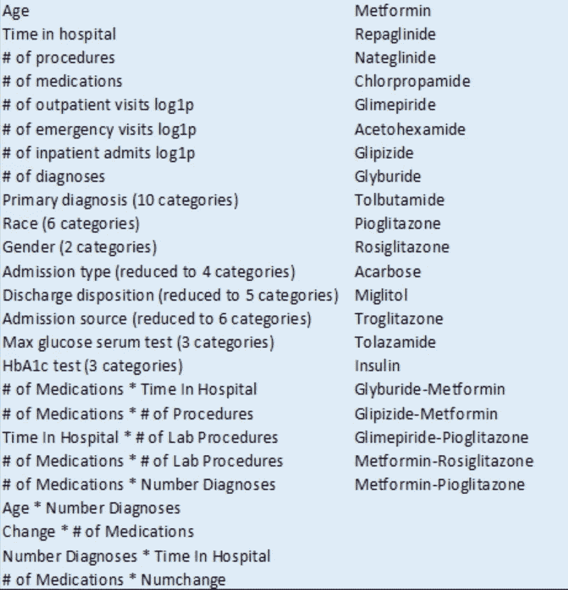
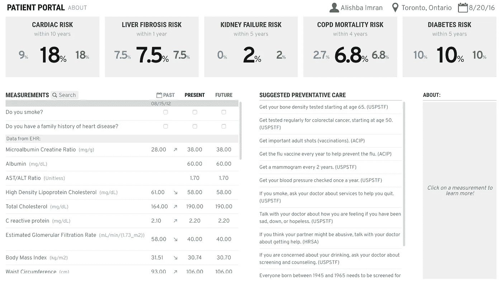
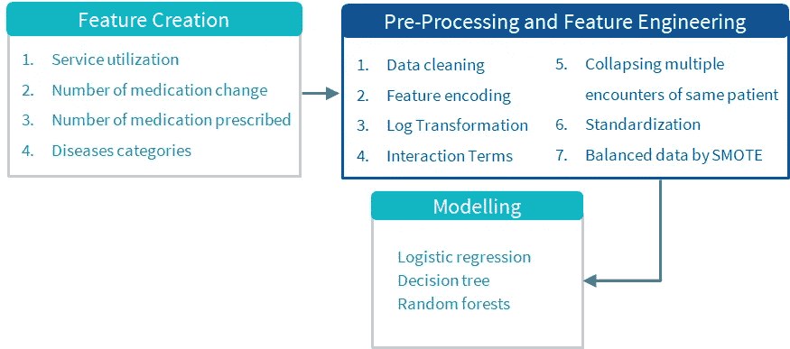
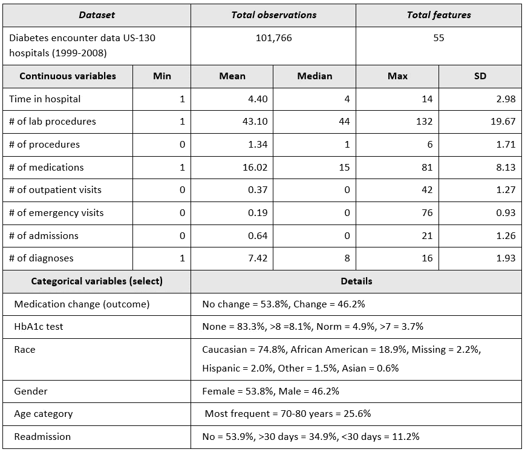

# 由于这个问题，医院损失了 413 亿美元

> 原文：<https://medium.datadriveninvestor.com/hospitals-are-losing-41-3b-due-to-this-problem-910684049818?source=collection_archive---------0----------------------->

## 我是这样解决的

医疗保健中最大的问题之一是病人重新入院的成本不断上升。这是指最近让一名患者出院的医院因让该患者在 *30 天*内返回医院而受到处罚。这通常要花费医院总计 5 . 28 亿美元。

**仅美国的医院就已经花费了超过 410 亿美元给那些在出院后 30 天内再次入院的糖尿病患者** 🛏️.能够确定导致此类患者再次入院的因素，并能够预测哪些患者将再次入院，可以帮助医院节省数百万美元，同时提高护理质量。

我是一个 16 岁的机器学习创新者🤓他最近对我们医疗系统中的系统性问题非常感兴趣。在与顶级数据科学家和顶级医院的研究人员(如 UHN 病童医院)交谈后，我意识到**很多问题是我们没有充分利用 EHR 的数据来做出更好的决策**。

我花了一些时间探索不同的**机器学习算法(梯度提升分类器)和库，比如 FHIR 上的 SMART 解决这个问题的风险评分、数据可视化和预防措施。**我已经构建了一个预测准确率为 92%的东西，稍后我将讲述我是如何构建它的。

## 分解问题

通过识别有这些疾病风险的患者，并确定哪些患者最有可能在出院后回到医院，我们可以提前采取预防措施。

问题的第一部分是确定哪些因素是糖尿病患者再次住院的最强预测因素。我们通常需要考虑很多因素，但并非所有因素对每个患者都适用:

Examples of 79 factors to consider

这里我们进入了一个数据问题:**我们经常没有收集到我们需要的特定于患者的正确数据**。在患者与医院取得联系并收集实时数据后，我们没有互动的方式与他们互动。这个问题可以通过改进我们的*患者门户网站得到显著解决。*

# 我们目前的患者门户还不够。

如今，患者门户网站的功能有限，通常不能为患者提供很多价值。通常从基本功能开始，患者最多可以查看:

*   一般医疗和健康信息
*   实验室和测试结果
*   约会详情
*   与你的医生交流的电子方式

然而，大多数患者仍然觉得他们没有从这些应用程序中获得很多医疗保健更新，医生也不能依靠他们做出明智的决定。如果我们能够通过患者门户网站不断收集数据，为患者提供风险评分和可预防的措施，我们就可以改善体验，并将我们从该平台获得的价值提高 10 倍。这就是电子健康记录(EHR)发挥作用的地方。

## 为什么是 EHR？

美国超过三分之一的医院处于亏损状态，许多医院无法为所有病人服务。

在对患者和医院特征进行控制后，在晚期 EHRs 医院接受治疗的患者的平均费用为 731 美元，比没有晚期 EHRs 的患者低 10%。

**通过在全球范围内采用 EHR，我们的医疗系统每年可以节省多达 780 亿美元**,这是通过减少医疗差错、消除冗余测试以及通过开放信息访问促进预防性护理等驱动因素实现的。

但是我们仍然没有充分挖掘这些系统的潜力，使其成为解决诸如患者再入院等重要问题的途径。电子健康记录仍然有可能使医疗保健更具预见性、预防性和精确性。这些是今天 EHR 系统的*三大缺点*:

*   使这些系统更适用于不同类型的功能+更好地集成到工作流程中(实验室报告、患者数据、风险评分)
*   以一种为患者和医生增加更多价值的方式合成数据(预测模型、数据可视化)
*   利用人工智能合成病历；将它们与医学文献相结合，并在护理点提供见解。

考虑到这些问题，我决定开发 Everva，通过**集成风险评分、数据可视化和预防措施**来解决这些主要问题。

# 患者门户:Everva

Dashboard for Everva

Everva 是 EHR 的一款网络应用，我致力于将其与现有的 EHR 系统整合，以帮助患者解读他们的健康数据，并帮助医生更好地跟踪患者出院后的情况。

我使用 FHIR 平台上的 [SMART 构建了这个应用程序，以创建一个界面，提供临床验证风险评分和来自患者临床测量的纵向数据的**交互式可视化。**](https://smarthealthit.org/)

这些可视化允许患者调查关键临床测量值和风险之间的关系。

基于对 EHR 中可用的纵向信息的更多理解，患者有机会积极地改善他们的健康，并开始与他们的医疗保健提供者对话。此外，医疗保健提供者要不断衡量患者可能面临的风险，以及如何最好地治疗他们，以减少或增加再次住院的可能性。

使用的应用程序有:

*   [React.js](https://reactjs.org/) — Web 框架
*   [Redux.js](https://redux.js.org/) — JS 状态管理
*   [智能上 FHIR](https://smarthealthit.org/) — App 平台和 FHIR JS 客户端
*   [fhir.js](https://github.com/FHIR/fhir.js) — FHIR JS 客户端
*   [d3.js](http://d3js.org/) —图形可视化框架

我的 web 应用程序的预测部分使用机器学习来预测医院的再入院率，其工作原理如下:

# 机器学习预测医院再入院

解决方案的下一部分是使用机器学习来预测糖尿病住院患者的再次入院，准确率为 **92%** 。

在美国，他们有一个名为 CMS '医院再入院减少计划的组织，该组织在每个财政年度收集医疗保险支付的罚款。医院必须支付 0.5%到 3%不等的罚金。

这三组患者的索引后住院**费用**通常存在巨大差异:30 天内再次入院的**患者为 73，252 美元，超过 30 天再次入院的**患者为 62，053 美元，而未再次入院的**患者为 5，719 美元。**

对于大约三分之二的普通诊断来说，再次住院的费用比初次住院的费用高得多。平均而言，每次再入院的费用为 7400 美元。这些费用中的大部分是疾病的治疗费用(由于病例变得更加复杂，一旦患者回来，治疗费用会更高)。然后，根据您与其他医院相比的统计数据，您可能会被收取您的 Medicare 付款的%罚金。

每一次再入院要花费医院大约 7400 美元。但根据病情和所需的护理，他们只需为每个病人支付 1000-2000 美元。

如果我们为 100 万患者减少 92%，那么我们可以**节省****【67 亿美元】**(7400 x920k-1000 x80k)。

根据 Ostling 等人的研究，糖尿病患者住院的几率几乎是普通人群的两倍。这就是为什么我想重点预测糖尿病患者再次住院的原因。

*我建立这个模型的一般步骤是:*

*   选择数据集
*   特征工程
*   构建培训/验证/测试样本
*   型号选择

我为此探索了各种不同的模型:逻辑回归、决策树、随机森林和梯度推进分类器，每种都有自己的好处。

*   模型评估

Overview of the process

# 资料组

我使用了来自 UCI 知识库([链接](https://archive.ics.uci.edu/ml/datasets/diabetes+130-us+hospitals+for+years+1999-2008#))的公开可用数据集，其中包含 130 家美国医院的去身份糖尿病患者遭遇数据，包含 10 年来的 101，766 次观察。该数据集有超过 50 个特征，包括患者特征、病情、测试和 23 种药物。

Breakdown of the data

# 预处理和特征工程

在我们开始实际建模之前，几乎总是需要与数据进行一些争论。我在这里应用了三种方法:

1.  **清理任务**如丢弃坏数据，处理缺失值。
2.  **现有特征的修改**，例如标准化、对数变换等。
3.  **新功能的创造或衍生**，通常来自现有功能。

我们将把这一部分分解成数字特征、分类特征和额外特征。

## 数字特征

这些特征不需要任何修改。我们将使用的数字列如下所示:

## 分类特征

我们要创建的下一类特征是分类变量。分类变量是非数字数据，如种族和性别。我使用一次性编码，将这些非数字数据转化为变量。

我们将处理的第一组分类数据是这些列:

在一次性编码中，您为该列中的每个唯一值创建一个新列。如果样本具有唯一值，则该列的值为 1，否则为 0。

`get_dummies` 功能不适用于数字数据。我们必须将 3 个 ID 类型的数字数据转换成字符串，然后它才能正常工作。

现在我们准备好制作我们所有的分类特征:

## 特征工程:概述

通过这个过程，我们为机器学习模型创建了 143 个特征。功能细分如下:

*   8 个数字特征
*   133 个分类特征
*   2 个额外功能

# 培训/验证/测试样本

到目前为止，我们已经研究了我们的数据，并根据分类数据创建了特征。现在是我们拆分数据的时候了。分割数据背后的想法是，这样你就可以衡量你的模型在看不见的数据上做得有多好。

我将数据分成 70%训练，15%验证，15%测试。

我们可以检查 30 天内住院的小组的百分比。

每个群体的患病率大致相同。

## 型号选择

超过 80%的时间实际上花在清理和准备数据上。我在一些机器学习模型的基础上训练我的数据，并使用一些技术来优化它们。

我对比了:逻辑回归，决策树，随机森林，梯度推进。

## 逻辑回归

逻辑回归是一种传统的机器学习模型。这个线性函数然后通过一个 sigmoid 函数来计算正类的概率。逻辑回归的一个优点是模型是可解释的。我们可以使用 scikit-learn 中的以下代码来使用逻辑回归:

## 决策图表

最简单的基于树的方法被称为决策树。你不断地询问样本是否有大于某个阈值的特定变量，然后分割样本来分解它。最终的预测是在树的最终分裂中阳性样本的分数。基于树的方法的一个优点是，它们没有关于数据结构的假设，并且如果给定足够的树深度，能够拾取非线性效应。我们可以使用下面的代码来使用决策树:

## 随机森林

决策树的一个缺点是，通过记忆训练数据，它们很容易过度拟合。因此，随机森林被创建来减少过度适应。在随机森林模型中，会创建多棵树，并对结果进行汇总。要使用随机森林，我们可以使用以下代码:

## 梯度推进分类器

另一种改进决策树的方法是使用一种叫做 boosting 的技术。在这种方法中，您将创建一组浅树，这些浅树试图改善先前训练的树的错误(梯度下降算法)。要使用梯度增强分类器，我们可以使用以下代码:

# 模型选择:特征重要性

我们可以对逻辑回归或随机森林等模型使用特征重要性。

我们可以使用以下方法从逻辑回归中获得特征重要性:

我们可以查看前 50 个正系数和前 50 个负系数来获得一些见解。

Positive Feature Importance Score

Negative Feature Importance Score

## 模型选择:超参数调整

我们应该研究的下一件事是超参数调整。超参数调整本质上是您在建立机器学习模型时做出的设计决策。例如，你的随机森林的最大深度是多少？这些超参数中的每一个都可以被优化以改进模型。

梯度推进分类器在验证集上是最好的。

## 模型评估

现在我们已经选择了我们的最佳模型(优化的梯度推进分类器)。让我们评估一下测试集的性能。

# 后续步骤

我个人的下一步是继续训练模型，进一步提高精确度。我想深入研究，更好地理解医院面临的数据挑战。

我还与 UHN 和 Sickkids 等顶级机构的数据科学家和研究人员进行了会谈，可能会与他们合作部署类似的模型。

# 你好。我是阿利什巴。

我是一个 16 岁的机器学习，区块链开发者和研究员。

如果你在医院或医疗保健研究机构从事数据科学工作，我会非常乐意与你聊天:

**电子邮件**:alishbai734@gmail.com

**推特**:【https://twitter.com/alishbaimran_】T4

**Linkedin**:[https://www.linkedin.com/in/alishba-imran-/](https://www.linkedin.com/in/alishba-imran-/)