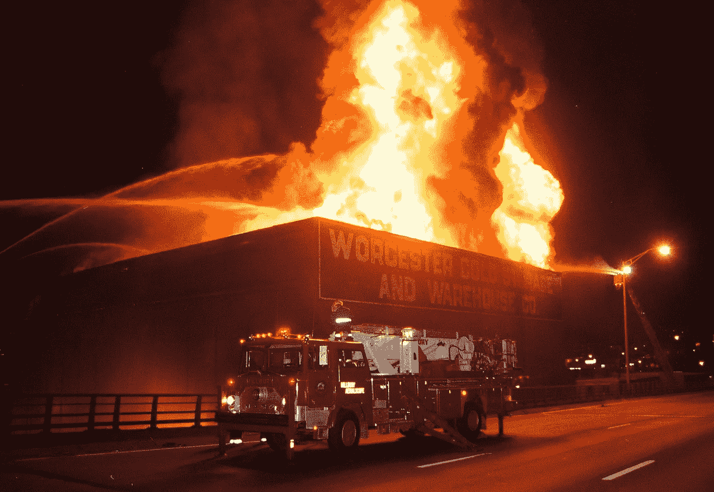
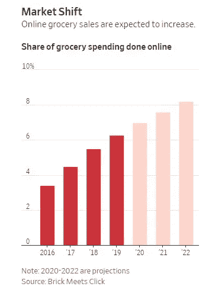

# 冷库中的高温时期

> 原文：<https://medium.datadriveninvestor.com/hot-times-in-cold-storage-cab35fadae80?source=collection_archive---------3----------------------->

## 冷链物流为什么火了

冷库仓储热。

在过去的一年里，我们看到了大量的资本涌入温控物流设施。投资者和买家纷纷涌入该行业，渴望抢购支持食品供应链的设施。

尤其是行业领导者天堂物流和美国铝业，一直在狂奔。最近的交易包括

*   在亚洲和拉丁美洲，[沿袭物流](https://www.lineagelogistics.com/) [以 9 亿美元从埃利奥特手中收购突如其来的冷](https://www.wsj.com/articles/lineage-logistics-expands-global-cold-storage-space-with-900-million-acquisition-11574105285)
*   在加拿大，Americold [以 2.53 亿美元从 Brookfield 收购 Nova Cold Logistics](https://www.bizjournals.com/atlanta/news/2019/11/21/americold-buying-canadian-cold-storage-operator.html)
*   在美国，血统[以超过 10 亿美元的价格购买首选冰柜](https://www.wsj.com/articles/lineage-logistics-buys-rival-preferred-freezer-services-11551092401)

在短短 11 年间，天堂公司一飞冲天，成为该领域最大的公司。根据国际冷藏仓库协会的数据，今天，天堂和它的竞争对手 Americold 一起控制了 63%的冷藏仓库市场。

为什么投资者对冷链物流的兴趣如此突然？

我认为有四个关键原因。

首先，顾客寻求新鲜食品当天送达。今年网上杂货销售额增长了 15%。网上购物的份额在三年内翻了一番，达到 6%。这种需求推动了食品配送市场的整合。德国的 DeliveryHero 刚刚以 40 亿美元收购了韩国的 Woowa。反过来，当天生产需要增加冷藏设施。

其次，当日物流的繁荣正在推动小型城市仓储场所的扩张。沃尔玛、艾伯森、西夫韦和其他公司都在投资这些生产的微履行中心。这些 10，000–20，000 平方英尺的仓库可以在短短 3 个月内建成。它们使零售商能够更快地满足客户需求。

 [## 物联网解决方案如何改变供应链中的机遇|数据驱动型投资者

### 物联网(IoT)可能开始时规模很小，但它正在成为世界经济中的一个重要因素。事实上…

www.datadriveninvestor.com](https://www.datadriveninvestor.com/2018/11/14/how-iot-solutions-are-shifting-opportunities-in-the-supply-chain/) 

第三，推动卡车经纪业和货运代理业整合的力量同样适用于冷链仓储。在短短 8 年多的时间里，XPO 的企业价值从 7500 万美元增长到 140 亿美元。对 17 家公司的收购热潮推动了它的增长。冷藏设备也可以从规模经济中获益。他们可以通过消除重叠开销来削减成本。他们可以在更广泛的基础上集中技术投资。他们可以在新的市场进行交叉销售。像 Lineage、Agro、Emergent 和 Americold 这样的买家都获得了这些好处。

第四，投资者喜欢冷链的抗衰退能力。我们正进入经济扩张的第 10 个年头，创下了自 1853 年以来的最高纪录。投资者对经济收缩的可能性感到紧张。食品物流提供了一个对冲。在经济低迷时期，食品被认为是抗衰退的。正如 [Americold 首席执行官 Fred Boehler 所说的](https://www.wsj.com/articles/e-commerce-made-warehouses-hot-now-investors-warm-to-cold-storage-11575979203)，“不管是收成不好还是牲畜短缺，我们作为消费者，还是要吃饭的。”

于是，冷库生意火了。在私人市场，M&A 和投资继续激增。在公开市场上，领头羊 Americold 的股票今年上涨了 46%。该公司目前的股价达到创纪录的 27 倍 EBITDA。根据 Capital IQ 的数据，尽管 EBITDA 增长相对保守，从 2.82 亿美元到 2.97 亿美元，但市值仍有增长。

冷链市场过热了吗？有人这样认为。另一方面，如果我们正在见证在线杂货销售的长期增长，那么前景可能会保持光明。

像 [Cambridge Capital](https://cambridgecapital.com/) 这样倾向于以增长为导向的投资者正在考虑冷藏物流公司，因为长期增长机会仍然具有吸引力。随着消费者继续优先考虑新鲜食品、有机易腐食品和当天送达，这个供应链部门很可能会继续提供机会。

[本杰明·戈登](https://benjamingordon.me/about/)是运输、物流和供应链技术公司的投资者。作为位于[棕榈滩](http://cambridgecapital.com/home/west-palm-beach/)的[剑桥资本](https://cambridgecapital.com/team/)的首席执行官，他投资于具有令人信服的增长战略的创始人。点击了解更多[。](https://blog.dynamo.vc/p/strategic-advice-for-logistics-companies)