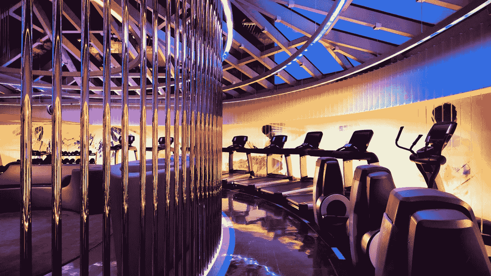
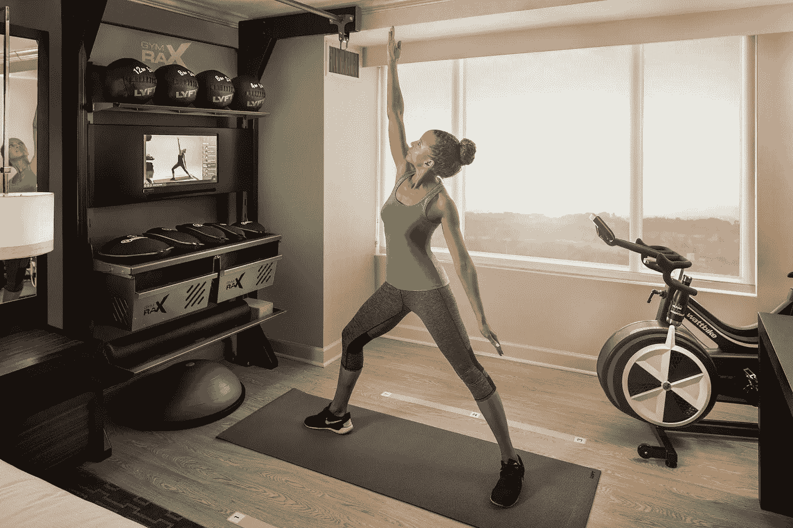
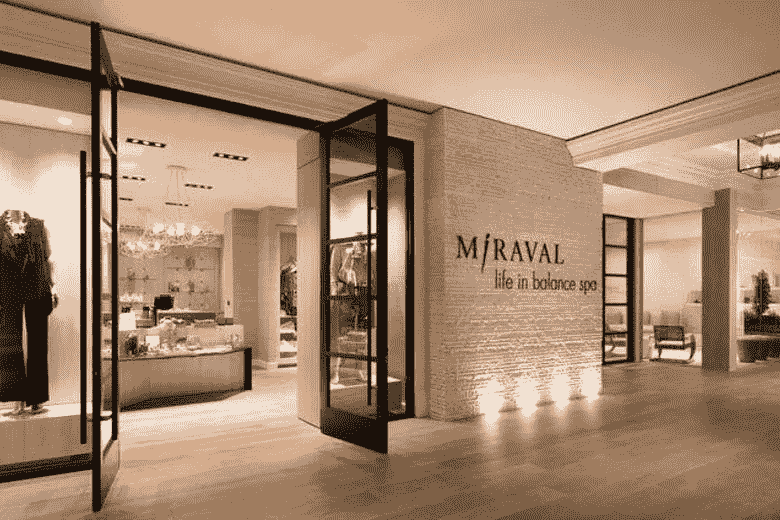

# 酒店和健身房正在结婚——他们的孩子棒极了

> 原文：<https://medium.datadriveninvestor.com/hotels-and-gyms-are-getting-married-and-their-babies-are-awesome-260d5a165259?source=collection_archive---------14----------------------->

科学与旅行相遇的地方。这是春分健康俱乐部新酒店概念的口号:春分酒店。还有比这更酷的吗？答案是肯定的。是的，确实如此。

酒店已经存在很长时间了。起初，他们在房间里为游客提供一张床，目的很简单。随着竞争的加剧，酒店开始重新定义自己。康拉德·希尔顿实际上发明了连锁酒店的概念，突然间，酒店大堂变得富丽堂皇，房间变得温馨舒适，食物也增加了，这样游客就不必离开酒店了。唯一缺少的基本体验就是娱乐，因此，酒店健身中心诞生了。

从一开始，这些婴儿就已经长大成熟了…然后他们就一直这样。酒店健身房经常过时，设备损坏或丢失，灯光糟糕，还有一股怪味。酒店开始关注装饰它们的外表，但忘记了美来自于内在。

# 留给千禧一代去提醒他们吧。

W Hotel Gym- San Francisco

**新技术**

上图中的 [W 酒店健身中心](https://www.hotelbusiness.com/health-nl-w-hotels-adds-fuel-to-fitness-offerings/)只是酒店在升级健身房方面取得革命性进展的一个例子。从现场[私人教练](https://www.hotelbusiness.com/nyc-sheraton-upgrades-fitness-center-pumps-up-experience/)到智能设备，以促进[互动锻炼](https://mytechdecisions.com/video/marriott-hotel-interactive-fitness-center/)，酒店已经跟上了健身趋势，并在一些非常平静的水域航行。

In-room Fitness- W Hotels

**室内健身**

早在 2007 年，酒店就开始在客房中放置一些健身器材。威斯汀酒店开创了这一潮流，像埃文、希尔顿和喜来登这样的大品牌紧随其后。今天，这些健身产品比以往任何时候都更高科技、更好。从瑜伽垫，到 peloton 自行车，以及直播健身课程——酒店已经解决了室内健身房的问题。

Miraval Studio

**兼并、收购和蓝海**

2017 年是酒店和健身房的大年。如果他们在 2000 年代一直约会，他们会在 2017 年初订婚，到年底他们会跑到拉斯维加斯私奔。最大的动作之一是 [Hyatt 收购 Miraval(一家精品健身工作室)和 outex(一家豪华水疗中心)。通过将这两个健康品牌纳入其产品组合，凯悦为酒店/健身房互动的新浪潮奠定了基础。在你的酒店里拥有一个世界级的健康中心不再是一种“额外津贴”，它就像 wifi 和水一样被期待和要求。](http://fortune.com/2017/08/30/exhale-spa-barre-hyatt/)

Equinox Hotel- Coming In 2019

【地平线上的 

酒店并不是唯一一个改变策略的玩家。健身房发现这个领域的竞争越来越激烈，因此他们希望转变为生活方式品牌，而不是影响消费者生活的更多领域，而不仅仅是健身。正如我在开篇提到的，豪华健身巨头 [Equinox 已经决定开设自己的酒店](https://www.equinox.com/hotels)。第一家店的计划定于 2019 年开业，如果听到其他健身品牌也在做同样的事情，我不会感到惊讶。在一天结束的时候，健康、养生和休息都是充分利用旅行的关键——我认为这是天作之合，我迫不及待地想知道接下来会发生什么。