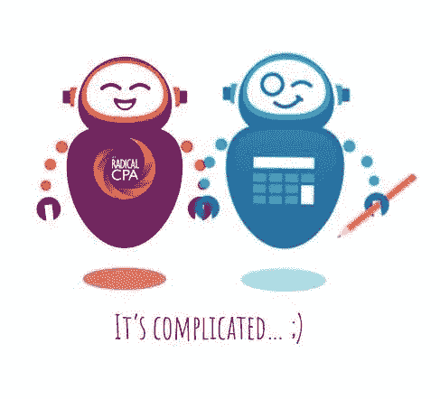

# Hotflashes 和机器人在 2019 年带来了一次彻底的科技之旅！

> 原文：<https://medium.datadriveninvestor.com/hotflashes-bots-bring-in-2019-a-radical-journey-into-tech-9ed53f1271cd?source=collection_archive---------12----------------------->

我丈夫刚满 50 岁，我也没有落后太多。在我热潮红、我女儿去上大学和我的云会计公司新视野 CPA 集团成为青少年之间，我似乎需要做一些新的和令人兴奋的事情。所以，我加入了一家专注于会计人工智能的科技初创公司，由谷歌资助的 Botkeeper。现在，我为一个 30 岁的人工作！

OMG。我从没想到会这样。你好，中年危机？或者是我在注册会计师行业有所作为的旅程中的下一个激进步骤。

这是怎么发生的？嗯，其实是我问的！是的，我问过了。当有什么事情引起了你的兴趣，并且你知道自己有能力做好这份工作时，那就主动提出来。大约 13 年前，当我离开我的老派公司时，我从来没有信心去做这件事。如果说作为一名企业家，你在创业过程中学到了什么的话，那就是如果你不问，什么都不会发生。

当我看到创造新事物和利用我最擅长的东西的机会时，我无法抗拒。我是会计大使和 bot 顾问。完美的角色，对吧？！

在年轻的科技创业公司工作是什么感觉？好玩！激动人心！快！有时候让人不知所措！我感觉自己就像一个“导师”——既是导师，又是实习生——同时又是导师和实习生。当他们去参加会议时，我拒绝住在共享的 Airbnb——就像“真实世界”的房子一样。当然，那个参考碳标明了我的年龄！

为一个领导工作是什么感觉，一个千禧一代，他可能是我的儿子？厉害！清爽！在过去的十年里，我一直在与婴儿潮时期出生的老派伙伴斗争，试图让他们接受云计算和其他新技术。

然而，这些合作伙伴的商业模式和退休计划已经将他们锁定在正在慢慢死去的破碎的公司模式中，而且随着季节的推移，这种趋势越来越快。我的职业生涯是在向年长的注册会计师学习和学习中度过的，他们太忙了，以至于看不到周围的世界在变化。但是市场已经发生了巨大的变化，现在老派公司的老板们渴望技术，因为他们害怕会被甩在后面。

现在，我可以跟随像我一样预见未来的人，而不是停留在“这是我们去年做的方式。”一个为未来培养技能的领导者。我可以成为一名支持性的领导者，利用我最好的传统技能并学习新技能。你知道我为什么这么兴奋吗？

当心，2019 年，它将变得激进！

2019 年机器人会接管会计职业吗？是还是不是？

他们肯定会的。坦率地说，他们已经在这里了。但是你也需要人类。这不是全有或全无。我们三个人的公司今天正在使用它们！

但是什么是机器人呢？正如我在技术领域短暂的时间里所了解到的，大多数会计师都不知道。他们认为他们知道，但他们不知道。基本上是算法或者一行代码，而不是机器人。你可以复制粘贴代码，让它们无限繁殖，填补人才短缺。我的一些机器人比我的新员工更聪明。

机器学习和人工智能比这更难理解。真正酷的是，作为一名注册会计师，你不需要了解所有的细节。你所需要知道的是，你希望机器人“坐在你旁边的立方体中”用数据做一些重复的任务。然后技术人员从那里开始。最后，我们可以有时间做我们真正想做的工作，并成为我们客户更好的顾问。或者，真的，早点回家就好！

这篇文章最初于 2019 年 1 月 1 日在 goingconcern.com 发表，题为:一些我们最喜欢的会计人员在 2018 年打了一个蝴蝶结，并在 2019 年谈论机器人

*乔迪·帕达尔，注册会计师，MST，是* [*新视野注册会计师集团*](https://www.newvisioncpagroup.com/) *的首席执行官和负责人，也是《激进注册会计师**和*从成功到意义:激进注册会计师指南》的作者。*她现在是*[*bot keeper*](https://www.botkeeper.com/)*的会计大使兼 bot 顾问。可以在推特上关注乔迪*[*@ jodypadarcpa*](https://twitter.com/JodyPadarCPA)*。*