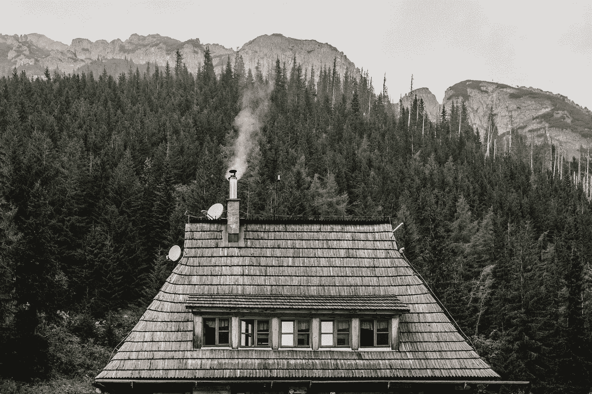

# 房子着火了。

> 原文：<https://medium.datadriveninvestor.com/house-on-fire-602b7fe15a1?source=collection_archive---------21----------------------->

## 当庇护所成为一种需求而不是需要。

你可以说我老土，但我以拥有所有权为荣。

Photo by [Kamil Szumotalski](https://unsplash.com/@kamilszumotalski?utm_source=medium&utm_medium=referral) on [Unsplash](https://unsplash.com?utm_source=medium&utm_medium=referral)

我从小就相信，一旦我开始谋生，拥有一栋房子应该是我的首要任务。

保护那栋房子是一种责任。

时代变了，经济也付出了代价。

我开始意识到，除非我们都是比特币百万富翁，否则我们不会很快买房子。

我们租了它。

可能不完全是。

可能只是一部分。

抵押贷款曾经是一个可行的解决方案，但社区之间的对话已经演变。

不知何故， ***【拥有一栋房子】***的想法并不是未来的头等大事。

我的父母能够直接购买他们的第一套房子，没有贷款或抵押——仅仅通过他们的储蓄。

那是 30 年前的事了，在我的成长过程中，随着家庭的成长，我们换了房子；在我 20 岁出头的时候，终于在我们最后的家安顿下来。

我很快就要购买自己的房子了，我最亲近的人似乎不理解我为什么要" ***"买*** "一套房子，而我可以" ***租*** "一套。

他们可能是对的，论点有道理(？)

*   我可以用这笔钱来投资。
*   我可以用这笔钱来教育。
*   我可以用这笔钱来应急。
*   我甚至可以买一艘船，住在上面。

但我想要一栋房子，因为它将是我的——至少，希望它不会被夺走。

除非我决定赌一把。

退休金基金对我来说越来越没有意义，原因如下:我想我宁愿现在就用这笔钱，而不是等到我退休的时候——在我这个年纪，我可能对它没什么用处。

我有健康保险，我很幸运能负担得起。

一般人做不到，也很可悲。

这是否意味着他们有一天必须做出决定，我是为孩子的健康买单还是买房子？

这是一个艰难的决定，毫无疑问我们注定要失败。

我们期待着我们的父母，想知道也许我们会继承他们的房子。

但是如果你不是独生子，这将会是一场艰苦的拉锯战。

我有机会参观了我长大的家，它变化很大。

墙上贴满了壁纸，高高的玻璃窗现在矗立在曾经是我的秘密阳台的地方。

我按响了门铃，希望不要让自己看起来像个讨厌鬼——给他们看了一张万圣节我穿着蝙蝠侠服装站在楼梯上的照片，说着 ***“这曾经是我的家，如果你不介意，我可以进来吗？”。***

他们非常热情地款待了我。

问我哪个房间是我的，我们在哪个房间制造了最大的麻烦。

问题是房间已经变了，我无论如何也描述不出我以前在哪里捉弄我的兄弟姐妹，或者我们玩捉迷藏的时候我藏在哪里。

我父母的房间还是老样子，窗户还是原来的样子。

楼梯没变，但护栏不同了。

他们笑了，告诉我他们有更守规矩的孩子——我完全同意。

在我离开时，我问他们什么时候搬进来的，他们说 6 个月前——这让我很吃惊。

***“那是最近的？”***

“不是最近，我们通常每两年搬一次家。”， 他们通知了我。

我想知道那些记忆呢。

***“我猜频率变了，我们每 7-8 年搬一次家……如果是这样的话。”***

T21:“嗯，我们通常不得不搬家，因为我们付不起房租。”， 他们谦逊地说。

> 他们没有房子，谁有？——我想知道。
> 
> 有人告诉我，一家企业确实如此。
> 
> 那是他们的租借地。
> 
> **不是房贷，只是生意。**
> 
> 我想知道会是什么行业，房地产吗？
> 
> 嗯，不，实际上是一家钻井公司——他们猜的。
> 
> 这是一家外国公司。
> 
> **在这里不存在或不起作用。**
> 
> 对他们来说，这是一项投资。
> 
> **一栋着火的房子供居民居住。**