# 基于机器学习的房屋定价

> 原文：<https://medium.datadriveninvestor.com/house-prices-linear-regression-eb57efeeb965?source=collection_archive---------2----------------------->

# 内容

1.  **简介**
2.  **项目目标**
3.  **3.1 数据**
    总视图。**数据帧**3.2
    。**组合测试和训练装置**
4.  **数据清理**4.1
    。**缺失值**4.2
    。**数据输入**
5.  **数据探索**
    5.1。**探索数据**
    5.2。**编码序数数据**
    5.3。**离群值**
6.  **特征工程**6.1
    。**变假人**
    6.2。**创建新功能**
    6.3。**创建四个特征类别**
    6.4。**主成分分析**
7.  **建筑模型**7.1
    。**从特征集构建模型**
    7.2。**打造五款新车型**
8.  **高级型号**
    8.1。**改进型号 3**8.2
    。**山脊和套索调整**
9.  **结果**

## 1.介绍

在这个项目中，我们致力于估算房价，这是一个当前的问题。众所周知，确定房价的一般做法是指派一名估价专家。然而，快速增长的人口和住宅数量迫使一些快速解决方案的出现。与许多领域一样，在这一领域，人们预测这一过程可以通过机器学习方法来加速，并进行了研究。我们的项目就是其中之一。我们的目的是准备一个预测性的数学模型，并使用这个模型来估计新房的价格。我们有埃姆斯市过去几年的房屋销售数据。我们研究了这方面的数据。我们使用**线性回归**创建模型。本项目中创建的模型将在项目中讨论。

 [## 机器学习对外汇交易的挑战——数据驱动的投资者

### 机器学习是人工智能的一个分支，之前占据了很多头条。人们是…

www.datadriveninvestor.com](https://www.datadriveninvestor.com/2019/02/18/the-challenge-of-forex-trading-for-machine-learning/) 

## 2.项目的目标

在这个项目中，我们将建立一个预测房价的回归模型。**目标**变量是房价，**销售价格**列在数据中。

我们有一个包含埃姆斯市 1460 栋房屋的建筑特征记录的数据集。首先，我们将从探索性数据分析开始。在下面的部分中，我们将评估几个用于预测的线性回归模型，并通过它们自身的预测能力来比较它们。

## 3.数据的一般视图:

我们在数据中有 81 列，但是‘Id’列对我们来说没有意义。因此，我们可以说，训练数据有 80 个变量，我们将要处理，测试数据有 79 个变量，不包括**销售价格**。我们的数据中还有 1460 个观察值。

## 3.1 数据帧

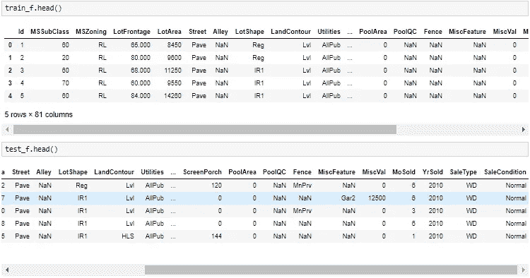

## 3.2 组合训练和测试集:

我合并了训练集和测试集，因为我想用相同的方法清理和填充它们。

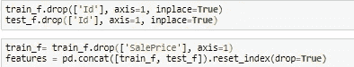

## 4.数据清理

## 4.1 缺失值

让我们检查一下数据集中有多少丢失的值。

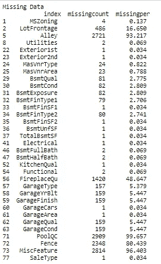

Alley，PoolQC，Fence，mischaracter 变量有太多的缺失值无法填充，所以我把它们都删除了。

## 4.2 数据输入

不同的方法被用来填充变量。在填充过程之后，在训练集和测试集中不再有丢失的值。然后我们分开训练，再次测试。

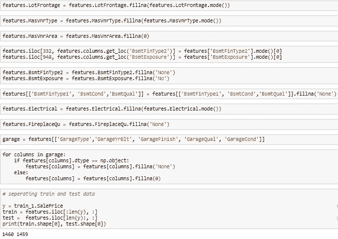

## 5.数据探索

## 5.1 探索数据

## 让我们来看看分类和数字特征

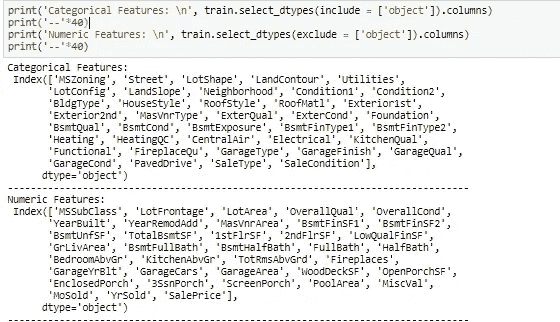

## 可视化分类数据:

在这里，我们可以看到一个类别中每个项目的项目频率和**销售价格**平均值和模式。

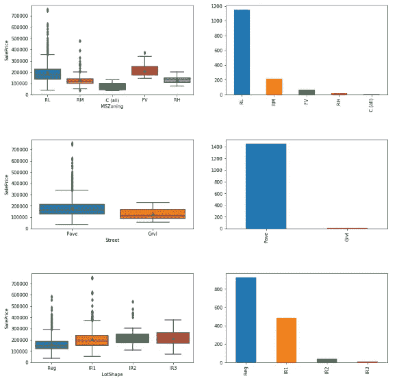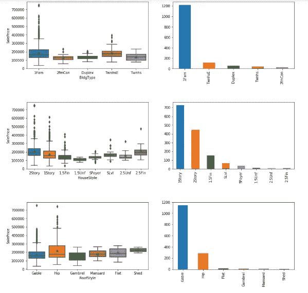

## 可视化普通分类数据

在这里，我们可以看到商品的数量、**销售价格**方式以及每件商品在类别中的平均值。但是这些类别不仅仅是分类数据。它们是普通的，这意味着我们可以认为它们是一种连续变量。在稍后阶段，我们将处理该案例。

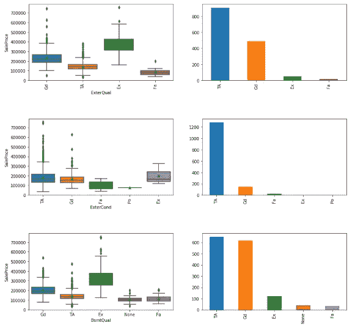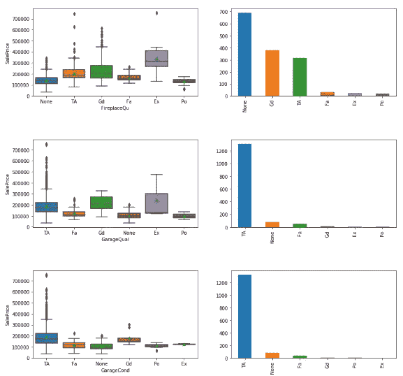

## 5.2 编码序数数据

这里，所有普通的分类变量都用 0 到 5 之间的数字编码。这种方法不能把序数准确地转换成数字，但它可能仍然有效。

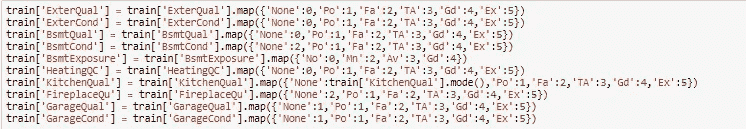

## 普通分类变量相关性

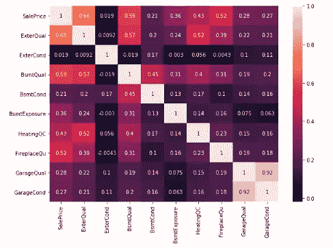

在这个关联图中，我们不能说这些值是完全真实和有意义的，因为它们在开始时不是连续的，但它给了我们一个关于它们在编码后的重要性的预推断。

## 5.3 异常值

我们试图处理连续变量的异常值。我们将 winsorization 保持在 5%左右，因为如果我们将这个比例提高太多，可能会导致一些副作用。删减太多信息可能不是最好的办法。

顺便说一下，有些变量没有 winsorized。因为有些变量的大部分值都是 0，而箱线图显示其余值都是上划线，只是因为其余值不为 0，但它们不是上划线。

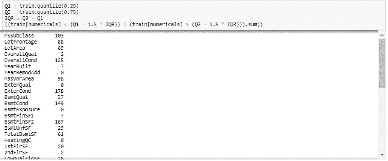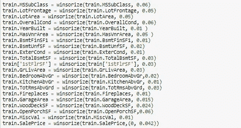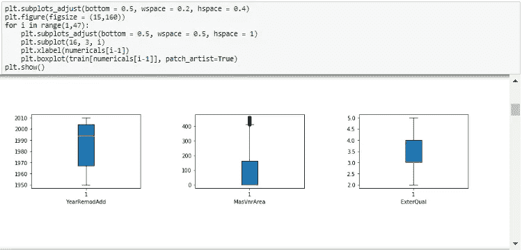

## 6.特征工程

## 6.1 获得假人

## 将分类变量变成假人

这里，我们连接训练集和测试集。所以我们可以一起做假人。

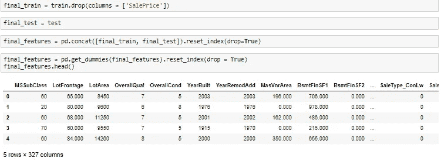

## 6.2 创建新功能

我们已经有一些变量来解释我们的预测模型的数据，但我们可以从现有的变量中创建更多的变量。我们的一些新功能可能有助于我们构建更好的模型。如果他们不这样做，我们就不使用他们，就这样。所以，多多益善。

## 新功能:

*   *现有特征的组合*
*   *质量和条件特性的简单版本*
*   *简化特征的组合*
*   *新的多项式特性*

在这一章中，所有的新功能都已创建。

## 6.3 创建四个特征类别

*   *品质*
*   *位置*
*   *空间*
*   *建筑*

我们创建了这些类别来为每一个类别建立模型。我们将分别探讨它们的能力和预测准确性。这可能不仅仅是为了预测的目的，但是我们在这个项目中做了这个，因为我们想单独看看特性对销售价格的影响。让我们找到每个类别的列。

所有功能类别都已创建为列表。我们将建立**线性模型**并在以后使用它们。

## 6.4 主成分分析

这里我们做了一个**主成分分析**。这个分析向我们展示了有多少差异可以用多少特征来解释。在本节的末尾，我们将会看到，我们必须使用 169 个特征来解释 95%的总方差。这个想法可以从这里借鉴，包含 169 个特征的模型比包含 404 个特征的模型更好。它可能有更少的解释差异，但它会相当快。我们称之为权衡。

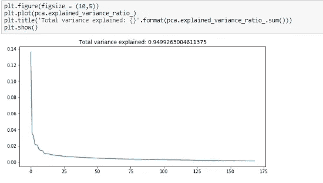

**有 169 个变量的 PCA** 可以解释总方差的 95%。

## 7.1 根据特征集构建模型

这些模型分别包含位置特征、空间特征、质量特征和建筑特征。

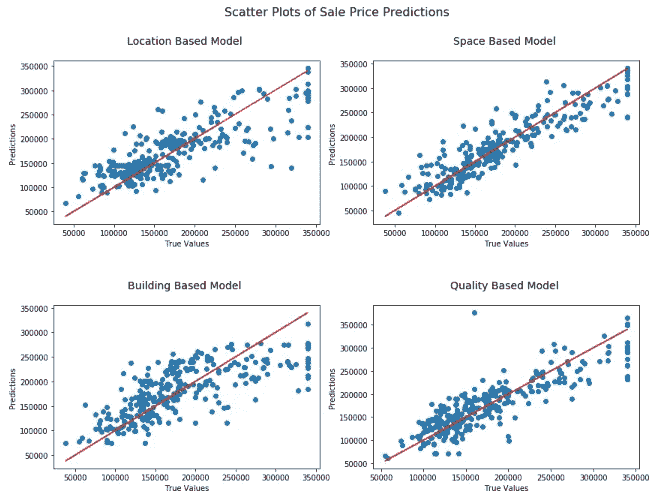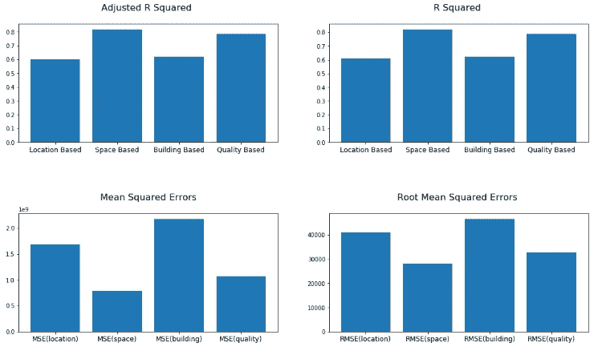

*   ***空间特征模型*** *似乎是最强大、最精确的模型。MSE 和 RMSE 都明显比其他人少。* ***优质型号*** *也好看，以下空间其次。*
*   ***天基*** *型号再好不过。调整后的 R 平方值差别很大。* ***基于质量的*** *模式在这里又是沿袭，有一点不同。*

## 7.2 构建五个新模型

在本章中，我们创建了 5 个模型，然后将它们可视化并相互比较。

## 我们是如何创建模型 0、1、2、3、4 的？

*   ***模型 0:*** *包含所有变量。*
*   ***模型 1:*** *在新的变量被创建之后，我只是查看了销售价格的相关性。通过查看增加的调整后的 R 平方图，选择了最高的 50 个。*
*   ***模型 2:*** *我创建了 4 个不同的类别来定义房子的不同特征，然后创建了 4 个不同的 OLS 模型。从这 4 个模型中，选择重要的变量，并查看与销售价格的相关性。已经选出了最高的 20 名。*
*   ***模型 3:*** *通过检查 p 值，从模型 2 特征集中移除了无关紧要的特征。*
*   ***模型 4:*** *我手动减少了模型 3 中的特征数量，创建了模型 4。目的是看看低维模型是如何工作的。*

我们合并了四个类别的功能，并创建了一个新的功能集。

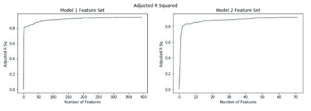

我们可以看到模型 2 的特性集更有优势。更快地达到更高的 R 平方。因为他们是根据一些标准挑选出来的。

## 分割验证(测试)和训练集

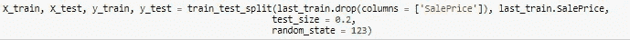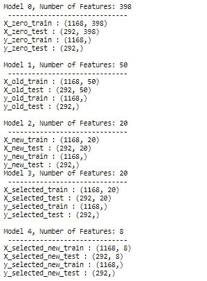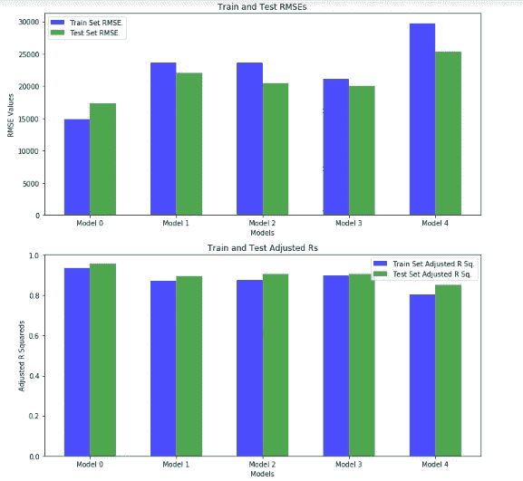

## 型号 0:

*   *最高调整的 R 平方*
*   *398 特性*
*   *最低 RMSE 值*
*   *平均过度拟合*

## 模型 1:

*   *调整好的 R 平方，低于 0 型*
*   *50 特性*
*   *比 0 型更高的 RMSE*
*   *比模型 0* 更低的过拟合

## 模型 2:

*   *调整好 R 方，同模型 1*
*   *20 特性*
*   *平均 RMSE，同模型 1*
*   *高于模型 1*

## 模型 3:

*   *调整好 R 方，同模型 1 和模型 2*
*   *20 特性*
*   *低 RMSE*
*   *最低过拟合*

## 模型 4:

*   *最低调整的 R 平方*
*   *8 个特性*
*   *最高 RMSE*
*   *最高过拟合*

显然看到了，模型 3 最好。它有一个低数量的功能，良好的调整 R sq。与其他产品相比，具有最低的 RMSE(误差)和最低的过拟合。我们将在后面的章节中改进这个模型。

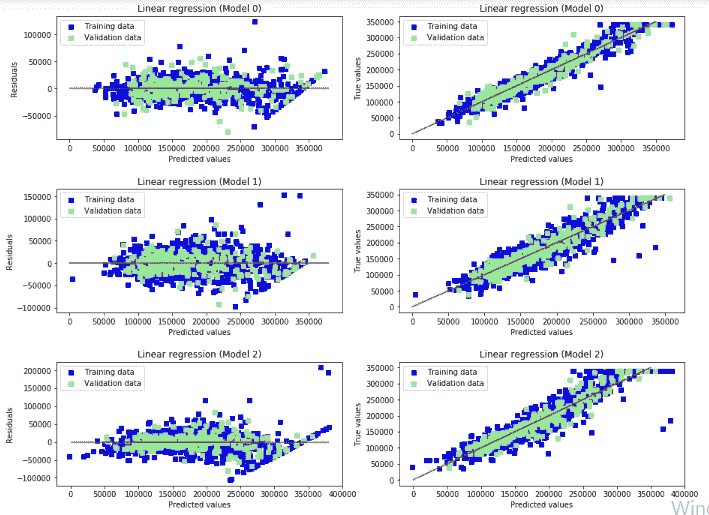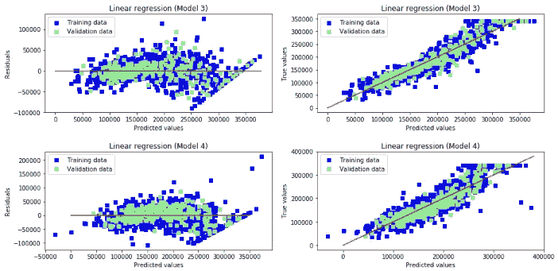

在残差图中，我们需要观察误差的分布。它必须趋于均匀分布。如果没有，可能存在**异方差**。我发现，在所有这五个模型中，当房价上涨时，误差往往呈线性分散。我们需要解决这个问题，实现**同方差**。到目前为止，**我们目前最好的型号是型号 3**。让我们改进它。

## 8.高级模型

## 8.1 改进模型 3

## 我们建立了模型 5 和模型 6 来改进模型 3。我们是如何建造它们的？

*   *模型 5:我们建立了模型 5 来解决残差图上检测到的* ***异方差*** *问题。模型 3 和模型 5 的区别在于，因变量经过了对数变换。*
*   *模型 6:我们在模型 5 无法解决* ***异方差*** *。这一次，我们使用了非 winsorized 目标变量，并对其进行了日志转换。然后* ***异方差*** *消失了那就好了。*

我们检查了独立变量在四个标题下的分布，见下图。

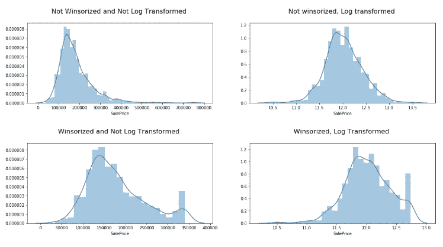

在 winsorized 和非 winsorized 变量分布中，我们可以清楚地看到偏斜度。为了解决这个问题，我们可以尝试对目标变量进行对数转换。最接近正态分布的分布在右上图。未经过 winsorized 和 log 转换。我们将在稍后的模型 6 中对此进行评估。

## 模型 5

我在模型 3 中使用了相同的变量。但是，我对相关销售价格变量应用了**对数变换**。

## 模型 6

我使用了与**模型 3** 和**模型 5** 相同的变量。我再次对因变量应用了对数变换。因变量——销售价格——现在没有被 winsorized。尝试并检查**异方差**是否会得到解决。

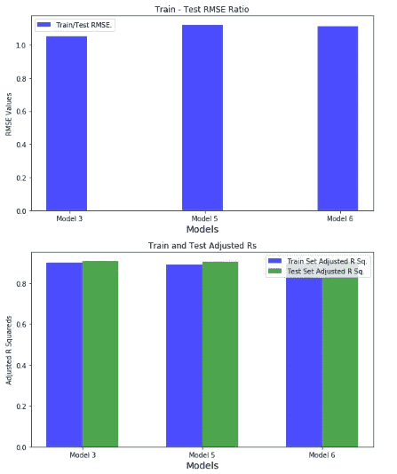

上图显示，跨检验 RMSE 比率略有不同，但不会太大。所以我们不必在意过度拟合。底部曲线表示调整后的 R 平方值，它们几乎相同，任何人都没有看到过度拟合。

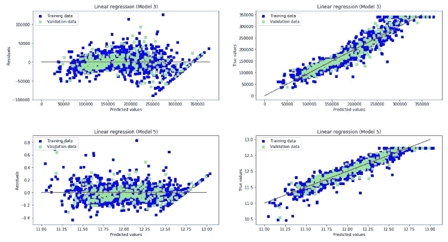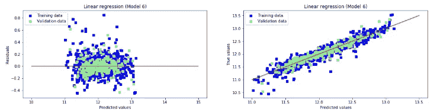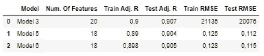

在上面的**残差图**中，**模型 3** 和**模型 5** 的残差分布不均匀。尤其是较高的销售价格，估计是不同的。这意味着，我们不能成功预测高价格的房子。这就是我们制造**型号 6 的原因。**在**模型 6** 中，我们对**售价**(本次未中标)变量进行了对数变换。在**模型 6** 地块，**异方差**消失。

## 8.2 山脊和套索的调整

在这一部分，我们使用正则化方法建立了两个不同的模型。**山脊**和**套索**是**线性回归**的类型。

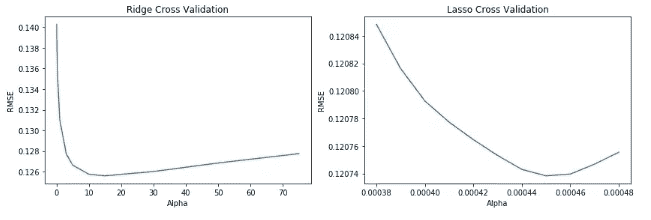

通过**交叉验证，**我们可以看到每个 alpha 值的最低平均 rmse。对于山脊，最佳 alpha 参数为 15，对于套索，最佳 alpha 参数约为 0.00045。我们使用了这些阿尔法值。

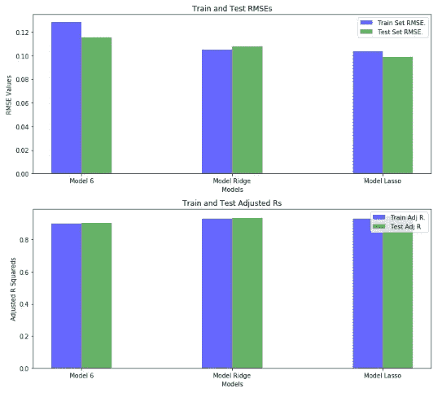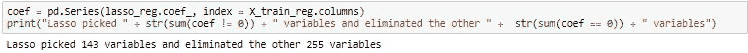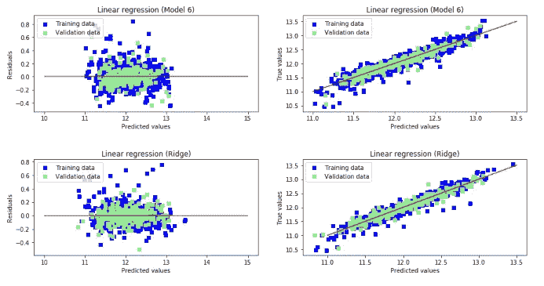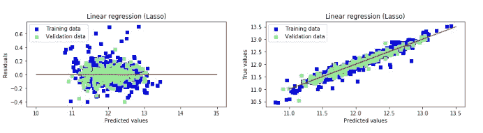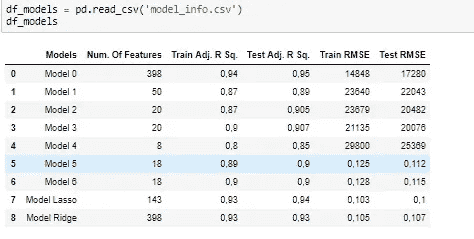

这里我们对比了**6 型、脊型**和**套索型**。

*   *为 R Sq。而 RMSE 的价值观，* ***型拉索*** *型比* ***型 6*** *型和* ***型脊。***
*   *明显看出，* ***型拉索*** *比* ***型脊*** *好用。*
*   *对于多维度，* ***模型 6*** *特征数量较少。意味着它会比别人工作得更快。*
*   *对于***过度拟合，在它们中的任何一个都没有看到相当大的过度拟合，但是* ***模型 6*** *比其他的稍微过度拟合一些。**

# *9.结果*

*在整个项目中，我们使用了埃姆斯市的数据。起初，我们只有数据。作为该项目的结果，我们现在有了一个使用这些数据创建的机器学习模型。有了这个模型，我们可以估计这个城市待售房屋的价格。这个项目从开始到结束经历了哪些阶段？*

*   **问题定义**
*   **检查的数据**
*   **决定使用哪个型号**
*   **准备用于模型的数据**
*   **模型建成**
*   **中断检查**
*   **模型再次建成**
*   **模型的性能分析和可视化**
*   **车型对比**

*获得最佳模型的方法如下:*

*   **在建模部分，从五个模型(0，1，2，3，4)中，我们确定模型 3 为目前最好的模型。**
*   **选择模型 3 后，我们决定对其进行改进，因为存在异方差。**
*   **5 型和 6 型建成。**
*   *目前来说，6 型是最好的。*
*   **模型脊和套索建成。**

*在第 8 节的结尾，做了一个快速的比较。据此，我们可以说套索模型对应的是最好的结果。*

*   **在拉索模型中，解释了变异率 I 为 94%。**
*   *包含 143 个变量。*
*   **RMSE 约为 0.1**
*   **模型的验证和训练分数与 rmses 非常接近。**

*可能会担心功能的数量，但这不是必须的。因为在那个科目里，算率没那么重要。我们有足够的时间来预测。此外，我们将不必面对大量等待定价的房屋。除此之外，所有的统计数据都非常好，没有观察到过度拟合。*