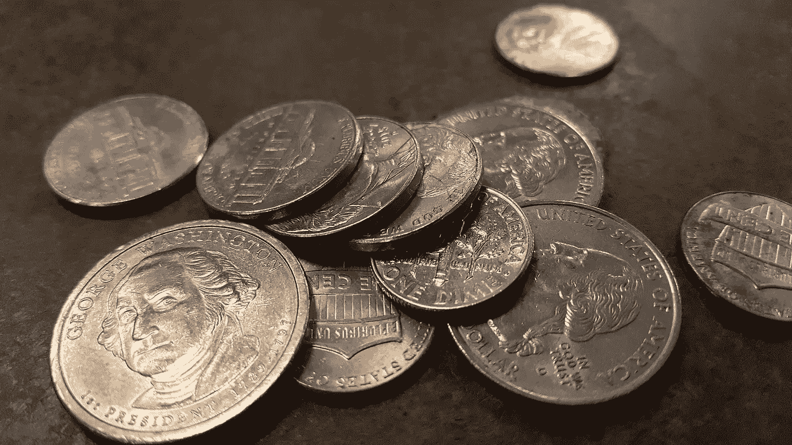

# 1.25 美元如何改变我的生活

> 原文：<https://medium.datadriveninvestor.com/how-1-25-changed-my-life-2a0f21091035?source=collection_archive---------59----------------------->

"$1.25?"不会吧！

你可能在想，1.25 美元或 5 个 25 美分硬币怎么可能对我的生活产生重大影响。你会惊讶的。

如果我告诉你，我们经常有机会改变别人的生活，但我们很可能没有意识到这一点。

我们大多数人都相信我们想在这个世界上做好事，帮助别人，回馈社会。

我们也可能赞同这样一种观点，即我们必须先做好自己，然后才能为他人创造影响。

这与事实相去甚远。

你可能会说我们的大部分生活都不是由重大事件组成的。

事实上，我们大部分的日常生活都是由日常事务或事件组成的。

真正的大事往往发生在我们面临一个可能改变人生的决定时。

去还是不去上大学。上哪所大学。申请什么工作。结婚或保持单身。嫁给谁。要不要孩子。什么时候要孩子。这样的例子不胜枚举。

对于我们中的一些人来说，可能是要不要去追求自己热爱的东西，开公司等等。

在这些大事件之间发生的一切都是短暂的。它们要么让我们做好准备，要么阻碍我们迎接未来。它们要么引导我们接近目标，要么引导我们远离目标。

> 生活真的是由许多小事情，小时刻，小机会组成的，这些加起来就是一个大馅饼。

沿着这些路线，我们在努力中取得了不同程度的成功，受到日积月累的小事的强烈影响。

我想你能明白我的意思。

给予的力量有多种形式。要成为一个给予者，我们不一定要给予慈善条款。

真正的付出是不求回报的付出。如果你帮助某人是因为你想从中获得什么，你不是在给予，而是在做交易。

交易型关系不会走得很远，因为双方都试图从对方那里得到什么。那是以后的事了。

那么 1.25 美元是怎么回事呢？

几年前，我和我的一位导师进行了一次改变人生的谈话。

他告诉我，“吉尔伯特，我想和你分享一些东西。每天早上拿出 5 枚硬币，放在左边的口袋里。

每当你为他人创造价值时，不管价值大小，从左边的口袋里拿出一枚硬币放到右边。当你把所有的 5 个硬币从左边的口袋移到右边的口袋时，你就完成了这一天的善举。每天都做。"

通过他，我知道了每天做一些善事的价值。硬币不是用来做记分牌的；它们仅仅是提醒你保持在正轨上。

你不一定需要使用 25 美分硬币或硬币。只要你有办法提醒你去寻找给予的方法。

已故的金克拉说:“如果你帮助足够多的人得到他们想要的，最终你会得到你想要的。”

一些任务，比如介绍一个相互接触的人，帮一个忙，甚至打电话问问别人怎么样了，这些都是小的善举可以有很大帮助的例子。

如果你经常真诚地付出，就不会被忽视。

> 在很多情况下，最终帮助你的人可能不是你曾经帮助过的人。不管叫不叫因果报应，宇宙自有它回报的方式。

我记得我第一次有机会在一家财富 500 强公司演讲。他们有自己的学习和发展团队，专门雇佣高质量的培训公司在他们的办公室开办研讨会。并不真正需要外部教练，更不需要一个没有这种能力支持的人。

起初，我被拒绝了，但几周后，总经理发来电子邮件，给了我一个在他们公司举办研讨会的机会，如果符合某些条件，还可能会给我一封推荐信。

我非常感谢他给了我这个机会，这给我的职业生涯带来了巨大的变化。

我们不需要经济上富有或事业上成功才能通过给予实现真正的财富。

> 事实是，我们都可以在给予中变得富有。如果一些阅读这篇文章的人开始行动起来，给他们周围的人、他们的家庭和他们的社区提供帮助，这个世界会有多大的不同？

最后，作为读者，我想请你帮个忙。

如果这篇文章启发了你或者为你创造了任何价值，我鼓励你与他人分享。让 1.25 美元的运动蔓延开来。

一个季度接一个季度，一个人接一个人，一个行动接一个行动，我们可以一起改变世界。

吉尔伯特是一名企业家、国际演说家、销售和网络教练，他教导他的客户如何培养稳固的商业网络，从零开始创造突破性的机会，即使他们性格内向或缺乏资源。你可以在[gilbertjoa.com](http://www.gilbertjoa.com)或者通过 LinkedIn [这里](https://www.linkedin.com/in/gilbertjoa/)找到更多关于他的信息。

