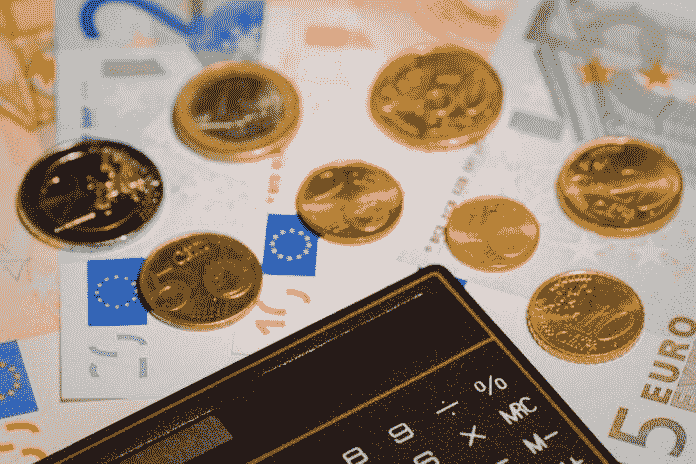

# 每天 20 分钟如何拯救你的财务

> 原文：<https://medium.datadriveninvestor.com/how-20-minutes-a-day-can-save-your-finances-a737a1c9cd11?source=collection_archive---------14----------------------->

Photo by [fran hogan](https://unsplash.com/@franagain?utm_source=medium&utm_medium=referral) on [Unsplash](https://unsplash.com?utm_source=medium&utm_medium=referral)

似乎永远没有时间给你的生活带来改变。尤其是重大的变革似乎太令人望而生畏，难以实施。我们找借口，回到我们的舒适区。生活总是和我们擦肩而过。

其中一个我们似乎很害怕的变化是控制我们自己的财务。当你不得不面对你最害怕的事情时，不知道似乎是更好的选择。

 [## 外汇投资如何帮助偿还债务|数据驱动的投资者

### 外汇是对外汇市场的投资，不同国家的货币在外汇市场上进行兑换

www.datadriveninvestor.com](https://www.datadriveninvestor.com/2019/02/13/how-forex-investment-helps-to-repay-your-debts/) 

“金融”已经变得如此可怕，这也于事无补。它要么激发无聊的反应，要么激发纯粹的恐惧。所以我不会在本文中过多使用金融这个词。我就称它为*资金管理*。这可能是我迄今为止最棒的营销伎俩，因为从*管理*这个词中似乎可以推断出许多积极的含义。所以我们开始吧。

控制你的财务，不好意思，控制你的资金管理似乎是一项令人生畏的任务。你从哪里开始？什么重要，什么不重要？

讽刺的是，最重要的部分是你开始。让一项任务看起来不那么令人畏惧的最快方法是把大任务分成小任务。你可以在一小时内完成的小任务，最好是 20 分钟以内。从长远来看会增加的事情。但是现在不要要求太多。

那么，你的财务状况会是怎样的呢？好吧，让我给你举个例子，告诉你如何计划第一周:

**第 1 天**:计划第 1 周
**第 2 天**:研究&安装 app 跟踪你的所有支出，给出关于储蓄的建议
**第 3 天**:订阅至少 10 个[个人理财](https://www.datadriveninvestor.com/glossary/personal-finance/)博客(包括电子邮件和时事通讯！)
**第四天**:集思广益，确定一个金钱目标
**第五天:阅读新博客+做笔记
**第六天**:阅读更多内容，总结你目前所知的内容
**第七天**:用你积累的知识计划第二周**

**你可能会想:是这个吗？嗯，第一周会的。记住，你每天只留出 20 分钟。如果你想留出更多你可以，进展会更快。然而，我答应你每天 20 分钟的指导，这就是你将得到的！**

****

**如你所见，第一周充满了研究。为什么？因为资金管理最令人畏惧的部分往往会被忽略。只是不知道从哪里开始，什么是重要的，如何处理复利，债务，偿还债务等等。重要的是你有专家(很多博主都有！)帮忙指导你。**

**一旦你觉得你已经获得了一些不错的信息，你就可以设立目标，并朝着这些目标做出积极的改变。你的应用程序仍然在后台跟踪你的支出，所以你可以利用这 20 分钟快速查看你的钱去了哪里，以及你是否仍然可以接受。**

**第二周的计划可能是这样的:
**第一天**:订阅更多的个人理财博客
**第二天**:阅读博客+给旧笔记添加笔记
**第三天:**总结理财应用的发现
**第四天**:调整你的理财目标或坚持最初的目标
**第五天**:分解如何每周、每月、每年达到你的目标。
**第 6 天**:总结目前为止你所知道的
**第 7 天**:用你所积累的知识计划第 3 周**

**一旦你养成了每天或每周花 20 分钟做这件事的习惯，你会发现自己与众不同。你的思想已经屈服于这个想法。你可能会开始对这 20 分钟感到兴奋，而不是恐惧。你可能会开始对实现你的中期目标感到更加兴奋。你可能会对最终目标感到兴奋。**

**通过最终把自己交给这个只有 20 分钟的想法，你已经允许了改变。**

**这样过了几个星期后，你有了一个计划，有了一个习惯，但更重要的是，你觉得你可以产生影响，改变不再是一件可怕的事情。你已经控制了它。你可以做到的。**

**每天只需一小步，就能发现你做对了什么，做错了什么。无论是金钱、爱情、工作、锻炼还是友谊。20 分钟可能就够了！**

**莫尔·范·登·阿克是华威商学院行为科学专业的博士生。她研究非接触式和移动方式对我们管理个人财务的影响。在她的“空闲”时间，她写关于个人理财、行为科学、行为金融和博士生生活的文章，确保学术界的知识流入主流，并能帮助尽可能多的人！**

***原载于 2019 年 11 月 20 日 https://www.datadriveninvestor.com***。****