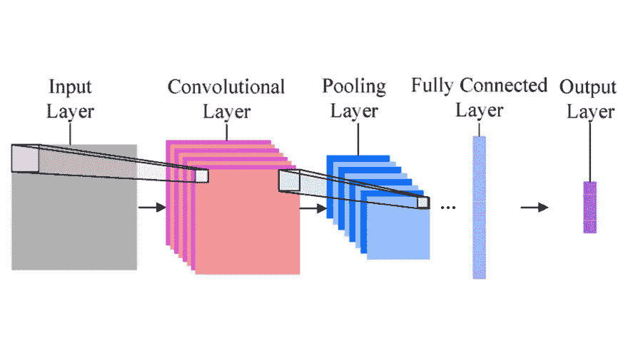
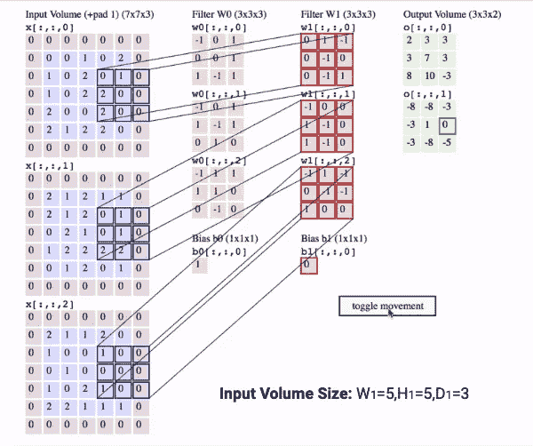
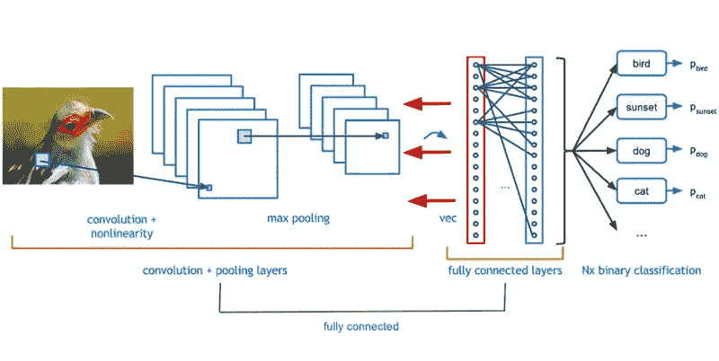
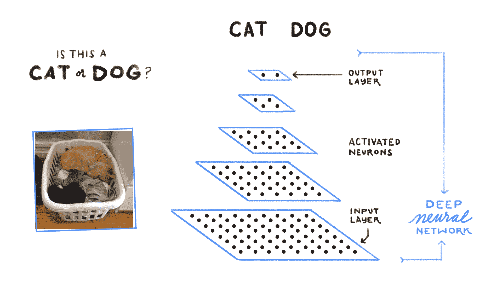
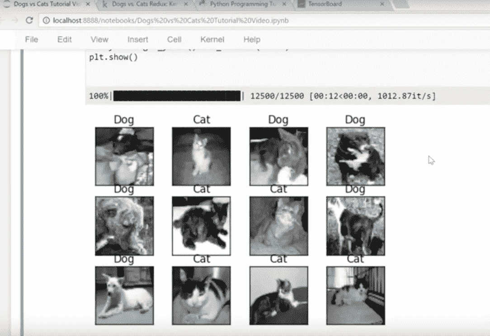

# 计算机如何看待图片:图像分类

> 原文：<https://medium.datadriveninvestor.com/how-a-computer-looks-at-pictures-image-classification-a4992a83f46b?source=collection_archive---------2----------------------->

## 使用 Python、TensorFlow 和 Kaggle 制作

我们的眼睛为我们提供了许多基于它们所见的信息，并且由于它们，我们对周围的一切(视觉上)有了足够的了解。当我年轻的时候(比我现在还年轻😄)，我一直想知道我们的大脑是如何理解我们看到的东西的，但当我开始研究新兴技术时，这个问题在我脑海中诞生了…

> 计算机是如何理解图像的？

为了找到答案，我做了大量的研究并编写了一些程序。这就是我在这篇文章中要谈的。

> *你想想，人工智能里的一切都是有联系的。当你大致了解了*[*【AI】*](https://medium.com/@deviupadyay18/the-existence-of-ai-in-our-daily-lives-1e0b3f83d6df)*之后，你就潜到了* [*ML*](https://medium.com/datadriveninvestor/what-is-machine-learning-and-how-does-it-work-6af591f48db) *，这又把你带到了*[*deep learning*](https://medium.com/@deviupadyay18/can-robots-think-like-humans-what-is-deep-learning-956fed7d5333)*。(无耻的推广到我的其他文章😜)*

## 这是什么？

图像分类是指使用**上下文**信息对任何图像进行分类。上下文信息基本上是像素中的信息(我们将在后面更深入地研究)。基于这些信息，计算机对不同的图像进行分类(例如，狗和猫)。

## 图像处理

计算机实际上无法像我们人类那样识别或看待图像。所以，我们必须想办法把这些图像转换成数字。在图像处理方面，有两种常见的方法:

1.  **灰度** -从白色到黑色的一系列灰色阴影。

当使用灰度时，计算机根据像素的暗度给每个像素分配一个值(数字)。

2. **RGB** **值** -红色、绿色和蓝色的组合。

一旦一种颜色被赋予一个 RGB 值，计算机就从每个像素中提取该值，并将结果放入一个数组中进行解释。

*阵列是指某物以某种方式排列或显示。*

## 卷积神经网络

CNN 利用了这样一个事实，即在任何给定的图像中，**邻近性与相似性强烈相关。**这意味着，与相距较远的两个像素相比，彼此靠近的两个像素更有可能相关。而在典型的神经网络中，每个像素都连接到每个神经元。

CNN 通过给定的邻近度过滤连接，使图像处理变得方便。CNN 不是将每个输入连接到给定层中的神经元，而是有意缩短连接，以便只有一个神经元接受来自其之前层的一小部分的输入。使得每个神经元只负责处理图像的特定部分。

**想知道它们是如何工作的吗？**

一个简单的 CNN 是一系列的层，每一层将一个激活量转换成另一个激活量。在卷积神经网络中有三种主要类型的层。卷积层、池层和全连接层。

## 卷积层

卷积层是卷积神经网络的核心构建模块，完成大部分计算工作。

卷积层参数由一组滤波器组成。每个过滤器都很小，但它延伸穿过输入体积的整个深度。

Since 3D volumes are hard to visualize, all the volumes are visualized with each depth slice, stacked in rows.

## 汇集层

共享图层旨在减少制图表达的空间大小，从而有助于减少网络中的计算量和参数。

池层使用称为 MAX 操作的东西来调整深度切片的大小(Max 操作基本上是使用来自前一层的每个神经元集群的最大值)。

## 完全连接的层

最后一种类型的层是全连接层。完全连接层中的神经元可以访问和完全连接前一层中的所有激活，就像任何其他常规神经网络一样。

Like you see in this image, all the layers are connected (that’s why it’s called the **fully** **connected** layer)

好吧！背景信息说够了！这对图像分类有什么帮助？嗯…

## 最后一步:图像分类

一旦图像通过卷积神经网络，计算机就能识别图像是什么。现在，它所要做的就是重复这个过程，直到它学会了关于物体的不同模式。因此，使用这个图像中的例子，计算机将使用*图像处理*和*CNN*来识别一些狗的图像，当给定一个图像文件时，应该能够正确地对所有图像进行分类和分组！

这是最后一步！

## 关于我的计划

You will learn more about this in my video!

我自己编了一个对猫和狗进行分类的图像分类程序！！！为了这个项目，我从 Kaggle 下载了一个文件，里面有不同的狗和猫的图片。如果你认为这很酷，你完全应该看看我关于这个的视频！

如果你喜欢我的文章，分享给我掌声吧！请务必在[***LinkedIn***](https://www.linkedin.com/in/devanshi-upadhyay-5853b9152/)***和 Medium 上关注我，随时更新我的旅程！要加入我的每月简讯，请发邮件至***[***deviupadyay18@gmail.com***](mailto:deviupadyay18@gmail.com)***！***