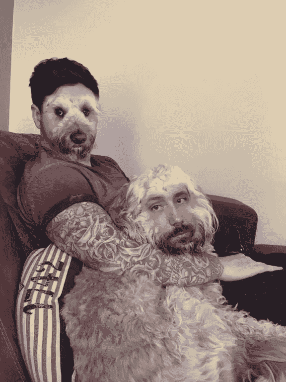
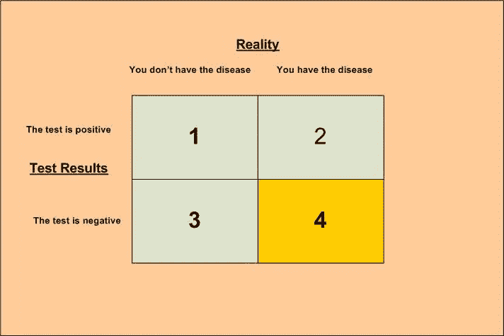
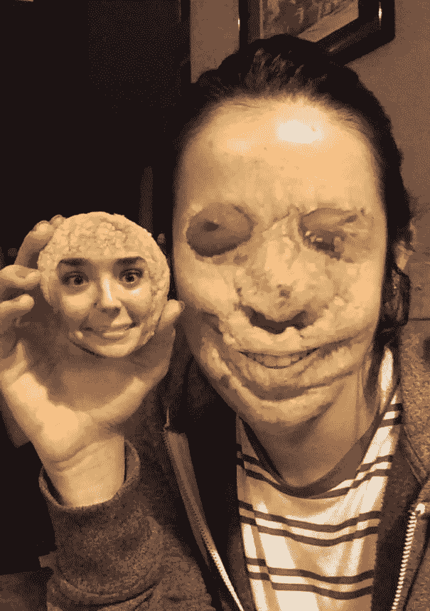
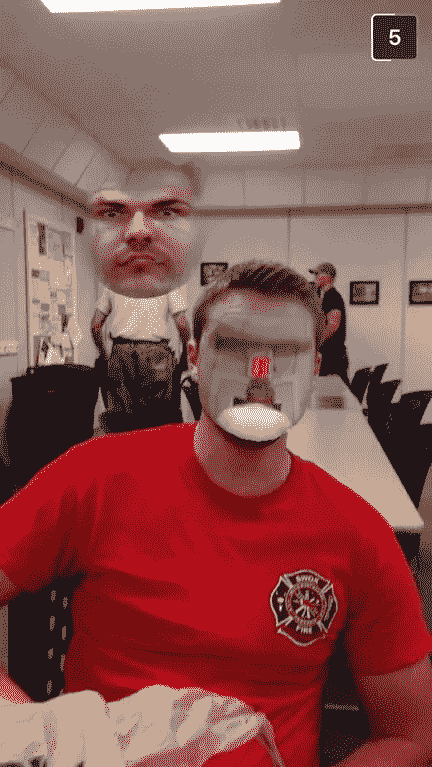

# 一个有趣的子编辑如何帮助解释机器学习

> 原文：<https://medium.datadriveninvestor.com/how-a-funny-subreddit-helps-explain-machine-learning-265aef3e8776?source=collection_archive---------1----------------------->

[https://www.reddit.com/r/InanimateFaceSwap/comments/85uy98/mans_best_friend/](https://www.reddit.com/r/InanimateFaceSwap/comments/85uy98/mans_best_friend/)

当谈到人脸检测时，没有什么比在一些无生命的物体(或动物)中检测人脸更令人沮丧(或好笑)的了。

当这种情况发生时，它被称为假阳性。它*正面地*辨认出一张脸，*反面地*。有时，跟踪假阳性、真阳性、假阴性和真阴性之间的区别有点令人困惑。

[https://jonboeckenstedt.files.wordpress.com/2008/10/disease-test-quadrant.jpg](https://jonboeckenstedt.files.wordpress.com/2008/10/disease-test-quadrant.jpg)

这个例子真的帮我弄清楚了。如果你正在进行某种家庭医学测试，你可以将情况分为这四类中的一类。你有这个病，你没有这个病，测试说你有这个病，测试说你没有这个病。

在医学诊断中，最危险的组合是；你有一种疾病，但测试表明你没有。

在人脸检测中(这远没有生命危险……可能),同样的分类也适用；有一张脸，没有一张脸，软件检测到一张脸，而软件没有检测到一张脸。

有趣的是，当人脸检测系统没有检测到人脸时，我们似乎更加宽容。通常(但肯定不总是)是因为脸转向了一边，在阴影中变得模糊，被一个物体或我们人类大脑理解的其他原因挡住了。我们的困难在于理解为什么一些无生命的物体会被混淆为一张脸。

我最喜欢的一个子主题很好地概括了这一点:[**r/inaimatefacswap**](https://www.reddit.com/r/InanimateFaceSwap)

[http://i.imgur.com/E2qIEoX.jpg](http://i.imgur.com/E2qIEoX.jpg)

[https://www.reddit.com/r/InanimateFaceSwap/comments/50ka32/face_swapped_with_the_exit_sign_and_the_back_of/](https://www.reddit.com/r/InanimateFaceSwap/comments/50ka32/face_swapped_with_the_exit_sign_and_the_back_of/)

发生这种情况是因为这些应用程序使用的任何面部检测技术都会返回误报。也就是说，他们在没有面孔的地方发现了面孔。在这个特定的应用程序中，它返回了一些有趣的结果。

但这也是一个重要的教训，有助于对机器学习的总体理解，以及你在实现它时将面临的一些挑战。

我们不知道为什么它会在那些无生命的物体中检测到一张脸。它使用的识别方式与我们人类大脑使用的不同。有时它真的工作得很好，而其他时候它失败了。就像我们一样。虽然它在我们擅长的事情上失败了(比如区分饼干和人脸)，但在速度和准确性上，它都超过了我们，比如在 1000 张人群照片中计数人脸。

每当我建议客户集成我公司的机器学习工具时，我总是试图让他们准备好不可避免的假阴性和阳性，因为优雅地处理这些情况是在你的业务中成功实施人工智能的关键。