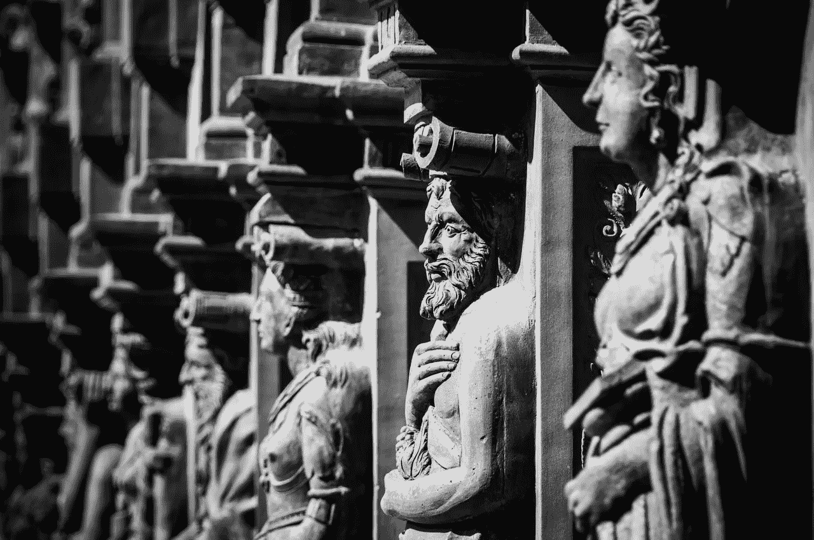

# 一个历史学家如何震撼我所知道的世界

> 原文：<https://medium.datadriveninvestor.com/how-a-historian-shakes-the-world-i-know-308b7bf94f18?source=collection_archive---------27----------------------->

> 永远不要低估人类的愚蠢。这是塑造世界历史的最强大的力量。尤瓦·诺亚·哈拉里

在我认识作者尤瓦·诺亚·哈拉里之前，我就知道‘T0’智人的重要性。我第一次被正式介绍是在詹姆斯·阿尔图切的节目中偶然看到他在[的播客采访。节目进行到一半时，我被他的思维方式迷住了，我问自己，为什么我以前没有这样想？](https://jamesaltucher.com/2018/09/391-yuval-noah-harari/)

节目结束时，我被尤瓦·诺亚·哈拉里讲述的人类过去、现在和未来的故事迷住了。我拿起萨皮恩，开始在 Youtube 上挖掘他最近的采访。

尽管他从宏观层面看待世界，并在世界经济论坛(World Economic Forum)上谈论重大紧迫问题，但我发现了一些令人震惊的观点，这些观点与像你我这样的每个人都相关。

# **自由意志排名第一:你可以被黑**

Yuvah 采访中的一个常见主题是，当我们在不知情的情况下收集了这么多关于我们的数据时，我们有被黑客攻击的危险，我们不知道谁拥有这些数据，也不知道这些信息将如何被使用。

数据的一个常见应用是算法如何从 Youtube、网飞、谷歌和亚马逊向我们推荐看什么、买什么或去哪里。当算法比我们自己更了解我们的时候，我们还有行使自由意志的权力吗？我们是不是无意识地把思维外包给了算法？

在商业消费之外的更深层次上，当我们的生物特征数据被企业或政府收集时，我们是否能完全控制自己的存在？为了组织的利益，他们能为我们做些什么？

# **#2 教育:管理你的思想**

按照目前的技术进步速度，尤瓦预测，今天的年轻一代在他们的一生中将有几个职业周期。虽然个人重塑对年轻人来说相对容易，但当一个人变老时，这可能是心理上的挑战。

因此，今天年轻一代需要掌握的最重要的技能是情商和精神管理。问题是，学校教给学生的技能是为工作做好准备，而不是为未来做好准备。

在未来，清晰是力量，而不是知识。换句话说，过去至关重要的收集信息的能力，现在远不如筛选信息的能力重要。

# **#3 工作:剥削总比不相干好**

当尤瓦谈到约伯的未来时，他说我们应该保护人类而不是工作。虽然有很多关于机器取代导致国家失业的对话，但 Yuvah 向我们指出了全球范围内更大的问题——国家之间日益扩大的差距。

发达国家可以对劳动力进行再培训，并部署机器在当地运营制造工厂，而牺牲第三世界国家的利益。在第三世界国家，劳动力变得无关紧要，缺乏应对工业革命浪潮的资源。

在这种状态下，我们会如何看待这个世界？

# **激起和唤起**

Yuvah 站在世界上一些最重要的舞台上，用我们作为一个物种所面临的现实和风险来激发和唤起所有层次的人们，这是勇敢的。

当被问到我们的未来会是什么样时，他总是以“我不知道”结束，尽管假设是基于事实和统计的。

这就是我们需要的领导透明度，他们正引领我们的航船驶向未来。没有人知道未来会怎样，也不知道人们会对“钱”和“制度”的故事坚持多久。

乐观地说，我们人类是地球上适应性最强的物种。Yuvah Noah Harari 的作品让我能够看到一个更大、更清晰的世界图景，并更深入地思考我在人类列车上的角色。

在我的控制范围内我能做什么？

***大家好，我是《拥有你的故事的艺术*** ***》一书的作者伊莎贝拉，我写的是关于有意识的生活和个人成长，建立了一个名为“拥有你的故事”的播客。可以跳上***[***www.isabellethye.com***](http://www.isabellethye.com)***阅读更多文章。***

如果你喜欢你所读的，你的掌声对我来说意义重大！谢谢:)

