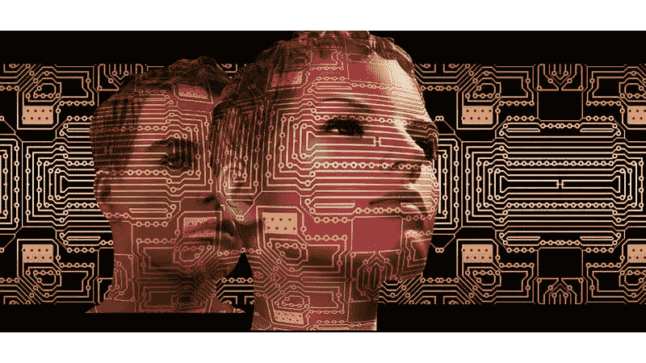

# 人工智能将如何颠覆配音行业

> 原文：<https://medium.datadriveninvestor.com/how-a-i-will-disrupt-the-dubbing-industry-11f399989615?source=collection_archive---------2----------------------->

关于人工智能，我最喜欢思考的是这项技术在现实世界中的应用能力。

我知道这里提出的想法并不像听起来那么容易实现，但我相信它们在中期是可行的。

 [## 今年值得关注的人工智能趋势——数据驱动的投资者

### 预计 2019 年人工智能将取得广泛的重大进展。从谷歌搜索到处理复杂的工作，如…

www.datadriveninvestor.com](https://www.datadriveninvestor.com/2019/02/19/artificial-intelligence-trends-to-watch-this-year/) 

## 电影配音:人工智能流程管道

**步骤 1:** **从电影**中去除脚本的文字，将原始音频文件和书面脚本作为输入。
这个过程可能需要人工智能在音轨中寻找指定的单词，这已经由智能助手完成，并在不破坏背景声音的情况下删除它们，这真的是唯一的困难部分。
如今，在没有原话的情况下重建音频以用于配音的方法既繁琐又耗时。我们目前使用一些无声时刻的背景噪音，并在他们说话时将其粘贴为背景。人工智能可以做类似的事情。

**第二步:翻译电影剧本**(用 AI，何乐而不为？).今天的翻译服务已经相当不错了，但它们将继续发展完善。
我相信这项技术在 5 年左右的时间内就能达到人类的水平。

**第三步:** **模仿演员的声音，念出翻译剧本的话。**在这一点上，我们有翻译的句子还没有应用到原始音频。你可能认为这一步比实际情况更遥远。创业公司 Lyrebird 已经能够复制你自己的声音，如果你输入一些短语的话——但这仍然是一个概念验证，对于这种应用来说还不够准确。

**第四步:** **将生成的句子应用到原音轨**，确认语调、口音、语速等。两条轨道看起来一样。这是整个过程中最难的一步。它必须从零开始，可能是这个应用程序的瓶颈。一个想法可能是获得原始音轨中每个句子开始和结束的时间戳，并用它来适应新音轨中翻译的相同句子，但这需要大量调整才能感觉自然。

第五步: **同步视频以更好地适应新的音频。**
这包括生成额外的帧来调整不同语言的演讲长度，并使用现有的深度伪造视频技术算法来同步演员的嘴唇和新的轨道。这是为配音添加保真度的最后一层，这意味着观看翻译的电影与原版没有明显的区别。
可以部署一个对抗性网络来衡量配音过程的表现，训练一个模型来区分原始视频和自动配音的视频。

我不知道完成这样一个过程需要多少时间，但我预计在未来 10 年内，我们将为这种令人兴奋的应用程序准备好所有的构件。

当然，这也可以用于 Youtube 视频，例如，你可以用自己的语言观看 Youtube，所有其他语言的视频都将被自动配音。这将需要一个额外的步骤，即以文本形式从每个视频中推断脚本，但已经有算法具有这种能力，包括 Youtube 的专有算法，它也使用人工智能。

*如果你喜欢这篇文章，请像* *一样留下一篇* ***，与你的朋友分享。我希望你喜欢读它，就像我喜欢写它一样。***