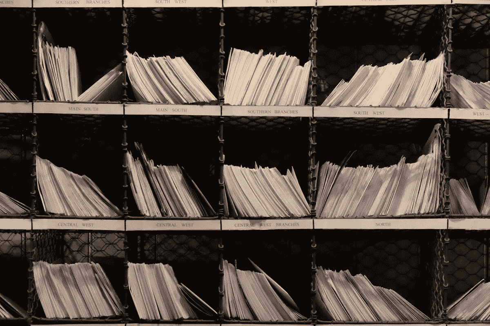

# 纽约市的一家初创企业如何重振印刷邮件营销

> 原文：<https://medium.datadriveninvestor.com/how-a-new-york-city-startup-is-reviving-print-mail-marketing-71451879e5da?source=collection_archive---------24----------------------->

很难想象在当今数字优先的环境下，公司还会投资印刷邮件营销。事实上，我怀疑是否有很多人还会查看邮箱，除非他们在等亚马逊的快递。

总部位于纽约的 PebblePost 打赌我错了。

该公司首创了一个名为程序化直邮的实时系统，该系统利用在线用户数据来创建更有效的印刷邮件营销活动。

该平台跟踪购物车放弃和关键字搜索等指标，以根据结果生成不断变化的印刷营销。据该公司称，营销材料可以在购物者访问网站的 24 小时内创建。

PebblePost 成立于 2014 年，目前提供两种格式:明信片和目录。明信片和你想象的一模一样。目录至少有八页，包括编辑内容、商品和促销活动。受欢迎的消费品牌如 Allbirds、TUMI、Peloton 和 Dyson 已经开始使用这个平台。根据公司网站，未来品牌将能够向顾客发送密封信封、超大明信片和三折本。

风险投资公司也对该公司表现出了浓厚的兴趣。PebblePost 在八轮融资中筹集了 1.11 亿美元。最近，该公司获得了由 Capital One Growth Ventures 牵头的 3100 万美元 C 轮融资。

每个零售商的目标都是将购物者转化为顾客。PebblePost 通过洞察驱动的印刷营销证明了这一点。根据该公司网站的统计，通过该公司的程序化直邮系统发送的所有邮件中，有 8%会导致购买。

印刷品仍然有一些非常怀旧和有影响力的东西。人们仍然欣赏设计精美的杂志、报纸和书籍。这个概念有强大的营销和品牌价值。

数字营销和广告公司正在争夺消费者的注意力。数字传播的主要好处是品牌可以不断接触到他们的客户。但是，这冲淡了每次互动的影响。印刷营销的罕见可以被视为创造更独特的客户互动的机会。

PebblePost 的价值主张是帮助零售商通过有意义的个性化营销最大限度地与客户沟通。

数字营销和印刷营销之间的关系类似于电子商务和实体零售。实体店不会消失——它们会转变成更小、更具体验性的空间。印刷营销可能也不会消失，但它肯定会改变。

在这两种情况下，数字资产都被用来增强实体资产，而不是取代它们。