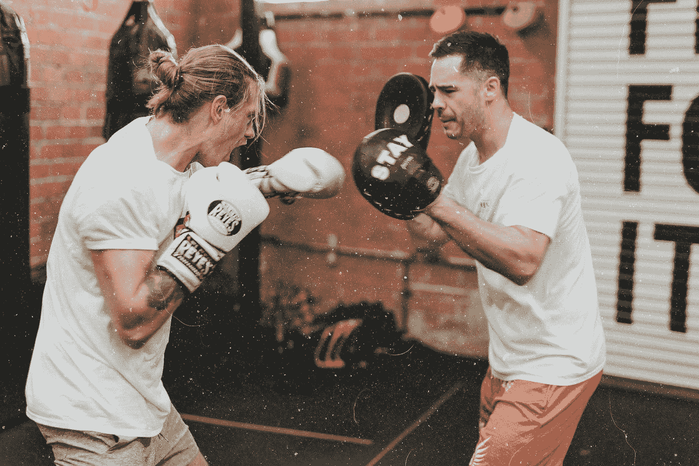
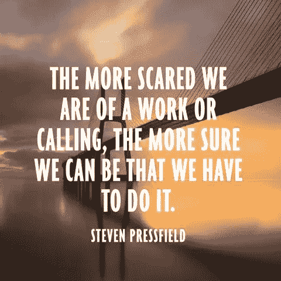

# 如何战胜恐惧，培养精英思维

> 原文：<https://medium.datadriveninvestor.com/how-a-pro-athlete-trains-an-elite-mind-18395a8a02ca?source=collection_archive---------19----------------------->

## 我们都感到恐惧，作为一名职业运动员，我每天都有这种感觉。我们这些为了个人成长而不断努力的人最终会成功。

Photo by [MARK ADRIANE](https://unsplash.com/@markadriane?utm_source=medium&utm_medium=referral) on [Unsplash](https://unsplash.com?utm_source=medium&utm_medium=referral)

> "立即开始生活，把每一天都当作一个独立的生命."——塞涅卡

“不，他们会成功的，”我想。“这不是真的。”

我父母离婚时我 16 岁。这是我在青少年时期不得不面对的第一次(真正的)永久性负面经历。是的，穿着白色巴塔哥尼亚的北密歇根郊区有它的好处。

> 但是突然间，我不得不处理我从未感受过的情绪:恐惧、焦虑和不确定性。

这听起来像一个精简的[创业公司](https://medium.com/@Trevor_Huffman/a-pro-athlete-on-going-pro-in-startups-life-and-happiness-918ee6fe03c)，不是吗？或者[去一个因《蒙特祖马的复仇》而闻名的外国](https://medium.com/@Trevor_Huffman/i-do-love-to-really-travel-5be224f94185)(无论如何都要吃生菜，好吧，别那么做)？还是我第一次失败的 [NBA 篮球赛](https://medium.com/grandstandcentral/my-failed-tryout-with-the-7-seconds-or-less-phoenix-suns-dcc8b97197ff)？或者和你的老板谈论你应得的加薪？

塞思·戈丁在《伊卡洛斯骗局》中说:

> *“如果你变得不自在，除非她在创造变化，如果事情停滞不前，你就坐立不安，如果你最近没有失败，你就感到失望，那么你已经知道如何适应最有可能让你安全前进的行为。”*

创造精英思维始于理解恐惧根植于我们的 DNA。战斗或逃跑是真实的——在体育运动中，在商业中，在人际关系中——在我看来，我们这些能够保持冷静并不断前进的人最终会成功。当我还是个孩子的时候，恐惧一直困扰着我。我从来不知道谁会赢得这场比赛，我的父亲是否会回来，或者当我作为一名篮球运动员踏上球场时，我是否会让他感到骄傲。这种恐惧就像一大群乌鸦一样吞噬着我(好吧，这有点过了！)

我会在大型比赛前生病。我会焦虑。但我学会了专注于两件事:

> **#1。尽可能以 100%的努力去竞争(没有 110%的努力，是吗？)—尽可能地对自己的最大努力感到舒服。**
> 
> **#2。在内心说出我的恐惧，并通过面对、做或谈论它们来理解它们的幻觉(我使用了一些不同的策略)。**

首先，我在年轻时就有处理恐惧的方法。读圣经。听听恩雅。想象一下。在比赛当天帮助指导孩子们。去教堂。帮我系鞋带。再绑一次。脱下来，然后穿上我的袜子，再系上。穿耐克。总是耐克。是啊，迷信从来不会伤害任何人，不是吗？

那么我的下一个策略就是问自己，“今晚可能发生的最糟糕的事情是什么？”

“我会死吗？不。我会输吗？也许吧，但是如果我尽最大努力，这是不可能的。我会错过制胜一球吗？嗯，那不是很有趣吗？我会在球场外被取笑和嘲笑吗？好吧，不太可能，但至少我可以打败所有的孩子和看台上的人。”

这些恐惧会在生活中对我们最重要的方面表现出来并发生在我们身上。伟大的白人莫比迪克不得不写。永无止境的论文。期待已久的与你的伴侣讨论你的需求的谈话。我的意思是，恐惧无处不在；如果你决定分享一件艺术品，或一句有思想的话，或写一篇爱的劳动，是恐惧保护我们不感到脆弱。

> **#3。但是恐惧并不知道恐惧的另一面是什么。它真的只是想保护我们免于死亡。不幸的是，在这个过程中，它也保护了我们不去闪耀，不去做，不去成长，不去爱，不去学习，不去赢，不去分享**。

港口、人生经验和投资有许多相似之处。购买股票或 ETF，在所有的研究，所有的时间，所有的努力，所有的练习时间，所有的钱之后，然后，砰，你的手艺可以被你的恐惧压扁:等等，什么，在你之前没有投资者因为市场不对而害怕扣动扳机？

> *市场从来都不是“恰好”正确的。你的协议应该考虑到它永远不会“恰好”正确。你的方案应该系统地帮助消除恐惧，代之以勇敢的行动。*

当你练习建立一个精英头脑时，恐惧会减少。要成为精英，必须培养英勇、勇气、坚毅和坚韧的精神。在最高水平的体育运动中，前 1%的人找到了获胜的方法。持续胜利的唯一方法是转身奔向那个让你害怕的东西。斯蒂芬·普雷斯菲尔德称之为“抵抗”

The Fears We Have… | photo credit: Pinterest

ete Carroll 说过一句关于胜利者和精英运动员的名言，我很喜欢:

> “……这些赢家不是那些试图在别人的游戏中获胜的人。每个人都是由优势、劣势、天赋和能力的独特组合构成的，我们中的任何人都可以在个人构成的背景下真正最大限度地发挥我们的潜力。”

你就是谜题。我就是谜题。我们都是最大化自身潜力的秘密。找到你的恐惧，用一个虔诚的痴迷系统战胜它们。嗯，我就是这样(又名。一个矮个子白人)成为了一名 MVP 获得者，一名职业篮球运动员，一名业余作家，一名媒体网站的顶级体育和旅游作家，一名…(我下一步会跑向什么？)

我的父母在 15 岁时离异，引发了焦虑、压力，最终导致了悲伤、悲痛和抑郁。我被迫扮演起父亲和指导我弟弟的角色。我与那些迫使我审视自己想要如何应对一个我永远无法忽视或控制的事件的重大想法和生活问题进行了斗争。我沉迷于我喜欢做的事情。我的计划是在夜里出去运球投篮，跑爬山，流汗到天亮。

我一直在调整我的游戏，痴迷于让玩家变得伟大的细节。

> “没人能把篮球从我身边夺走，”我记得当时是这么想的——甚至没有恐惧。

我知道，如果我真的失败了，精英运动员只会更快地站起来，然后继续工作。就是这样。职业运动员不会为失败哀叹太久。他们也不会对胜利幸灾乐祸。总是有更多的工作要做。罗马不是一天建成的，它是几十年的劳动、辛劳、鲜血、汗水、灰尘和数百个其他无辜帝国的内脏建成的。

*哈哈——好吧，对不起古罗马。*

> 塞涅卡说:“从地球到星星没有容易的路。”

我不是世界上最坚强的 T4，面对你的恐惧并阻止自己成为你必须成为的人从来都不容易。马斯洛重申:“*如果你计划做任何低于你能力的事情，你可能会一生都不快乐。”*

该死的，我最害怕的就是这个。我发现我的恐惧与我必须和想要成为的人有关，然后我试着找到勇气，一次迈出一小步，成为我有能力成为的人。这是我的定义。然后，我用自我意识、努力和自尊的大锤猛击那些恐怖的时刻。

更多未经编辑的关于运动、自我和旅行的故事，请阅读这里。