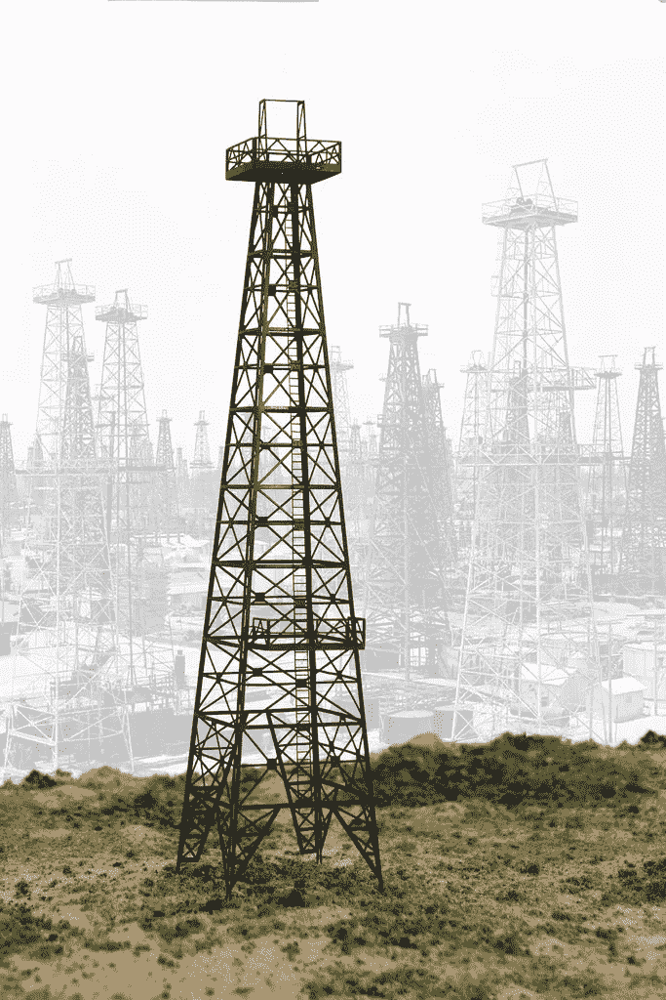
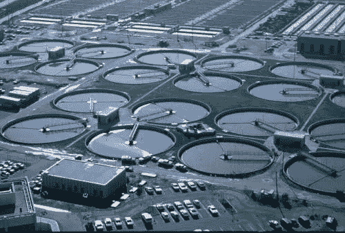
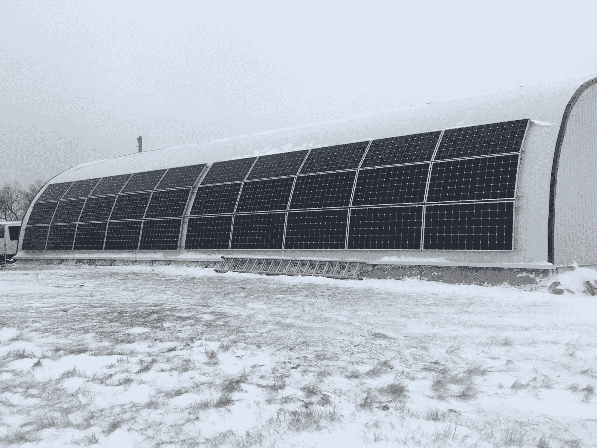

# 一个有弹性的住宅、耕地或农场如何应对全球在食品、水、能源和废物方面的生存风险

> 原文：<https://medium.datadriveninvestor.com/how-a-resilient-home-acreage-or-farm-can-address-global-existential-risks-in-food-water-energy-d6f94651c103?source=collection_archive---------0----------------------->

弹性住宅、土地或农场是一种高性能的财产，它融合了住所、水、可再生能源、食物，有时还能创收。其目的是提供一个安全和持久的土地财富来源。一种有形的财富，利用和恢复自然的健康的本地丰富资源— *自然资本* —而不是依赖波动的市场和货币，同时增强所有者的弹性。

在过去的 100 年里，我们围绕越来越大的中央基础设施建设了人类住区，这些基础设施号称更高效、更便宜、更有弹性，但可悲的现实是，事实并非如此。今天，普通的家庭面积或农场依赖于电网网络满负荷运转，以确保我们能吃、能喝、能开车、能照明、能冲水。这些网格包括:

*   水
*   浪费
*   力量
*   热燃料(天然气、石油、丙烷、电力)
*   食物
*   运输燃料

更糟糕的是，这些独立的网格在很大程度上相互依赖，这使得它们更加脆弱。

*   水靠电，电靠水
*   食物依赖于运输燃料，来自气体和水的肥料
*   废水依赖于水和电力

你不必挖得太深，就能发现食物、电力、废物、热能、运输燃料和水系统中存在的弱点，从而认识到大多数人类住区都处于危险的边缘。

*   BBC 最近做了一篇题为“The 11 个最有可能耗尽饮用水的城市——比如开普顿”的文章
*   著名投资者吉姆罗杰斯(Jim Rodgers)多年来一直押注农业，因为农业劳动力正在消失，全球年度粮食产量正在下降。当亿万富翁开始对冲我们赖以生存的体系时，值得关注。再加上奥加拉拉这样的地下蓄水层即将崩塌，你就正式进入了黑天鹅的领地。
*   石油和天然气可能已经见顶，这是我们取暖燃料、化肥和运输燃料的主要来源。虽然转型正在进行，但需要几十年才能实现。我最关心的过渡是[家庭取暖](https://medium.com/@rob_74123/the-energy-risk-no-one-is-talking-about-e38999e7107d)的过渡。

Industrial Waste Water Treatment

*   通过大量使用能源和水，人口高度密集的城市和特大城市变得可行。如果你把水拿走，人们就无法饮用，但很少有人谈论的事实是，水的损失将导致城市中最关键的系统之一——下水道——的损失。

Nassim Taleb’s Book on The Impact of the Highly Improbable

我讨论这些并不是为了制造恐惧，事实上恰恰相反。作为一名工程师，我的工作是思考风险并制定缓解策略，我的公司 Adaptive Habitat 受雇设计弹性住宅、土地和农场，以减轻这些风险以及其他风险，让人们能够继续生活。我们将土地及其包含的基础设施视为有形财富，就像一种保险。具有讽刺意味的是，如果更多的人对他们的房子、土地或农场采取这种方式，世界的脆弱性将在很大程度上消失。正是对集中的大规模工业系统的依赖，将黑天鹅烤进了这个混合体。

## 解决方案

这些风险的解决方案并不困难，但是需要有意识的努力和合理的设计。管理这种风险并不意味着我们都必须脱离电网嬉皮士，事实上，技术和系统从来没有更容易获得。以下是针对上述风险的一些解决方案。

*   通过使用现场灰水系统、堆肥厕所、重力化粪池系统和增加备用电源，可以快速处理废水。
*   电力风险可以通过[电网混合系统](https://medium.com/@rob_74123/what-you-need-to-know-if-you-go-solar-c9c2e00dc39a)来管理，无论有没有电网都可以运行。

*   通过设计低能耗被动式太阳能住宅和对现有住宅进行深度能源改造，热能燃料可以在系统之外进行设计。在一些管辖区，这些房屋只是稍微贵一点，不需要任何燃料保持在零度以上，只需要少量的燃料就可以将温度升高到 21 摄氏度(72 华氏度)。
*   食物可以很容易地在花园、[多年生食物系统](https://vergepermaculture.ca/2018/03/06/living-larders-part-1/)中种植，如食物林、果园、坚果林、水产养殖系统和[被动式太阳能温室](https://vergepermaculture.ca/product/psgh-case-studies/)。您设计的食物系统将基于您的财产(城市-农村)的大小和规模以及您试图实现的目标。
*   交通燃料对于出行是必不可少的，但它们也是上述大多数其他必需品的基础。交通运输行业可能是第一个从化石燃料过渡的行业，然而，与此同时，节能电动汽车、自行车或电动自行车将减少出行。

这项工作让我们走遍了整个北美，全球范围内我们也开始对它越来越感兴趣。[设计具有弹性的酒店](https://adaptivehabitat.ca/how-we-work/)是一个耗时的过程，正因为如此，我们每年只接待几个客户。我们越来越多地发现，人们希望学习如何设计和管理他们的土地，因此我们开始远程指导人们使用相同的工具和流程。

要了解我们行之有效的设计和建造弹性房产的 5 步流程，请点击[这里。](https://vergepermaculture.ca/building-your-permaculture-property-listing-page/)

**Rob 的简历:**
在不到十年的时间里，Rob Avis 离开了卡尔加里的油田，重新开始了他的工程生涯，帮助客户和学生设计住房、能源、水、废物和食品的集成系统，同时支持当地经济和再生土地。他现在正领导着下一波的永久农业教育，教授改变职业的专业人士成为成功再生企业的生态企业家。了解更多信息，并在[https://vergepermaculture.ca/contact/](https://vergepermaculture.ca/contact/)与罗布联系

PS。如果你觉得这有帮助，请点击拍手按钮。

PPS。如果你喜欢它，请在社交媒体上分享。THX:)