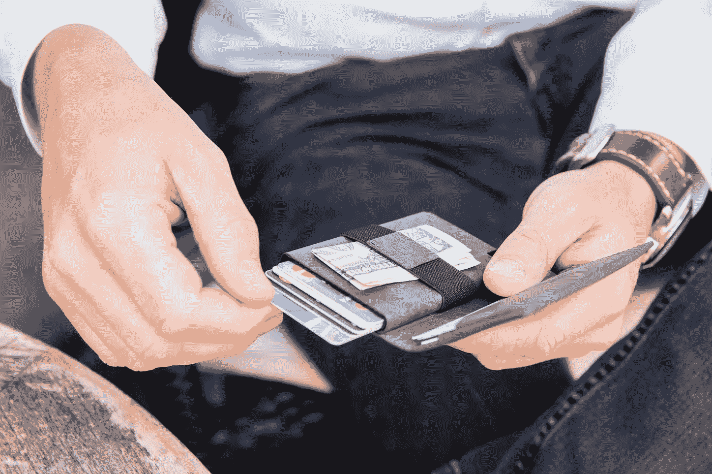
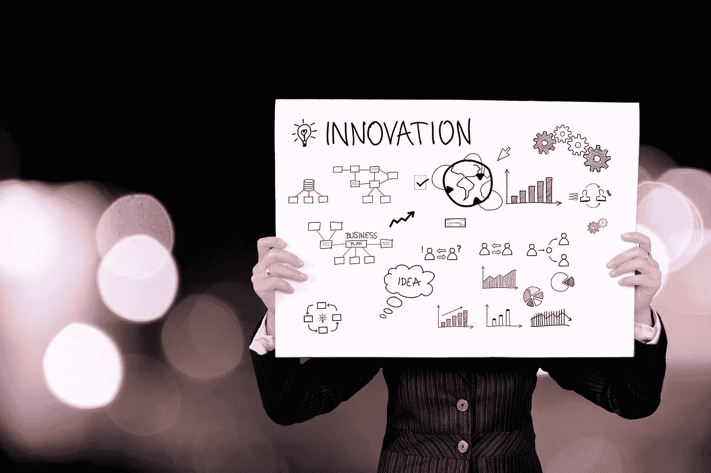

# “智能”钱包如何让生活变得更简单

> 原文：<https://medium.datadriveninvestor.com/how-a-smart-wallet-made-life-easier-15d7efae65b3?source=collection_archive---------15----------------------->

## 埃克斯特智能钱包使用几个月后的跟踪评测

当你通读产品评论的时候，你常常没有考虑到从评论者第一次使用到现在已经过了多长时间。从了解几个月后某人对一件产品的感受中可以获得很多东西，所以我想重温一下[大约半年前我写的一篇评论](https://medium.com/the-mission/the-life-altering-power-of-making-small-upgrades-to-your-daily-routine-b6083a93fd9d)会有所帮助。

当我第一次拿到[埃克斯特的超薄智能钱包](https://ekster.com/?gclid=Cj0KCQjwz93cBRCrARIsAEFbWsg7PvUJgicq7aZc57i3PVF0M6r8zi5nuI7TH4MrdysgWTjvM6ZBbD4aAvU4EALw_wcB)时，我被它的创新和时尚所震惊。钱包似乎是那种在过去一个世纪里奇怪地设法保持不变的日常物品，有点像烤面包机，所以给钱包升级设计的想法似乎是一个聪明的主意。然而，更重要的是，Ekster 钱包是为日常使用而设计的，所以尽管看起来像是为詹姆斯·邦德制造的东西，但如果它不是可以长期使用的东西，那么它就不值得购买。谢天谢地，在写我的评论之前，我用了两个星期，效果非常好。

自从我第一次写评论以来，已经过了相当长的时间，直到今天，当人们看到我拿着我的钱包问我时，他们还是会拦住我。说实话，我的想法和我第一次写评论时有些不同。虽然我忘了我写的东西，但是当回顾过去的几个月时，有一些事情是值得注意的。

首先，我仍然在使用它的事实是它的性能的最明显的标志，因为已经有其他钱包出现在现场，声称是革命性的。作为一个整天都在地铁通勤、自发购物和安全检查中不断掏钱包的纽约人，我可能比大多数人更依赖于钱包；我可以热情地证实，它仍然继续让我的日常生活变得更加轻松。我消除了在笨重的钱包中摸索的烦恼，也获得了小小的心理提升，因为我知道丢失钱包的噩梦并不可怕，因为我可以通过埃克斯特的 GPS 卡跟踪它。

话虽如此，但仍有一件事我会换成埃克斯特的智能钱包。如前所述，GPS 卡是钱包“智能”的重要组成部分，因为一旦丢失，你可以追踪它。然而，这种卡的厚度很大，所以当它被放入钱夹时，就占了它总重量的大部分。到现在为止，我已经习惯了，但我仍然希望看到将来有所改变。你当然可以选择只取出卡来减轻钱包的重量，但这样做会降低钱包的整体功能。

关于 Ekster 智能钱包，我要说的最后一点是，一直以来，我发现自己渴望看到更多的产品。如今网上有很多生活方式品牌，对一些来说，它们成为昙花一现的奇迹，发布了一个伟大的产品，并没有真正跟进任何其他令人兴奋的东西。我对 Ekster 的希望是，未来会有更多的产品继续推动钱包向前发展。总的来说，钱包可能还有其他的改进，我认为埃克斯特可能是实现这一点的公司。

幸运的是，Ekster 没有表现出任何停止其设计创新的迹象，因为随着其新的 [Kickstarter 活动](https://ekster.com/pages/earlybird-discount)的宣布，他们当前智能钱包系列的下一次迭代将使其更加纤薄。如果 [Ekster 3.0](https://ekster.com/pages/earlybird-discount) 智能钱包比目前的更薄，那将是对我提出的问题的直接回答，但它也对卡片触发器和外部皮革质量进行了改进——我甚至不认为还有更好的优化。

正是因为这些原因，埃克斯特赢得了我的全力支持，因为它需要一个有前瞻性思维的公司去做，而不仅仅是回应客户的建议。在这种情况下，埃克斯特将超越并证明他们是一家致力于从钱包中推出我们应该期待的东西的公司，坦率地说，是时候了。今天如此多的技术进步的伟大之处在于，它们可以应用于对我们的日常生活有直接影响的事物，是的，包括我们认为理所当然的物品，如我们的钱包。

几个月过去了，我仍然袖手旁观着我的智能钱包，但当创新成为你品牌的一部分时，忠诚的顾客会期待它以其他形式继续下去。我对 Ekster 的感觉也是如此，但在此之前，我对他们的智能钱包很满意，并仍然推荐给那些对自己的钱包感到厌倦的人。