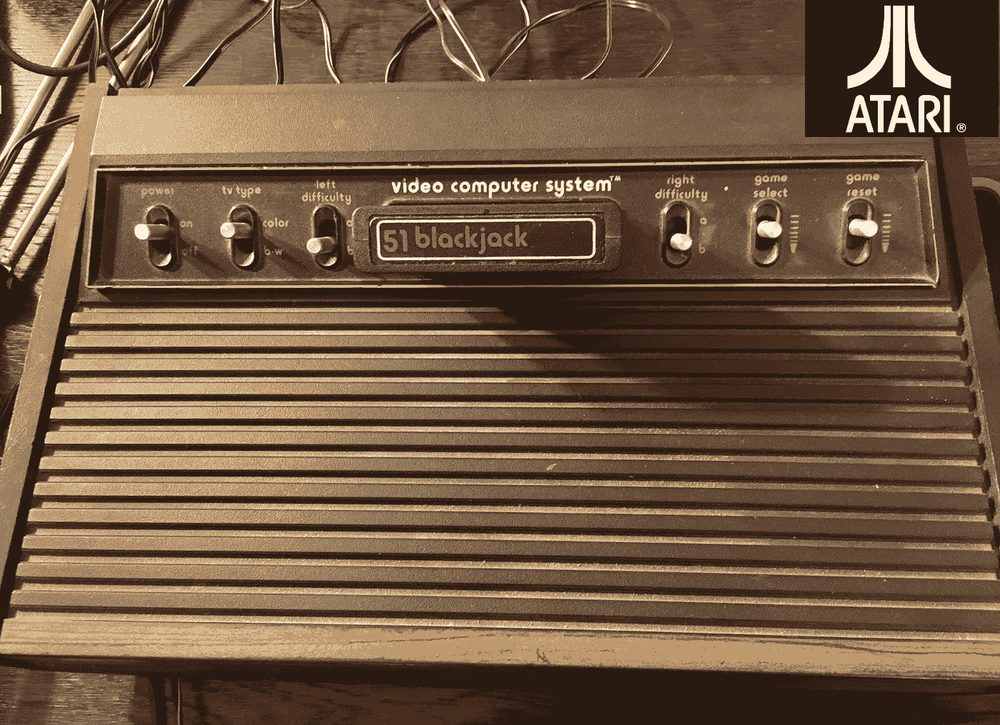
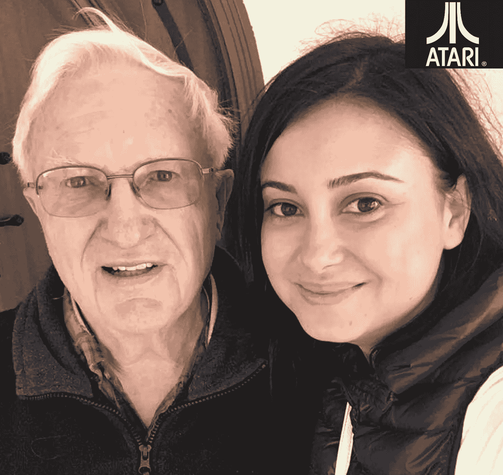

# 一个小小的电视控制台如何让我对机器学习产生了热情

> 原文：<https://medium.datadriveninvestor.com/how-a-tiny-tv-console-made-me-develop-a-passion-for-machine-learning-5e5c5068e447?source=collection_archive---------12----------------------->

本着感恩的精神，我想和那些热爱电子游戏的人分享一个故事，他们创办了创新公司并投资于这些公司。

2015 年秋天，我抵达美国，经过一个月的寻找住处，我最终在罗伯特·布朗租了一个小工作室。我惊喜地发现，我在美国的第一个家也是在不知不觉中影响我学习计算机科学并促使我想住在硅谷的那个人的家。

你想知道这怎么可能？我在罗马尼亚的黑海海岸长大，大约 5 岁的时候，有一天，我和爸爸去买杂货，但是，我们回家时却拿着一台雅达利 2600。当我们开始玩第一个游戏青蛙和苍蝇的时候，我们就不再饿了。我和我爸瞬间被我妈的绝望迷住了，总是在竞争。游戏开始了！因此，在寻找我在硅谷的第一个住所时，我很容易就认出了我在洛斯阿尔托斯山拜访的房子厨房里的雅达利中土弹球。询问厨房里的弹球机，我发现站在我面前的这个人以前是雅达利微电子部门的负责人，直接负责我们家心爱的 2600。

‘哇！这太棒了！“继续开发吧！”

14 岁时，布朗博士有一个在电视机商店工作的朋友，他也开始在那里工作，早在 1951 年就开始修理电视机。对于我的千年同龄人来说，在那些日子里，电视机是黑白的，最大的是 16 英寸，有显像管，想象一下！从斯坦福大学毕业后，他在北美罗克韦尔公司工作了 5 年，从事模式识别，尤其是语音识别。然后，他加入了研究生院的几个朋友，为飞兆半导体工作，从事集成电路的自动化布局。在那之后，他接到了北美洛克威尔公司前同事的电话，他们正在创办一家新公司。他加入了他们，但事情并没有按计划进行，该团队被开发集成电路的标准微系统公司收购。他做过模拟、测试和编程。后来碰巧他的一个创业公司的朋友去了雅达利工作，他找到罗伯特，请他为他当时在雅达利开发的东西咨询并做一个测试程序。这些是投币机的集成电路。在订婚的过程中，罗伯特想出了一个主意:他观察到一个家伙正在将立体声系统的两个声道输入电视机，于是就形成了一些非常有趣的图案。罗伯特很快注意到问题是不得不出售整个系统，这是一个内置立体声系统的大型控制台电视等等。所以他想，如果你可以做一个设备，连接到你家里的电视上，然后生成模式。然后他开始想‘嘿，他们在做视频游戏’，做一个能让你在家里的电视上玩视频游戏的设备怎么样。所以他带着这个想法去了雅达利，当他向雅达利的总裁乔·基南展示视频音乐原型时。在那个特定的时刻，乔可能有点兴奋，大叫“哇！这太棒了！“继续开发吧！”。罗伯特全职加入雅达利时，雅达利才 2 岁。罗伯特就是这样开始开发第一个产品的，那就是 1975 年问世的乒乓游戏。

**一个真正放松的公司，有很多自由**

那时候，公司要求男员工穿白衬衫、打领带和运动外套。与这些公司相比，雅达利是一家松散的公司。罗伯特将其描述为一个真正放松的公司，有很多自由。有时他们会喝啤酒或抽大麻，但只是在头脑风暴会议上，而不是在工作中。正如人们可能已经猜到的，所有的技术员工都是男性。我特别问罗伯特，作为一名女性工程师，如果我在雅达利工作会是什么样，他承认这是一种男性沙文主义文化，有时他们会在内部以自己喜欢的女孩命名项目，如阿莱特。我很高兴软件行业已经发展，并且变得越来越好，我想对所有加速这一进程的人大声疾呼。斗争是真实的！罗伯特以他自己的方式帮助铺平了道路，他雇佣了一名女性程序员，但他不记得雅达利的任何技术人员在那之前是女性。当他领导雅达利的微电子部门时，有 32 名工程师为他工作。

**史蒂夫·乔布斯疯了**

罗伯特回忆说，史蒂夫·乔布斯当时在那里做咨询工作，并被首席工程师阿尔·奥尔康聘用。雅达利的创始人诺兰希望减少硬币操作游戏中的集成电路数量，因此他告诉史蒂夫，如果他能从系统设计中删除每个集成电路，他会给他 2000 美元。于是史蒂夫找到沃兹，说‘嘿，我和雅达利谈过了，他们说我们能设计出的每一个集成电路，他会给我们 500 美元，我和你平分’。沃兹设计了 5 或 6 个集成电路，但雅达利不能使用它，因为它不是直通式的，很难调试，所以他们决定不实用。罗伯特记得当史蒂夫决定离开雅达利并创办自己的电脑公司时，阿尔·奥尔康说他疯了。天哪，他错了！史蒂夫当时告诉罗伯特，在雅达利推出自己的 400 和 800 家用电脑后，他担心雅达利会挤垮苹果。但是雅达利把他们的家用电脑建成了一个封闭的系统，这就是它是如何消亡的，违背了罗伯特的建议，即把它开放，这样人们就可以为它开发软件。史蒂夫随后告诉罗伯特，他根本不应该担心雅达利的家用电脑。

**发布前先卖掉**

在雅达利发布 Pong 游戏之前，他们试图将它卖给业内的其他人。他们去找了美泰，但美泰不感兴趣。他们又去了其他商店，得到了同样的答案，直到他们去了西尔斯的电视部。西尔斯也拒绝了，文具部也拒绝了，但这些人没有放弃，他们说‘这是一场网球赛，我们为什么不去体育用品部呢？’那里的人真的很喜欢。他们向他展示的设备比原来大十倍，这个人有点怀疑他们能否把所有的电子设备都放进一个小芯片里，但他们说服了他。西尔斯就是这样成为第一个顾客的。雅达利销售了一款带有西尔斯品牌名称的乒乓游戏和一款带有雅达利品牌名称的游戏。1975 年的圣诞节，这款产品一上市，就有人在西尔斯商店排起了长队，试图在等候名单上买到这款游戏。他们计划生产 5 万台，但最终生产了 25 万台。别人都没有，这就是问题所在。

游戏设计师是真正的独角兽

雅达利知道他们不能一直做专用游戏，需要可编程的游戏卡带。当时，每个游戏只有一个开发人员，这个人必须热爱游戏，必须是一个优秀的游戏设计师，知道是什么让一个游戏真正令人上瘾，还必须是一个优秀的程序员，因为卡带有 4k 的内存，他们会花 80%的时间试图减少代码大小以适应 4k 的内存。这才是真正的问题，试图把游戏装进盒子里，但是他们会完成的，而且游戏本身没有退化。制作一个真正好的游戏需要大约 9 个月的时间。

罗伯特认为他做得很好的一件事是找到优秀的人。他回忆说，他的一名员工说“他知道如何让自己看起来不错，雇用了这些人”，罗伯特认为这是一种负面的言论，但他后来想了想，认为他应该说谢谢，因为这是他的工作。他的工作是雇佣那些让他看起来不错的人，而不是为了让他看起来不错，但是如果他雇佣了好的人，那就是结果。这就是他去那里的原因，去面试和雇佣优秀的人。

**驱动即时游戏的旧游戏规则直到今天还在流行**

当时许多公司都在尝试开发游戏，包括 Quaker Oats，许多公司都很糟糕，因为他们没有意识到一个伟大游戏的公式:你想要任何人都可以走近并立即开始玩的东西，你想要人们可以越来越擅长的东西，当他们越来越好时，奖励会越来越大。一个经典的例子是突破，罗伯特最喜欢的游戏，在这个游戏中，你必须打破操场的两面墙，一次一块砖。今天，他认为游戏非常复杂，如今成为热门的游戏是那些遵循旧公式的游戏。顺便说一下，即使在今天，他仍然在尝试新的游戏，并带着一种很难不被注意到的热情分享他的经验。当人们点燃谈论他们所热爱的东西时，这种激情就会表现出来。

**地毯商和末日的开始——更换首席执行官并不总是一个好主意**

雅达利吸引人们是因为如果他们热爱游戏，那么这就是他们应该来的地方。就这么简单。当华纳收购该公司并决定任命自己的首席执行官，并请来纺织公司 Burlington Industries 的负责人 Ray Kassar 时，情况发生了变化。你想知道纺织品和电子游戏有什么关系，罗伯特和他的同行们也想知道他当时被称为“地毯商人”。他想‘天哪，他完全不懂技术，他不知道这是怎么回事’。此外，他有一个坏主意，他可以解雇和雇用游戏程序员，就像他们是一毛钱一打。因此，在罗伯特雇佣的 32 名工程师中，只剩下 2 名，他们是测试工程师，甚至不是设计工程师。这是罗伯特离开雅达利一年后，地毯商一进来，他就被赶了出去。罗伯特回忆说，在华纳收购该公司之前，他们还被许诺一大笔奖金，每售出一个游戏，就有 25 美分分配给工程组。但当华纳接手时，雅达利刚刚实现收支平衡，他们拒绝发放奖金，即使他们告诉罗伯特在雇人时要提到奖金。当罗伯特与他们对质时，他们说不记得了，并装聋作哑。工程师离开后，他们试图聘请顾问来制作游戏，并付给他们高薪，但这并没有转化为成功。他回忆说，他们决定推出一款外星人游戏，因为外星人太受欢迎了。顾问们在 6 周内开发了这款游戏。这个游戏太糟糕了，以至于他们最终召回了所有的游戏卡带，把它们扔到垃圾箱里，并在上面浇上混凝土。

**市场永远是赢家**

雅达利如此受欢迎，以至于包括桂格燕麦公司(Quaker Oats)在内的 15 家公司开始为 2600 主机制作游戏。但过了一段时间，市场饱和，视频游戏业务陷入崩溃，雅达利也就此终结。罗伯特在离开雅达利后创办的初创公司 Starpath 陷入了这种困境。Starpath 能够在 carthridge 中为系统添加更多的 RAM，因此通过编写自我修改代码，它的垂直分辨率是其他任何人的两倍。尽管他们的游戏在游戏杂志上被评论者评为第一名，但 Starpath 失败了，因为游戏市场崩溃了。

**市场总是赢家，再一次**

Starpath 始于 81 年，82 年获得资助。当 Robert 开始加注时，游戏市场表现非常好。在为自己的公司筹集资金时，罗伯特注意到风投们更关注团队而不是产品。梅菲尔德基金投资了他们，因为他们错过了投资游戏市场的机会，投资 Starpath 是显而易见的:他们可以做更大的游戏，他们有雅达利的经验，他们是令人难以置信的游戏开发商。Starpath 推出了 11 或 12 款游戏，他们短暂成功的秘诀还是游戏工程师。游戏没有经过最终用户的测试，程序员是最终用户，他们比任何人都想把游戏做得更好。他们是制造商和目标市场，他们是整个包装，游戏设计师，程序员和用户。Starpaths 公司的几名工程师都是 17、18 岁的大专辍学生，他们热爱编码和玩游戏。在 Starpath 出现的时候，有游戏杂志，他们有评论者，Starpath 有最好的评论，因为它有更高的分辨率和游戏性。但是后来游戏市场崩溃了。他们没有预料到的是市场已经饱和。市场突然满足了需求。更多的产品被倾销到市场上，在 1982 年和 1983 年没有任何进展。罗伯特回忆起风险投资公司向他推荐一个人成为 Starpath 的首席执行官。一个曾经获得过一次成功的人，但有时成功只是因为你在正确的时间出现在正确的地点。这需要很多运气，并不意味着同一个人创办另一家公司会有同样的结果。这位新的首席执行官没有做太多事情，他会在计划会议期间小睡片刻，然后“精神抖擞”地回来。不考虑这个问题，Starpath 还是因为市场而失败了。Starpath 在评论中排名第一，并取得了爆炸性的增长，但仅存在了两年。

我想分享罗伯特的故事，以此感谢他积极影响了我和其他许多人的生活。激情是成功的共同要素，不管是修理电视机的激情，开发最好的游戏的激情，还是雇佣最好的设计工程师的激情。引入一个对创业没有热情的 BigCo CEO 可能不是最好的选择。你对你的工作有热情吗？

他的故事也告诉我，即使现在市场很热，也应该考虑市场的发展。

谢谢你，罗伯特，你是有史以来最好的房东，让我在家里玩雅达利的所有游戏，并雇佣了雅达利的女程序员，为我们铺平了道路！你真棒！

