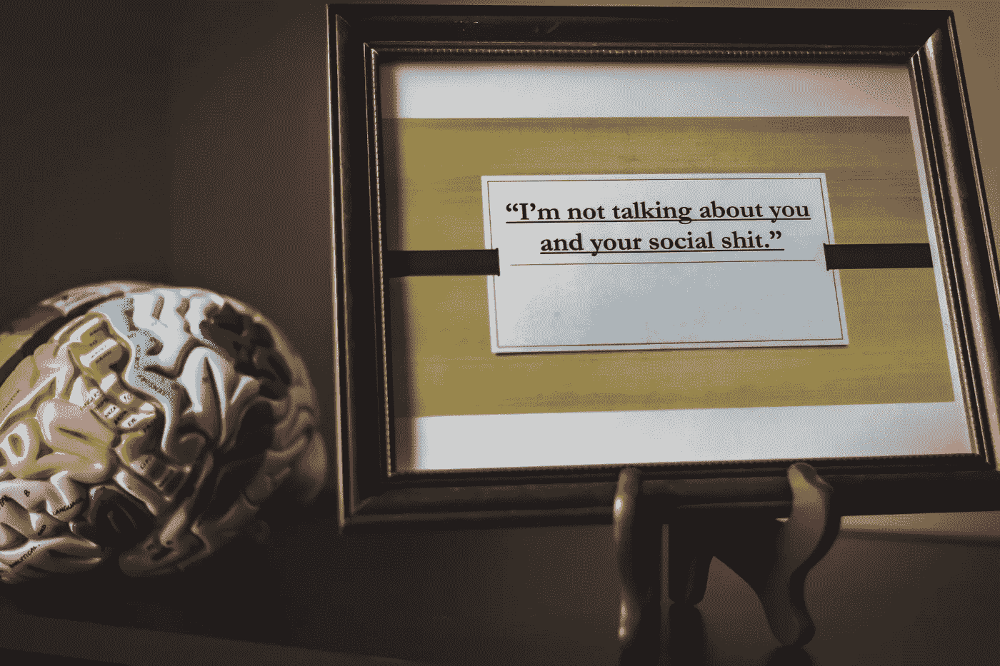
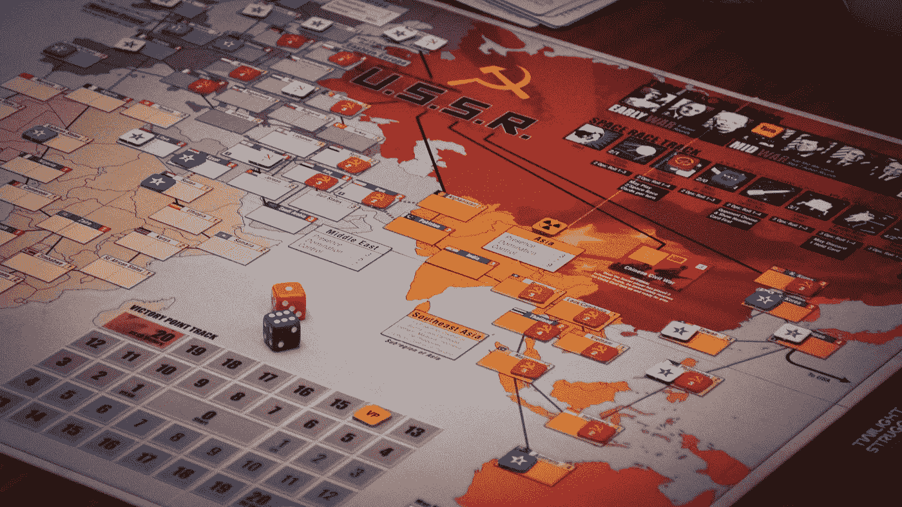
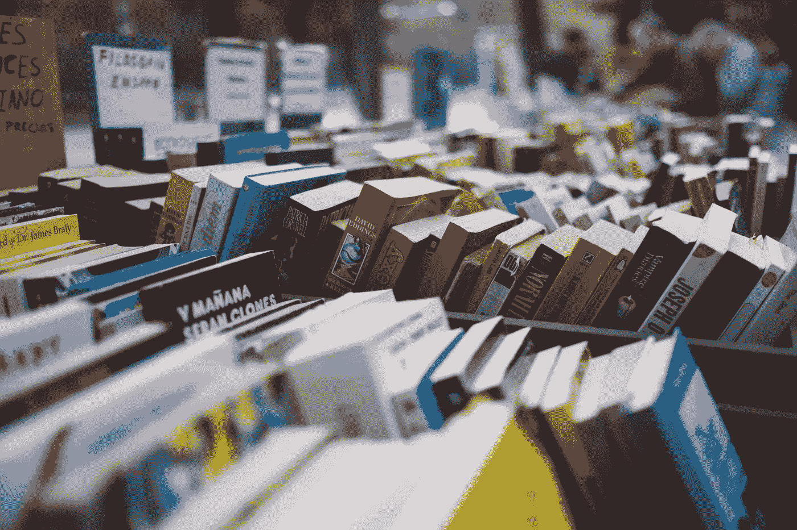

# 游戏化大脑升级怎么样？

> 原文：<https://medium.datadriveninvestor.com/how-about-gamifying-brain-upgrades-380d4a5f8c3c?source=collection_archive---------10----------------------->

Photo by [Daniel Hjalmarsson](https://unsplash.com/photos/41Wuv1xsmGM?utm_source=unsplash&utm_medium=referral&utm_content=creditCopyText) on [Unsplash](https://unsplash.com/search/photos/brain?utm_source=unsplash&utm_medium=referral&utm_content=creditCopyText)

嘿，人类同胞们，你们好？你们中的一些人分享说[上一篇关于我们大脑缺点的博客缺乏可操作的步骤](https://medium.com/datadriveninvestor/shortcomings-of-the-simian-human-brain-2d21d5e603c8)，所以写这篇文章作为后续。你可能听过古怪的亿万富翁天才马斯克先生的比喻，我们的大脑类似于计算机硬件，新技能或学习类似于软件。或者不是。太酷了。最起码，你大概在告别 snapchat 之前，已经升级了 Instagram，可以和朋友分享故事了吧？社交媒体隐士？没关系。也许在数字设备的世界里，你可能已经给你的手机或笔记本电脑的操作系统或固件打了补丁？还是没有？(不酷。如果你没有做到以上任何一点，你可能正过着一种真正美好的生活，充满了旅行、独角兽、彩虹和无知。(只是调侃。学会驯服你敏感的自我，你！)用马斯克先生的比喻，让我们进入问题的实质。或者豆芽，对纯素食者来说…

Photo by [Deviyahya](https://unsplash.com/photos/Ti2QQ36R5dQ?utm_source=unsplash&utm_medium=referral&utm_content=creditCopyText) on [Unsplash](https://unsplash.com/search/photos/sprout?utm_source=unsplash&utm_medium=referral&utm_content=creditCopyText)

我的大多数同龄人、朋友和同事通常都淹没在他们的屏幕前，让我成为他们各自生活中最不重要的人。也许你也面临着同样的挑战，或者也许我只是很无聊。为了应对社交领域的空白，我求助于书籍，很快意识到 21 世纪的人类被高估了一点。然后回过头来想，如果这种情况继续下去，我将孤独地死去，尽管我有大约 3000 个虚拟朋友。我采取的第一步是删除大多数社交媒体账户，以解决这个源于偏执的假想问题。这看起来是个坏主意，就像生活在杰特森时代的摩登原始人一样。那次古怪的举动已经过去两年了，我挺过来了，我想我很开心。但是这和大脑升级有什么关系呢？这种社会隔离加上对电视的终生憎恨导致了大量的空闲时间。现在，我不仅没有了我的虚拟“朋友”，也没有了让我保持“忙碌”的滚动提要。

Photo by [Ryan Rush](https://unsplash.com/photos/8cBr8btnudo?utm_source=unsplash&utm_medium=referral&utm_content=creditCopyText) on [Unsplash](https://unsplash.com/search/photos/brain?utm_source=unsplash&utm_medium=referral&utm_content=creditCopyText)

进入棋盘游戏。因为大多数人际交往对我周围的人来说都很无聊。(感情是相互的如果你问的话。(如果你非要进一步问，我只是在开玩笑。))我试图通过与不同人群举办桌游之夜来使互动游戏化。《卡坦半岛的定居者》、《线索》、《龙与地下城》、《秘密希特勒》、《冒险》、《乘车票》都对这个内向的人的社交技能做出了巨大贡献，我是这么告诉自己的。更不用说一些组织技巧可能帮助我更好地管理社会交往中最不确定的变量——人类。试着在一个非专业的环境中招待人们，你会看到人们在发脾气时的古怪表现。我把这些夜晚视为伪科学的社会实验，很像看手相或群体占星术。这些给了我一种提高社交技能的虚拟感觉，但并没有取得实质性的成就。请忽略讽刺，但有时尝试举办一个棋盘游戏之夜。只要你考虑避免过度竞争的笨蛋、自大狂或自怜过度的人，这真的没那么糟糕。如果这让你几乎没有人，那就沉溺于对同龄人糟糕的生活选择的判断中吧。一旦你康复并重新露面，考虑主持一个聚会小组。说真的。在我看来，社交技能也是一种智力形式，棋盘游戏是一种在不损害肝脏的情况下磨练这些技能的方式。你可能最终会花掉相同或更多的钱，因为人们似乎不会买下一轮，无论是棋盘游戏还是啤酒。再说一次，这是讽刺，人们并没有那么坏，我不是一个愤世嫉俗的人。还是我？或者他们是？

Photo by [Sheldon Nunes](https://unsplash.com/photos/T35fIhhUK1c?utm_source=unsplash&utm_medium=referral&utm_content=creditCopyText) on [Unsplash](https://unsplash.com/search/photos/boardgame?utm_source=unsplash&utm_medium=referral&utm_content=creditCopyText)

接下来，我会借出书籍，而不是送一束花或一件没人喜欢的展品，或者最没创意的礼物，一张礼品卡。我们都失去了无关紧要的朋友，就像我们的第一部 iPhone(或任何手机，你们这些机器人和诺基亚的忠实拥护者。有人要黑莓吗？).即使我们在 2016 年购买了“有史以来最好的(I)手机”,它也只能陪我们 30 分钟。也许你很难与过去的好朋友交谈。为什么会这样？生活改变了？不在同一个行业或地区工作？有没有为此感到内疚？让自己和每个人都了解最新情况的一个方法是购买、阅读和赠送书籍。让你的同事负责更新自己。这里有一种方法。去给他们买一本你真心认为他们需要和/或会喜欢的书。认真思考一下。他们真的会喜欢吗？这有关系吗？去告诉他们…

“嘿，我担心的朋友，我想把这本书借给你，因为我觉得你可能会因为你的兴趣/生活状况/爱好而觉得这本书有趣/有趣/有帮助。就当这是贷款吧。如果你读了，它就是你的了。如果你在六个月内没有读到这本书，你必须把它和我选择的另一本书一起归还。你可以直接拒绝这个提议，不要有任何想法或判断，但是如果你参与了交易，就没有回头路了。你也可以要一本不同的书。你怎么看？”

根据我的经验，几乎所有人都接受这项交易。一大群人会兑现它，其他的大部分都不值得你在未来浪费时间，除非他们连本带利的还了贷款。我把一本书借给了学校的一个密友，他在班加罗尔的一家初创公司开始做同样的事情，这个概念似乎在那里很受欢迎。如果明天我死了，我会为这份小小的遗产感到骄傲。但我很健康，从统计学上看死亡似乎不太可能。但是我最近也不是很幸运，所以我们会知道的。我跑题了，但偶尔想想死亡是有好处的。回到正题，所以送几本书，达成交易，这是一个多赢的局面，你要么有博学的同龄人，更多的书，要么有更少但有意义的关系。在我看来，这是我想到的最好的交易。

Photo by [freddie marriage](https://unsplash.com/photos/w8JiSVyjy-8?utm_source=unsplash&utm_medium=referral&utm_content=creditCopyText) on [Unsplash](https://unsplash.com/search/photos/books?utm_source=unsplash&utm_medium=referral&utm_content=creditCopyText)

对于经常打电话的人来说。也许可以考虑像 peak，chess，duolingo，sudoku，OneDrive，Libby 或 2048 这样的应用程序？这不是最理想的方法，但这是我们用像你们这样的多巴胺微量给药器所能做的最好的事情。

运动、露营、旅行、锻炼、徒步旅行和与不同的人共度时光听起来可能是陈词滥调，但可以帮助我们收集丰富多彩的生活经历，从不同的角度看待生活。在最近一次去安达曼和尼科巴群岛的旅行中，我有机会开车穿过一个被称为 *Jarawas* (不要和超级敌对的 *Sentinelese* )的(半)敌对部落居住的地区。当他们试图要水喝时，我们正好从他们身边开过。(' *Paani '！，‘比斯勒里’！他们一边喊着，一边试图跳上汽车。该死的，这些营销人员！他们几乎不会说印地语，但是？)通过大约三十多次短暂的加洛瓦目击，我意识到如果我不积极努力保持联系，智能革命可能会让我的后代比几千年前更快地被淘汰。妄想症，我同意。但是，正如英特尔的联合创始人安迪·格罗夫所说，只有偏执狂才能生存……(也许这是你今年开始阅读 Goodreads 上的挑战时挑选的第一本书？)*

对粉丝和评论家来说，有什么其他方法可以在娱乐的同时保持相关性？关于游戏化大脑升级有什么小技巧吗？(他几乎没有写过关于桌游和书籍的博客。但是*游戏化？大脑升级？*该死，这些营销的家伙！)

点击阅读更多布比金[的文章。阅读](https://medium.com/@bubbykin)[作者](https://medium.com/@bubbykin)关于[人类大脑](https://medium.com/datadriveninvestor/shortcomings-of-the-simian-human-brain-2d21d5e603c8)的缺点。

你可能还会喜欢一些即将到来的批评家们认为可以接受的帖子:

[什么造就了艺术家？](https://medium.com/@bubbykin/what-makes-an-artist-48752ae7699)

[那个妖孽司机。](https://medium.com/@bubbykin/the-uber-driver-2f4f2902faf0)

家在哪里？