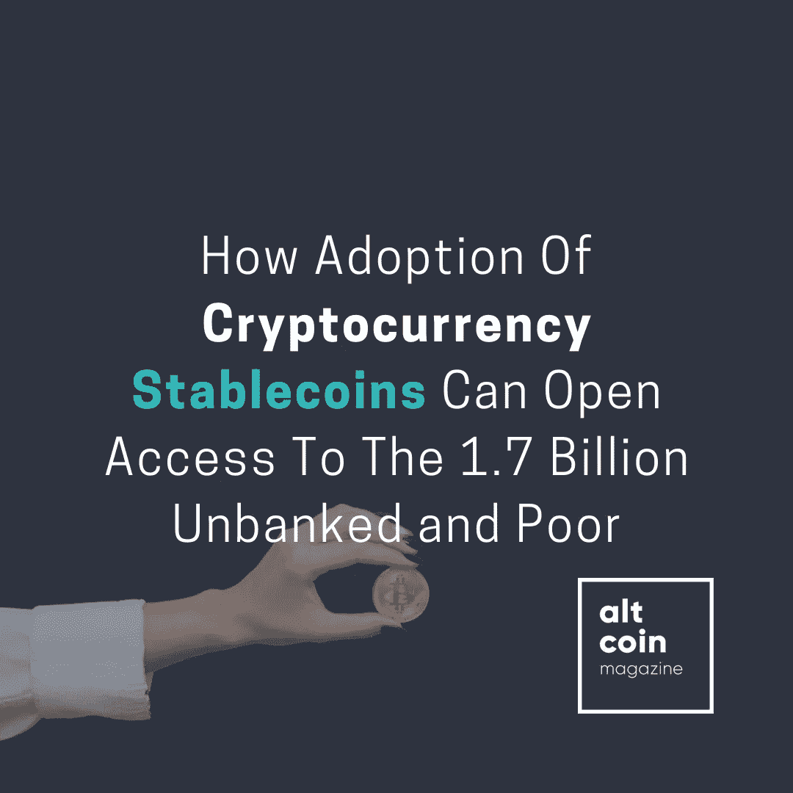

# 加密货币 Stablecoins 的采用如何为 17 亿没有银行账户的穷人打开通路

> 原文：<https://medium.datadriveninvestor.com/how-adoption-of-cryptocurrency-stablecoins-can-open-access-to-the-1-7-billion-unbanked-and-poor-d8697ef4a1d6?source=collection_archive---------4----------------------->

## 《另类硬币》杂志的罗伯特·安佐隆

***在没有强大银行基础设施的国家，公众零售采用 stablecoins 的速度可能会更快。***

由比尔和梅林达盖茨基金会资助的 2017 年全球 Findex 数据库指出，数字技术的进步是实现世界银行普及金融服务目标的关键。

稳定社区倡议正在快速发展。stablecoin 是一种与日元或美元等稳定的法定货币挂钩的加密抵押货币，各国央行正在讨论采用 stable coin。这是一个好迹象；监管机构正在讨论区块链风格的硬币如何成为主流支付方式。然而，在银行业更加成熟的发达经济体中，监管者仍然对风险保持谨慎。

 [## 如何创建加密货币[逐步指南] |数据驱动的投资者

### 加密货币是如何工作的？如何制作加密货币？如何创建自己的加密货币？所有这些问题…

www.datadriveninvestor.com](https://www.datadriveninvestor.com/2019/03/25/how-to-create-your-own-cryptocurrency-and-make-your-business-ready-for-the-future/) 

虽然大规模采用稳定硬币的基本用例是作为一种潜在的法定货币替代品，但这些硬币是如何实施的仍在激烈辩论中。由欧元、美元或英镑等传统货币担保的硬币可以有不同的结构。不同的硬币可以采取代币、链上或链外担保硬币和算法稳定硬币的形式。

# 更多讨论

基于欧洲中央银行(ECB)的论文“寻找加密资产的稳定性:稳定是解决方案吗？2019 年 8 月”，稳定硬币的采用，特别是在监管良好的国家，例如欧盟国家，需要明确的规则来管理发行者的责任、分散责任，以及在广泛实施之前支持资产价值的明确指导方针。上个月，法国财政部长发表声明，打算阻止 Libra 在法国的发展，这清楚地表明，稳定的货币采用面临挑战。

与此同时，作为法国金融监管体系一部分的金融市场管理局(AMF)等机构于 2019 年 7 月宣布，计划为加密公司创建一个自愿监管框架。

虽然 Libra 可能会面临在欧洲国家被采用的风险，但很明显硬币的发展将会继续。

最近，欧洲央行行长在 2019 年 9 月 26 日的一封信中表示，他们正在探索加密资产的潜力，并评估它们对货币政策和零售的影响。欧洲央行行长马里奥·德拉吉在信中表示:

> “由大型科技公司支持的新 stablecoin 协议(如 Libra)可能会被广泛采用”。

然而，在同一封信中提到了一些问题，其中 stablecoin 举措未经测试，并“引发了大量风险和问题”。

# 现在呢？

对于采用稳定硬币的支持者来说，央行的媒体报道加上脸书创造 Libra 的决心表明，在未来几年的某个时候，抵押硬币将有一个未来，特别是在零售支付方面。

但是短期内，稳定的货币交易和交换在哪里可以找到一个真正的货币选择的立足点呢？

在货币波动、监管不力的银行体系或不存在的金融基础设施成为常态的国家，潜在的采用可能具有竞争优势。与金融系统被视为缺乏信任的经济体相比，稳定的货币交易可以提供波动性较小的银行业务，委内瑞拉就是一个很好的例子。

由比尔和梅林达·盖茨基金会资助的 2017 年全球 Findex 数据库指出，数字技术的进步是实现世界银行普及金融服务目标的关键。同一份报告强调，全球有 17 亿人没有银行账户。稳定币可以成为无银行账户者创造稳定的货币价值储存和交换的途径。如果数字技术的使用在所有国家都有所增加，那么对于没有银行账户的人和穷人来说，这很可能意味着加密技术在本地和弹性较低的金融系统中被广泛采用。

一个值得关注的采纳策略是，稳定的信贷可以提供恶性通货膨胀的替代方案，为公众提供价格稳定和金融渠道。

*最初发表于*[*【https://www.forbes.com】*](https://www.forbes.com/sites/robertanzalone/2019/10/04/how-adoption-of-cryptocurrency-stablecoins-can-open-access-to-the-17-billion-unbanked-and-poor/)*。*

 [## Altcoin 杂志(@Alt__Magazine) | Twitter

### Altcoin 杂志(@Alt__Magazine)的最新推文。我们的目标是让世界了解加密，并最终…

twitter.com](https://twitter.com/Alt__Magazine)