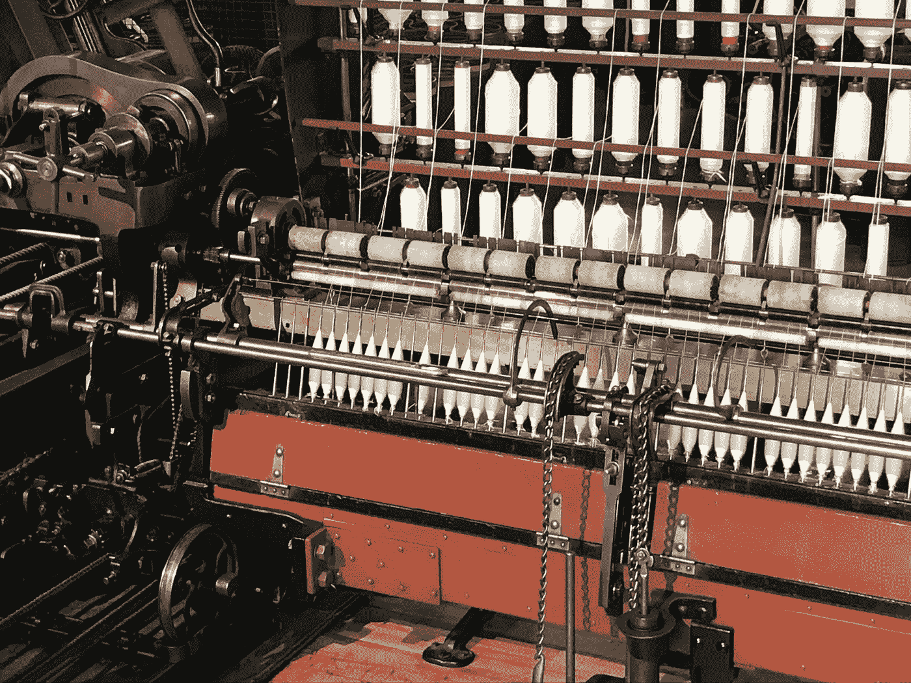
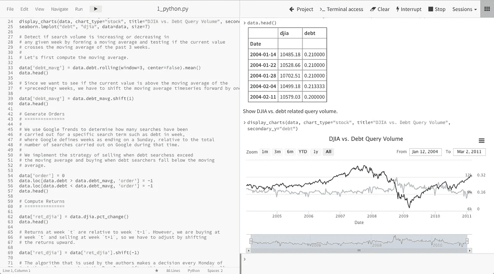

# 人工智能和大数据如何支持人类的努力

> 原文：<https://medium.datadriveninvestor.com/how-ai-and-big-data-supports-human-endeavour-aae00607d67e?source=collection_archive---------30----------------------->

我们已经听到很多关于新兴人工智能(AI)技术将如何取代人类从事日常工作的谈论，这些工作为我们提供了很多就业机会。人工智能和大数据可以成为一种好的力量，然而这在很大程度上取决于你对技术影响的世界观。技术是通过商品化和自动化来取代劳动力，还是通过提高能力来提高生产率？当然，从短期来看，这两种说法都是对的，但最终产能会上升。维多利亚时期的纺织厂将自动化引入纺织生产，为服装设计和各种工匠和工程学科的劳动力创造了新的机会。

前沿人工智能将做同样的事情，为那些拥抱它的人支持人类的努力。例如，在新兴的精确医学领域，人工智能已经证明了对肿瘤的准确可靠的识别，尽管破译它们是否是癌症，仍然是有经验的人类更擅长的事情。目前的做法是将临床医生配对，以便提供有效的诊断检查。用这些放射技师中的一个来代替人工智能机器人，为识别过程创造了更多的能力。这对于专业人员来说特别有用，比如放射诊断技师，他们的技能很昂贵而且供不应求。公共和私人交通系统也有可能从这些类型的决策支持中受益。良好的决策不仅可以增强安全性，还可以增强经济性。例如，自动驾驶汽车的运行模式可以优化，以减少排放，同时满足安全监管要求。这对实现气候变化目标有巨大的潜在好处。类似的增强通过更高效的应用程序代码库延长了手机的电池寿命。在电池的基本化学成分保持相对稳定的情况下尤其有用。

人工智能模型可以通过模拟来优化和改进质量控制。一旦您理解了模型的输入参数和期望的结果，您就可以快速模拟输入的变化来改变结果。通过模拟，我们可以对故障场景和其他结果进行建模。这有利于制造产品和检测系统中的欺诈行为。如果欺诈可以被发现，那么无论是金融交易还是体育运动中的欺骗也可以被发现。由于我们使用统计模型，输入参数不一定是显而易见的，只要模型具有适当的输出精度。顺便说一句，这种形式的目标定位对于检测体育运动中的药物服用和识别信用卡欺诈一样有用。

就像工业革命时期的纺织厂一样，许多企业将专注于降低成本以获得竞争优势。更低成本的产品和服务，以以前无法想象的方式促进新的努力。没有更现代的纺织品，征服南极洲或珠穆朗玛峰是不可能的。

当技术应用于服装生产以促进人类努力时，今天它在精英运动中很普遍。为国际空间站的机组人员开发了自行车功率计，以尽量减少在太空中长时间失重期间的肌肉萎缩。它们现在已经成为衡量努力程度的常用工具，类似的设备也被开发出来测量跑步效率。运动员正在使用数据和分析来拓展我们甚至现在仍然认为人类能够做到的极限，而且不仅仅是精英运动员。对各种运动的分析显示，业余水平的获胜次数有所增加。在我的运动中，场地自行车，我们已经看到速度有了相对巨大的提高，尽管技术规则大大限制了设备的改变。这些进步来自于更有效的训练制度，这些制度是在体育科学的支持下发展起来的，由精英阶层逐渐形成的。随着这些技术在规模上的完善，它们变得适用于更广泛的人群，并将成为老龄化社会中未来医疗保健的关键组成部分。

我们已经在医疗保健领域看到了早期基于人工智能的决策支持系统，例如，NHS 已经为患者实施了第一个基于人工智能的医疗保健分类应用程序。巴比伦健康聊天机器人[https://www.gpathand.nhs.uk/](https://www.gpathand.nhs.uk/)使患者能够通过智能手机应用程序注册虚拟全科医生(GP)。尽管聊天机器人没有获得进行诊断的许可，但它已经过训练，可以判断病人病情的紧急程度，并支持非紧急 111 号码，为病人提供初步的分类服务。f1 车队使用机器学习来优化速度和维修策略，而自行车车队则根据天气条件和其他变量(如疲劳和海拔)使用模拟来优化比赛策略。这里有一个很好的例子来说明机器学习如何帮助战略选择来提高工业效率【https://turbofan.fastforwardlabs.com/

这些组织已经采用技术来创建代表最佳性能的模拟。该技术可以使用[神经网络](https://en.wikipedia.org/wiki/Artificial_neural_network)生成一个模型，该模型可以通过迭代进行改进，并根据动态环境变量进行优化，例如电路特性、患者症状或对手团队可能会做的事情。神经网络基于类似于人脑的技术。有了足够的处理能力，就有可能模拟竞争战术和策略对结果的影响，从而使教练能够相应地改进战术。

直到最近，除了最先进的技术公司或学术机构之外，几乎所有人都无法获得这些工具和功能。我们现在看到的是现代机床的出现，包括我自己的雇主 [Cloudera](https://www.cloudera.com/solutions/improve-products-and-services.html) 的机床，它们大大降低了进入市场的成本和技能壁垒。随着先进的机器学习技术变得越来越容易获得，可用性和安全性得到了改善，功能和库也扩大了功能阵列。重要的是，成本和复杂性不再令人望而却步。

一段时间以来，社会已经接受了数据捕获和存储，但利用这些数据可能具有挑战性。在教学和教练职业中，存在大量数据，以及关于什么有效什么无效的观点。人工智能和机器学习给决策者和从业者带来了希望，他们可以对自己方法的有效性负责。如果有正确的衡量成功的标准，结果是必然的。在体育运动中，这是显而易见的，奖牌和成绩很重要。

未来，我们将利用这些分析技术自下而上地改善社会。新的机会将会出现，以分享最佳做法和经验，从以前的成果，我们知道是成功的，回到实际证据。我们将使用人工智能来改进我们的技能和经验模型，将专家教练的知识传授给学员，以提高他们的能力和技能深度。面临的挑战是在不建立依赖的情况下进行知识转移，没有依赖就无法维持。有许多例子表明，如果不经常使用，技能就会丧失，我们的大脑会自我修复。成功将来自于包裹在髓磷脂中的神经通路，髓磷脂是从基于证据并被充分证明的结果发展而来的。然而，要做到这一点，我们需要经历并认识到失败，而且要在失败变得更加严重之前尽快做到这一点。做得这么好是一种微妙的平衡，但也是人类特别擅长的事情。只要看看婴儿学走路就知道了。

> **参考文献**
> 
> http://www.srm.de/company/history/的 SRM 功率计
> 
> 英国国民保健署手头的 GP[https://www.gpathand.nhs.uk/](https://www.gpathand.nhs.uk/)
> 
> 涡轮风扇大亨[https://turbofan.fastforwardlabs.com/](https://turbofan.fastforwardlabs.com/)
> 
> 神经网络[https://en.wikipedia.org/wiki/Artificial_neural_network](https://en.wikipedia.org/wiki/Artificial_neural_network)
> 
> Cloudera 数据科学工作台[https://www . cloud era . com/products/Data-Science-and-engineering/Data-Science-work bench . html](https://www.cloudera.com/products/data-science-and-engineering/data-science-workbench.html)
> 
> 髓磷脂[https://en.wikipedia.org/wiki/Myelin](https://en.wikipedia.org/wiki/Myelin)