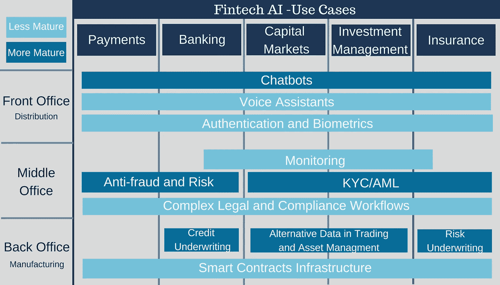

# 人工智能和机器人如何颠覆银行业

> 原文：<https://medium.datadriveninvestor.com/how-ai-and-bots-are-disrupting-the-banking-industry-d2108f2eb156?source=collection_archive---------18----------------------->

人工智能预计将在未来几个月和几年内以深远的方式永久改变银行业。公司希望通过实施更多技术来提高速度、成本、准确性和效率，从而寻求竞争优势。

在这篇博客中，我们重点关注人工智能将如何改变行业的来龙去脉，包括在办公室和消费者之间。

[*(*](https://intelligentautomationbfsi.iqpc.com/landing/how-ai-and-bots-are-disrupting-the-banking-industry?-ty-m&utm_source=disruptingbanking&utm_medium=ad&utm_campaign=10000.002-external-ad&utm_term=disruptingbanking&utm_content=text&mac=medium_aguis&disc=medium_aguis) *点击此处查看完整报告)*

聊天机器人

银行和金融公司希望通过实施更多技术来提高速度、成本、准确性和效率，从而寻求竞争优势，因此它们正在迅速采用聊天机器人，以至于聊天机器人现在被视为行业标准。

聊天机器人似乎是公司人工智能的开端，主要用于通过各种方式为客户服务。机器人最常见的两种使用方式是通过移动应用程序和在网络上作为虚拟助手。美国银行的助理埃里卡为公司继续破纪录的增长开辟了一条道路。

“我们希望在最重要的时刻陪伴客户。美国银行零售银行业务总裁 Thong Nguyen 表示:“将人工智能融入我们的移动银行服务将有助于客户更高效、更一致地管理其简单的银行需求，从而让我们金融中心的专家有更多时间与客户相处，了解他们更复杂的需求，帮助他们改善金融生活。

实施聊天机器人也将重点更多地放在了客户和他们的需求上，给他们提供了许多选择——从选择在移动设备上获得帮助还是去分行，或者决定与机器人或人类交谈。

根据 Autonomous Next 的报告，千禧一代的消费者比后几代人更喜欢在没有人类互动的情况下使用人工智能联系他们的银行或信用社。尽管如此，只有 12%的千禧一代更喜欢使用手机，而所有其他人都转向聊天、社交媒体或短信渠道。

**人工智能与安全**

人工智能在很大程度上帮助了银行——它被用于安全措施，因为洗钱是全球银行业的一个长期问题。欺诈检测和风险管理是人工智能被用来帮助安全的主要方式。

人工智能可以在欺诈发生之前检测到欺诈，提醒银行保持警惕，并给他们一个百分比，描述卡被泄露的可能性。因此，这为银行和信用卡提供商节省了资金，并防止消费者关闭他们的账户。

**人工智能与银行内部结构的组织**

根据 Autonomous Next 的报告，银行和贷款将经历最大的转变，数十亿的储蓄和数百万的工作岗位处于危险之中。

这将导致银行内部结构的重大变化。

*Source: Autonomous

随着机器学习变得更加先进，从事重复性工作的银行柜员可能会首先被淘汰，其次是中台办公室的工作，但后台办公室的工作较少被取代。当通过前、中、后台办公室的自动化来平衡工作时，可以在银行、投资管理和保险领域节省 1 万亿美元。

据报道，在银行和保险业之外，70%面临风险的工作将是前台系统，将被聊天机器人、自动认证和生物识别技术所取代。相反，数据还表明，人工智能的扩散将伴随着银行工作岗位增加 14%。公司将招募知道如何与人工智能合作的人。埃森哲认为人工智能是解放人类的一种方式，使人类能够从事更有趣和复杂的工作。

**其他技术趋势**

人工智能并不是唯一一个据说正在颠覆这个行业的技术趋势。埃森哲表示，扩展现实、数据准确性、无摩擦业务和思维互联网(IoT)都是银行和保险公司的破坏性驱动因素。

1.通过扩展现实，公司可以通过用数字增强覆盖真实世界来扩展人类现实，从而创造竞争优势。

2.如果一家银行未能验证数据的真实性，那么他们就很容易利用数据的真实性得出商业见解或做出可能让他们陷入各种不必要困境的决策。

3.无摩擦的业务太普遍了——太多的合作关系会导致过时的系统跟不上步伐，并成为增长和未来准备的障碍。

4.通过使用物联网，银行能够与电信服务提供商合作，并在征得同意的情况下实时分析数据共享。

[*(点击此处查看完整报告)*](https://intelligentautomationbfsi.iqpc.com/landing/how-ai-and-bots-are-disrupting-the-banking-industry?-ty-m&utm_source=disruptingbanking&utm_medium=ad&utm_campaign=10000.002-external-ad&utm_term=disruptingbanking&utm_content=text&mac=medium_aguis&disc=medium_aguis)