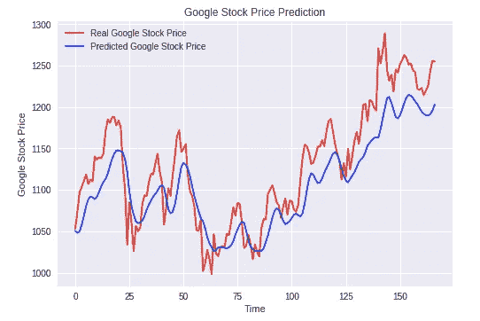
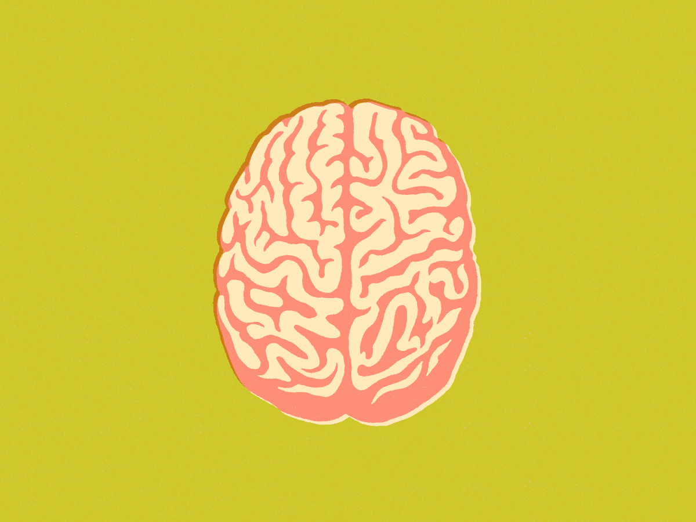
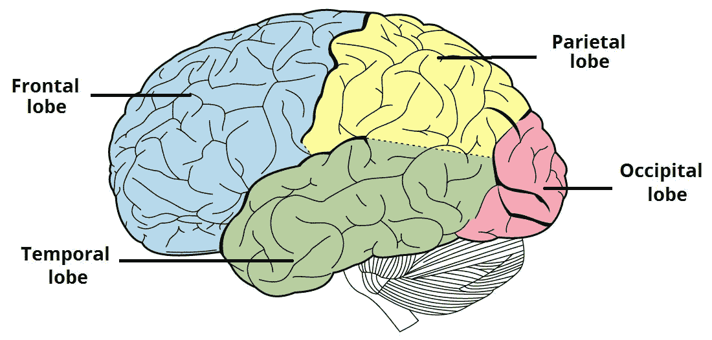
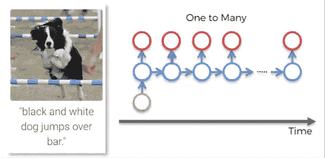
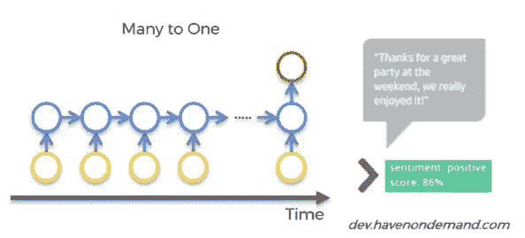
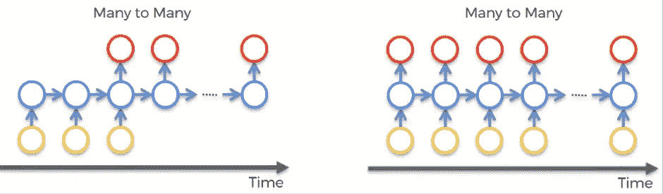
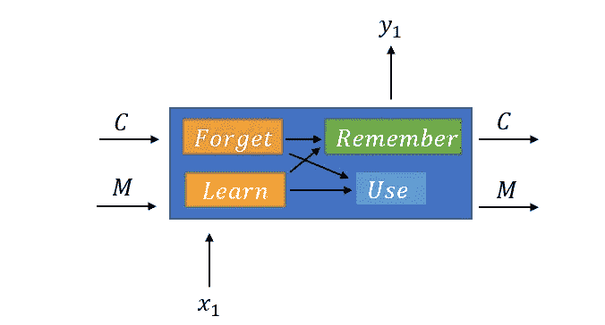

# 人工智能如何轻松成为你赚钱的超能力

> 原文：<https://medium.datadriveninvestor.com/how-ai-can-easily-be-your-moneymaking-superpower-263cceefdabc?source=collection_archive---------6----------------------->

[](http://www.track.datadriveninvestor.com/1B9E)

## 用递归神经网络和 LSTMs 预测股票


Photo by [Franki Chamaki](https://unsplash.com/@franki?utm_source=medium&utm_medium=referral) on [Unsplash](https://unsplash.com?utm_source=medium&utm_medium=referral)

如果你能拥有任何实际的超能力，那会是什么？

对于许多人来说，他们会说预测未来或轻松赚钱的能力(第*和不，这不是一个快速赚钱的骗局*)。

好吧，你可以在你的“人工智能已经完成的疯狂事情清单”上添加另一个项目，因为人工智能确实可以做到这两者。

头脑 B L O W N🤯

人工智能*实际上是*能够预测未来股票价格的波动。这也不难做到。



The model I built’s prediction in comparison to actual prices.

这种类型的人工智能将被归类为使用*深度学习*。深度学习是机器学习的一个子部分，其工作方式类似于**人脑学习**的方式。不同类型的人工神经网络正被用来模拟人类大脑的部分，并创造出更强大的人工智能。如果你需要深度学习的复习，你可以看看我的文章[覆盖基本概念！](https://medium.com/@mishaallakhani/machines-with-brains-like-ours-an-intro-to-deep-learning-a5dff4c24e97)



所以，为了**理解深度学习**，并深入到股票预测器的模型类型(*递归神经网络*)，只有提醒我们自己**我们自己的大脑是如何工作的**才有意义。

如果你碰巧是一个大脑互动体，并想跳过这个复习，你可以点击[这里](https://medium.com/p/263cceefdabc#d67a)跳转到 rnn 的类型。

对于那些需要唤起他们对六年级健康课记忆的人，让我带你进入我们的大脑。

大脑有 3 个主要部分:大脑 ***(深度学习关注的)*** 、*小脑*、*脑干*。

大脑被分解成**颞叶**、**额叶**、**枕叶**和顶叶，通过不同类型的人工神经网络进行模拟。



Deep learning is can relate to the way certain lobes in the cerebrum function.

*   颞叶:接收感觉信息，处理信息，通过先前的经验(长期记忆)进行学习 **—人工神经网络**
*   枕叶:视觉处理，基本上是图像识别 **—卷积神经网络**
*   额叶:短期记忆，记住以前观察到的信息并将其应用于前方**——循环神经网络**


Why make our most powerful tech without a short term memory?

对于很多情况，*没有意义* ***没有*** 给予这些强大的程序这种奢侈。以阅读这篇文章为例。如果你真的记不起你读过的前一句话，那就太可悲了。

递归神经网络具有利用具有短期记忆的神经元的能力。**基本上，它们可以记住之前神经元中的内容，并在网络内传递给未来的神经元**。

> “这很重要，因为数据序列包含了关于接下来会发生什么的关键信息，这就是为什么 RNN 可以做其他算法不能做的事情。”[尼克拉斯·东格斯](https://towardsdatascience.com/@n.donges)

# 不过，RNNs 并不是万能的。有几种不同的类型:

## 1.一对多(一个输入和多个输出)



One Input (yellow) leads to multiple outputs (red)

有了一个输入，比如一张图片，网络就会产生一个有多个单词的连贯句子作为输出。RNN 能够创造出一个有意义的句子，因为它能将句子中的下一个单词建立在前面的单词的基础上。

## 2.多对一(多个输入和一个输出)



The multiple inputs (yellow) leads to one output (red)

类似情感分析器的东西就是多对一 RNN 的一个例子。通过串在一起的多个单词/值的**输入和对单词含义的理解，网络**分类或给出单个输出**。**

## 3.多对多



Multiple outputs(yellow) leads to multiple outputs(red)

想想一个翻译器，有**多个输入**(一些文本)，导致**多个输出**(另一组文本)。你需要关于前面单词的短期信息来翻译下一个单词。

# 但是有什么问题呢？

这听起来不错，如果你问我的话，有点太好了。当然，这其中肯定有猫腻。

你可以说对于 RNNs 来说，我们的问题不是*是什么*，而是它的*不是什么—* 又名消失渐变

*噗* *一个*一个*的渐变消失得无影无踪*🎩

好吧，不完全是。

***消失梯度*** 是当在**长序列**中，梯度最终**非常低——**导致**结果**不准确，真正**训练时间**。

***梯度*** 是**成本相对于权重或偏差变化**的比率。在大多数情况下，任何一点的梯度都是之前梯度的**乘积。**

*(网络*预测*输出和*实际*输出之间的*差*来自标记的训练数据)通过反复训练调整权重和偏差来降低，直到获得最低值。*

*在 RNN 中，连接和**隐藏层**的 ***递归权重*** 在时间**循环**中结束——这些小权重被一次又一次地相乘，导致小值变得更小。*

*你穿过网络的**更远的**，训练重量的**更低的****坡度**和**更难的**，这对整个网络中的所有更远的重量产生了**多米诺骨牌效应**。基本上，这些早期层负责成为简单的构建块。如果早期的层出错了，那么根据它们的输出构建的后续层也会出错。*

# *解决办法？长短期记忆*

*有了消失梯度的问题，循环权重小于 1，所以基本上就消失了。 ***长短期备忘录* ry** 的目标是使**权重等于 1**并且**根据 RNN**实际需要知道的**来过滤输入**以用于下一个输出。*

**

*A really really really simplified LSTM cell*

*LSTM 单元有 **4 个门**来管理先前和新的输入，以确定输出。选择**忘记**、**学习**、**记住**还是**使用**某些输入决定是否需要影响输出值。*

*以预测股票价格为例。对新股票价格的预测取决于:*

1.  *前几天的上涨或下跌趋势→ **前几个单元格状态***
2.  *前几天的股票价格(短期)→ **前一个单元格的输出***
3.  *其他可能影响公众意见的因素——新的公司政策、利润下降等。→ **当前时间的输出***

*LSTM 识别这一点并传递相关信息，允许网络自我发展并决定如何使用其资源来最好地完成任务。*

# *与 LSTM 共建 RNN*

**

*Photo by [M. B. M.](https://unsplash.com/@m_b_m?utm_source=medium&utm_medium=referral) on [Unsplash](https://unsplash.com?utm_source=medium&utm_medium=referral)*

*为了测试这一点，我决定使用 LSTMs 复制一个 RNN 来预测谷歌股票价格的上涨和下跌趋势。*

*这个模型使用 2009 年至 2017 年的数据进行训练，然后预测 2018 年的趋势(然后与实际趋势进行比较)。你可以在我的 GitHub 页面上看到我所有的代码。*

*这个过程可以分为三个步骤:
1 .数据预处理
2。建立 RNN(一个辍学正规化的堆叠 LSTM)
3。做出预测并可视化结果*

*我们开始吧！*

# *数据预处理*

*我们从导入库开始:Numpy 允许我们制作数组，Matplot lib 允许我们使用图表可视化结果，Pandas 允许我们轻松地导入和管理数据集。*

```
*# Importing the libraries
import numpy as np #allow to make arrays
import matplotlib.pyplot as plt #visualize results on charts 
import pandas as pd #import dataset and manage easily*
```

*然后我们导入训练集。需要注意的是，我们现在只导入训练集(不是测试集)，因为除了比较最终预测之外，RNN 实际上从不使用测试集。*

*数据集中的列被转换成 NumPy 数组(使用“.值”)，因此它们可以用作 Keras 中的输入值*

```
*dataset_train = pd.read_csv('GOOGL_Stock_Price_Train.csv')training_set = dataset_train.iloc[:, 1:2].values*
```

*接下来，我们进行特征缩放。这可以通过标准化或规范化来实现。在这种情况下，我们使用规范化将值调整到 0 和 1 之间。*

```
*from sklearn.preprocessing import MinMaxScaler
sc = MinMaxScaler(feature_range = (0, 1))
training_set_scaled = sc.fit_transform(training_set) #fit (gets min and max on data to apply formula) tranform(compute scale stock prices to each formula)*
```

*我们为每个输出创建一个 60 时间步长的数据结构。在每个时间(t ),网络将查看 60 个先前的时间步长，以做出新的预测。数字 60 是基于实验的值——只有 1 个时间步长，会导致过度拟合，即使 20 个时间步长也仍然太低。60 个时间步长将是 3 个月的财务天数。*

```
*X_train = []
y_train = []
for i in range(60, 2168): # upper bound is number of values 
  X_train.append(training_set_scaled[i-60:i, 0]) #takes 60 previous stock prices from 60 past stock prices
  y_train.append(training_set_scaled[i, 0]) #contains stock price learned to predict 
X_train, y_train = np.array(X_train), np.array(y_train) # make into numpy arrays* 
```

*我们还必须调整数组的形状以增加维度-新维度将允许更多的指标，并与 RNN 的输入形状兼容，而不是只有一个指标。*

```
*# Reshaping- add dimension in numpy array 
X_train = np.reshape(X_train, (X_train.shape[0], X_train.shape[1], 1)) #adds dimension in numpy array*
```

# *第 2 部分—建设 RNN*

*(一个叠加的 LSTM，具有防止过度拟合的去除规则)*

*我们从导入必要的 Keras 库/包开始*

```
*from keras.models import Sequential
from keras.layers import Dense
from keras.layers import LSTM
from keras.layers import Dropout*
```

*接下来，我们初始化 RNN。这表示预测连续值(回归)的层序列*

```
*# Initialising the RNN
regressor = Sequential()* 
```

*我们添加了第一个 LSTM 层，并做了一些调整以防止过度拟合。*

```
*regressor.add(LSTM(units = 50, return_sequences = True, input_shape = (X_train.shape[1], 1)))
#regressor- object of sequential class, can add layers to network#use lstm class and create object of lstm class- 3 args#num of units, return sequences- set to true because is stacked lstms, and shape#units- neurons in first layer. 50 in layers for high dimensionality, can capture upward and downwardregressor.add(Dropout(0.2))# takes arg of dropout late- num of neurons want to drop. dropping 20% of neurons to be ignored during training for each iteratin. 10 neurons will be dropped out*
```

*我们继续添加第二层。总共有 4 个或多或少相同的图层，唯一的区别是只需要在第一个(输入)图层中指定输入形状*

```
*regressor.add(LSTM(units = 50, return_sequences = True))regressor.add(Dropout(0.2))# Adding a third LSTM layer and some Dropout regularisation
# same as second layer 
regressor.add(LSTM(units = 50, return_sequences = True))
regressor.add(Dropout(0.2))# Adding a fourth LSTM layer and some Dropout regularisation
# almost same, but return sequence is false because it is the last lstm layer (so it is removed becasue default is false)
regressor.add(LSTM(units = 50))
regressor.add(Dropout(0.2))*
```

*最后，添加输出层。这一层通过密级完全连接。*

```
*dimesion/units/neurons is 1
regressor.add(Dense(units = 1))*
```

*由于预测的是连续值，因此使用回归量类来编译 RNN。*

```
*regressor.compile(optimizer = 'adam', loss = 'mean_squared_error')*
```

*RNN 适合这个训练集。这是有趣的部分！(开个玩笑，你要等……等……等着经历所有的时代)。基于我们所拥有的数据，100 个时期给出了良好的收敛性和最佳结果。*

```
*# Fitting the RNN to the Training set
#have not made connection to training set, training will take place
regressor.fit(X_train, y_train, epochs = 100, batch_size = 32)* 
```

*快到了！！！我们的 RNN 基本上已经学会了它需要的一切，现在剩下的就是看到它的工作。*

# *第 3 部分-进行预测并可视化结果*

*测试集最终开始使用，以获得 2018 年的真实股票趋势*

```
*dataset_test = pd.read_csv('GOOGL_Stock_Price_Test.csv')
real_stock_price = dataset_test.iloc[:, 1:2].values*
```

*这就是所有的一切。我们的模型自行预测了 2018 年股价的趋势。*

```
*dataset_total = pd.concat((dataset_train['Open'], dataset_test['Open']), axis = 0)
inputs = dataset_total[len(dataset_total) - len(dataset_test) - 60:].values #getting input of each previous financial days
inputs = inputs.reshape(-1,1)
inputs = sc.transform(inputs)
X_test = []
for i in range(60, 227):
    X_test.append(inputs[i-60:i, 0])
X_test = np.array(X_test)
X_test = np.reshape(X_test, (X_test.shape[0], X_test.shape[1], 1))
predicted_stock_price = regressor.predict(X_test)
predicted_stock_price = sc.inverse_transform(predicted_stock_price)*
```

*还有**关键时刻**！我们通过图表将模型的结果可视化，用红色标注真实价格，用蓝色标注预测价格。*

```
*# Visualising the results
plt.plot(real_stock_price, color = 'red', label = 'Real Google Stock Price')
plt.plot(predicted_stock_price, color = 'blue', label = 'Predicted Google Stock Price')
plt.title('Google Stock Price Prediction')
plt.xlabel('Time')
plt.ylabel('Google Stock Price')
plt.legend()
plt.show()*
```

**

# *这一切意味着什么？*

*这其实很疯狂！RNN 能够非常成功地*预测 2018 年谷歌股价的趋势，如果我这么说的话*。*

*这意味着，有了前几年的数据，**任何人都可以预测任何股票的轨迹**到比*以前*高得多的容量！*

*深度学习正在并将继续扰乱股票市场和投资行业。像贝莱德、两个适马、复兴科技这样的主要交易公司已经在使用人工智能来管理、选择和决策——但现在任何人都可以复制基本模型。*

*正如 [Shagufta Tahsildar](https://www.quora.com/profile/Shagufta-Tahsildar-1) 所说，“人工智能将能够通过考虑所有技术、基本面和外部因素来进行评估并预测正确的估值。所有这一切都将在瞬间发生。”*

**感谢您的阅读！如果你喜欢这篇文章，请留下一些掌声，并关注我的媒体和 LinkedIn。**