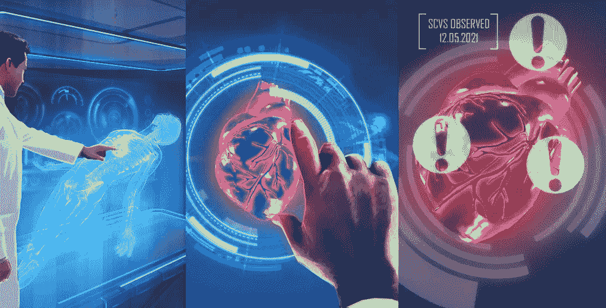
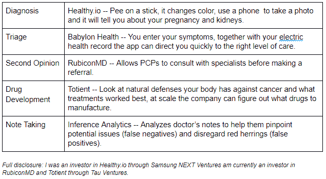

# 人工智能如何帮助我们拯救医疗保健

> 原文：<https://medium.datadriveninvestor.com/how-ai-can-help-us-save-healthcare-b7973de5a863?source=collection_archive---------29----------------------->

1714 年，人们发明了被认为是第一个使用水银并带有标准刻度的现代温度计。此后不久，医生开始在病人身上试验使用它。一些人认为这将有助于诊断和治疗。其他人认为只有通过触摸，医生才能确定病人是否真的发烧。这场争论持续了一百年，许多医生抵制一种工具，他们认为这种工具将观察减少到仅仅是数字。

今天，没有人会质疑温度计是多么不可或缺。虽然过去的体温计只有一英尺长，只有学术医院才有，而且读数需要 20 分钟，但今天它们是便携式的，普遍便宜，可以在几秒钟内给出读数。

 [## 人工智能与创造力:梦想成真|数据驱动的投资者

### 人工智能总是让我着迷。不仅作为一套有用的工具，不断发展，而且作为一个…

www.datadriveninvestor.com](https://www.datadriveninvestor.com/2019/01/28/ai-creativity-deep-dream-comes-true/) 

人工智能是医学中的新温度计。人工智能不是什么新东西，我们所知道的这个领域已经存在了将近 50 年。不同的是，我们现在有指数数量的数据和计算能力，这使得人工智能可以在以前不可能的规模上进行。我们仍然缺少的是，无论是从业者还是外行，都要完全接受人工智能的优势和局限性。

我们为什么要关心？医疗保健在世界范围内都被打破了，但这是在一个高度发达的国家，人们的期望和现实之间的反差最为明显。上个月，我进行了年度体检，并接受了维生素 D 的血液测试，维生素 D 对骨骼健康至关重要。我打电话给保险公司，确认它将被编码为预防性的，他们确实提交了索赔，但保险公司拒绝了它，理由是它不是联邦指南。最重要的是，我因为一次简单的验血被罚了 500 美元。为了避免我们在这里指责付款人或决策者，供应商收取了过高的费用。医疗保健确实充满了这种影响患者、提供者、支付者、制药商和决策者的陷阱——5p。

但人工智能如何修复根本上是激励和利益错位的结果？人工智能不是万能的(医疗保健领域有很多 Ps ),但它是一个强大的工具，下面是一些具体的公司，它们说明了更广泛的主题:

正如这些例子所示，通过利用人工智能，确实有可能节省成本、节省时间，并提供更高质量的护理。对 AI 让医生变得无关紧要的恐惧？人工智能不会取代它们，就像温度计也不会。机器非常擅长识别模式，特别是如果它们已经获得了大量的训练数据，但它们不擅长理解一些新奇的东西，而这可能是人类永远拥有优势的地方。人工智能非常擅长非常狭窄的任务，尽管媒体说，我们离一般人工智能的能力与人类相当还差得很远。

自从人类诞生以来，我们一直依靠技术来提高生产力。现在变化的速度比革命前快得多，我们需要更快地适应——学习新技能，创造新工作。医学更有理由拥抱人工智能，因为我们有希望在有生之年治愈它的许多疾病。

*原载于:* [*数据驱动投资人*](https://www.datadriveninvestor.com/2019/12/15/how-ai-can-help-us-save-healthcare/) *。”我是*[*Tau Ventures*](https://www.linkedin.com/pulse/announcing-tau-ventures-amit-garg/)*的管理合伙人和联合创始人，在硅谷工作了 20 年，涉足企业、创业公司和风险投资基金。这些都是专注于实践见解的有目的的短文(我称之为 GL；dr —良好的长度；确实读过)。我的许多文章都在*[*https://www . LinkedIn . com/in/am garg/detail/recent-activity/posts*](https://www.linkedin.com/in/amgarg/detail/recent-activity/posts/)*上，如果它们能让人们对某个话题产生足够的兴趣，从而进行更深入的探讨，我会感到非常兴奋。如果这篇文章有对你有用的见解，请评论和/或给文章和* [*Tau Ventures 的 LinkedIn 页面*](https://www.linkedin.com/company/tauventures) *点赞，感谢你对我们工作的支持。这里表达的所有观点都是我自己的。*