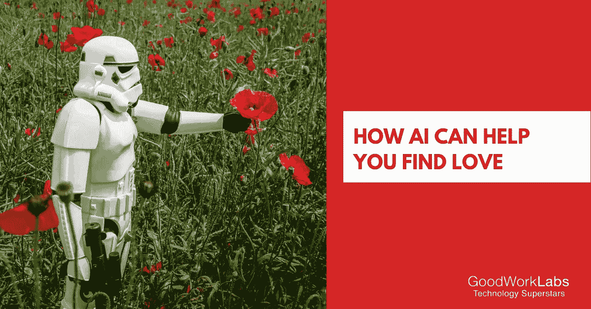

# 2019 年 AI 如何帮你找到爱情

> 原文：<https://medium.datadriveninvestor.com/how-ai-can-help-you-find-love-in-2019-44af3d31da47?source=collection_archive---------9----------------------->

很明显，你至少用过一次约会应用，即使你从未敢在你的社交圈里公开承认。大部分交友 app 的前提都是一样的；看一看带有一点信息的可见图片，然后决定向左或向右滑动。这些刷卡分别决定了你对某个特定人的个人资料的拒绝或感兴趣。

在开发阶段，这些约会应用程序有点混乱，让人摸不着头脑。然而今天，你可以告别数小时无意识地浏览大量个人资料的生活了。感谢[人工智能](https://www.goodworklabs.com/artificial-intelligence-solutions/)。

约会应用程序越来越多地利用人工智能的帮助，帮助用户建议第一次约会要去的地方，指示可以对另一端的人说的初始评论。更有趣的是，这些应用程序甚至可以帮助你找到与你最喜欢的名人相似的伴侣。

直到最近，像 Tinder 这样的智能手机约会应用程序还把邀请某人出去并让约会顺利进行的任务留给了使用该应用程序的人。渐渐地，这导致了用户的疲劳，他们不得不不停地搜索大量的个人资料而没有太多的成功。

 [## 对按需应用日益增长的需求——数据驱动的投资者

### 优步是最普遍的按需智能手机应用程序之一，现在有远见的企业家正在开发中…

www.datadriveninvestor.com](https://www.datadriveninvestor.com/2019/04/02/on-demand-apps/) 

这就是为什么在线约会部门转向利用人工智能的帮助，让人们在现实生活中安排约会，更像某种约会教练。

这些新发现的人工智能的用途，即计算机被编程来开发人类的思维或决策过程，已经被一次又一次地强调，表明了它的重要性。

# 人工智能在约会应用中的应用

如果有什么不同的话，约会网站和应用程序已经确立了自己作为新的基准，当它归结为为自己获得第一次约会。这就是为什么正如我们上面提到的，许多网站和应用程序所有者正试图在人工智能上使用一些不同的东西，以确保和提供给用户一个奇妙的整体体验。

在这里，我们看看人工智能如何改善用户的约会生活，以及约会应用程序或网站的整体用户体验。

# 1.帮助找到更好的匹配

当然，作为最明显的用途，约会应用的人工智能有助于改善人们与潜在约会对象的匹配。这是通过两种非常不同寻常的方法实现的。约会应用 Hinge 最近被观察到正在测试一个他们称为最兼容的功能，该功能在机器学习的帮助下找到更好的匹配。

该功能可以监控人们在应用程序上的行为。这种行为涉及用户以前喜欢的内容类型。该功能旨在充当媒人，找到您之前在平台上匹配的人。

约会网站目前和他们拥有的数据一样好。记住这一点，约会网站越来越多地利用技术和合适的数据来为他们的用户筛选匹配。有许多线索，如交流中的情绪、回复时间和个人资料的大小。

# 2.保持事情适度

在约会应用上保持适度非常重要，有两个基本原因。很明显，你希望人们有一个整体积极的用户体验。如果人们不得不担心意外获得假账户而不断刷卡，他们最终会转向其他应用程序。

为了保护应用程序公司本身，适度也变得至关重要。许多当局正在关闭任何对性交易和相关犯罪不严厉的网络平台。

这使得品牌不再选择适度，实际上他们有两个选择——人工适度或由计算机视觉(CV)适度实现的自动化。两种方法中只有一种可以帮助约会应用以更低的成本扩展和调节更多的内容，那就是计算机视觉。

# 3.防止安全问题

对于任何约会应用的用户来说，安全性是首要考虑的问题之一。一次负面体验足以让人们永远远离某个特定的应用。约会应用程序必须非常认真地对待这一点，并投资采取措施，使其平台尽可能安全。

让每个人都有足够的帮助来约会是不可能的，这就是为什么公司将不得不依靠人工智能来解决这个问题。一款名为 Hily 的应用程序为用户提供了一个“风险分数”，为用户提供了通过身份验证、过去的投诉、与其他用户交谈的程度以及在应用程序上花费的时间。

其他用户可以在应用程序上阻止具有高风险分数的个人将他们的私人信息发送到特定的个人资料。该应用程序还可以检测照片何时被篡改，然后阻止此类用户。

# 4.提供大量有用的用户内容

2019 年约会场景约会 app 的最终用途。许多因素使约会应用程序具有交互性和用户友好性，他们可以在那里度过美好时光。自拍图像和与个人资料相关的信息是此类应用程序中可用内容的一部分。

人工智能可以用来为用户提供更好的建议，告诉他们可以做些什么来改善他们的约会档案和可见性。例如，在线约会教练格雷格·施瓦茨(Greg Schwartz)使用面部识别模型 Clarifai 创建了一个应用程序，该应用程序可以识别人们在某些约会应用程序上使用照片时往往会犯的标准错误，例如使用豪华汽车和自行车的图像来获得令人印象深刻的个人资料。

虽然不是每个人都认为人工智能将帮助他们找到生命中的爱，但这一趋势目前正在上升，看到今年内事情如何进一步发展将是令人着迷的。

*原载于 2019 年 4 月 1 日*[*【www.goodworklabs.com】*](https://www.goodworklabs.com/ai-for-dating-apps/)*。*