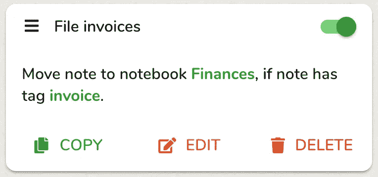
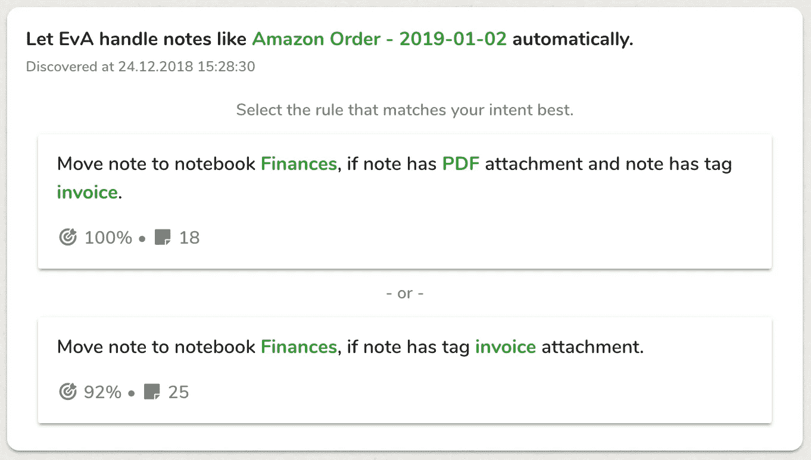

# 人工智能如何学习管理你的 Evernote

> 原文：<https://medium.datadriveninvestor.com/how-ai-can-learn-to-manage-your-evernote-cf8f22f8b9c1?source=collection_archive---------8----------------------->

Evernote 是一款流行的笔记软件，全球有超过 2 亿人使用。然而，该应用程序只为组织数据提供了非常基本的支持，因此用户必须花费精力来维护其结构。幸运的是，人工智能可以自动化许多这些乏味的家务活动。这改善了用户体验，并允许用户将他们的注意力投入到更有价值的活动中。

# Evernote 是什么？

[Evernote](https://evernote.grsm.io/ebccPascalHeld) 是市面上最流行、最强大的笔记工具。它的口号是“记住一切”——你只需把你的文档拖进应用程序，Evernote 就会帮你搞定。人们使用 Evernote 获取所有类型的个人和专业信息，并在需要时使用其强大的搜索功能来检索这些信息。

Evernote 将信息存储在*笔记*中。只有三种简单的构造笔记的机制，称为*标签*、*笔记本、*和*堆栈*。属于某个主题的笔记如*财务*或*项目*可以存储在相应的笔记本中，笔记本可以相互堆叠。或者，笔记可以被赋予标签来表示它们所关联的主题。Evernote 为笔记内容和元数据(如作者或创建日期)提供了搜索功能。因此，用户可以搜索带有标签*项目*的所有笔记，或者一周多以前由 Susan 创建的笔记*。*

# Evernote 的强势也是它的弱势

Evernote 是一个通用工具，所以它不会对所提供的信息类型或它的应用做任何假设:一个文档可以是任何东西，从巧克力饼干的配方到博士论文的笔记。

由于这个原因，Evernote 不能提供以特定于应用程序的方式组织信息的支持。例如，受欢迎的[完成事情](https://en.wikipedia.org/wiki/Getting_Things_Done) (GTD)时间管理系统是 Evernote 用户的常用应用。它要求未来的事件根据它们的到期日来组织。由于 Evernote 没有这种能力，用户不得不通过创建和分配标签和笔记本来尽可能地模仿它。因此，他们可能决定创建 12 个笔记本(或 12 个标签)，标题为*一月 _ 任务*、*二月 _ 任务*等。每当他们创建一个描述新任务的笔记时，他们必须记住将它移动到适当的笔记本上(或者给它分配适当的标签)。如果他们忘记这样做或犯了一个错误，那么 GTD 系统就会丢失该笔记，这在未来可能会产生严重的后果。

这意味着，如果您想要为您的信息维护一个特定的组织结构，您将需要执行许多重复的操作。例如，每次你扫描一张发票时，你必须给它添加一个标签，如*税*或*发票*。这既繁琐又费时，如果你忘了做，你的组织系统会立刻崩溃。

因此，Evernote 的通用功能既是优势也是劣势:你获得了最大的灵活性，但代价是大量的手工劳动。

# 委派操作以进行筛选

作为 Evernote 的用户，我们敏锐地意识到了这一弱点，并着手通过构建一个名为 [Filterize](http://www.filterize.net/) 的软件工具来弥补这一弱点。

Filterize 是一个基于网络的 SaaS，链接到 Evernote 帐户，可以模拟某些用户操作，如给笔记添加标签或将笔记移动到特定的笔记本。用户可以定义规则，指示 Filterize 在笔记满足给定条件时采取什么操作。

例如，用户可能希望标签为*发票*的所有票据都存储在笔记本*财务*中。这是 Filterize 在控制面板中显示相应规则的方式:

A rule in Filterize

从该规则被激活的那一刻起，无论何时用户修改标签为*发票*的票据，Filterize 都会自动将其移动到笔记本*财务*中，而无需用户的任何干预。

由于像添加标签或在笔记本之间移动笔记这样的操作经常发生，像这样的规则有可能为用户节省大量的工作。此外，它们消除了出错或被完全遗忘的风险。一些 Filterize 用户创建了 100 多个规则，每个月为他们节省了数千个手动操作。

规则对于在 Evernote 中构建[仪表盘](https://filterize.net/blog/using-filterize/evernote-dashboards/)特别有用，因为它们需要不断更新。Filterize 每周自动刷新我们的一些用户的仪表板超过 2000 次，而不需要他们进行任何干预。

然而，为了有效地应用这些规则，用户必须在头脑中有一个结构良好的“文件系统”，以便他们可以翻译成 Filterize 所需的语法。对于超级用户来说是这样，他们可能有成千上万的笔记，但对于普通用户来说就不一定了。

# 加入人工智能来过滤

因此，我们寻找一种方法，让主流用户也能享受过滤规则的好处。这些人以一种不太结构化的方式使用 Evernote，也可能对制定规则犹豫不决。

实现这一点的关键是意识到用户的意图实际上已经隐含在他们的 Evernote 数据库中:笔记本中笔记的元数据和位置是他们“精神归档系统”的镜像。人工智能算法可以分析这些信息，并将其与单个笔记的内容相关联，以便重建用户对其应用的操作。然后，这些操作可以被转换成规则，Filterize 可以自动执行，用户甚至不必显式地制定它们。

这种认识使我们能够开发我们的 *Evernote 虚拟助手* (EvA)，我们最近已经将它集成到 Filterize 中。EvA 将 Evernote 从被动的存储库转变为主动的助手:它学习你重复做的事情，然后主动为你做。

# 例子

在用户将名为*亚马逊订单—2019–01–02*的笔记移动到笔记本*财务*后，紧接着发生了下面的例子。这张票据有标签*发票*和一个附加的 PDF 文件。根据数据库中现有的注释，伊娃发现了两条极有可能描述这一行为的规则。

AI suggestion for a rule

在第一个案例中，EvA 了解到用户之前已经将标签为*发票*的笔记和一个 PDF 附件移动到笔记本*财务*中。数据库中有 18 张票据，带有 PDF 附件和标签*发票*，100%位于笔记本*财务*中。

第二种情况类似，只是没有 PDF 附件。数据库包含 25 张标签为*发票、*的票据，其中 92%位于笔记本*财务*中。

用户现在可以选择 Filterize 应该将这两个规则中的哪一个(如果有的话)添加到它的库中，并在将来自动应用于 notes。

# 使用人工智能检测模式

伊娃使用一种被称为[频繁模式挖掘](http://data-mining.philippe-fournier-viger.com/introduction-frequent-pattern-mining/) (FPM)的人工智能技术，在 notes 数据库中寻找模式和相关性，揭示用户如何构建他们的信息。频繁模式挖掘是预测人类行为的常用技术。它通常用于零售和电子商务领域，以发现一些事实，如“购买牛肉饼和番茄酱的人可能也会购买汉堡包子。”

这种分析的结果是一组可能用于构建数据库的规则。EvA 根据各种标准(如准确性、复杂性和发生频率)为每条规则打分。这个集合最初非常大:对于一个典型的 Evernote 用户来说，它可能包含数百万个选项。因此，EvA 的第二个任务是确定哪一个对用户最有帮助。

# 寻找最佳规则

在第一个淘汰步骤中，EvA 丢弃所有准确率低于 80%的规则。换句话说，数据库中不应该有超过 20%的例外。这排除了大多数的选择，但是对于一个普通用户来说，可能仍然会产生成千上万的可能性。

下一步，EvA 会计算[帕累托边界。](https://en.wikipedia.org/wiki/Pareto_efficiency)这是一组规则，就所有评估标准而言，其分数无法被其他规则超越。这一步也将消除绝大多数剩余的规则，但是对于一个典型的 Evernote 用户来说，可能仍然会留下几百条。

在第三步中，EvA 选择它认为与用户过去选择的规则格式最匹配的规则，并且如果应用这些规则将是最有益的。

然后，EvA 向用户显示排名靠前的规则列表，用户可以选择最合适的规则。在上一节的图像中，该列表只包含两个选项；在更复杂的情况下，它可能包含多达 20 个。EvA 将选定的规则添加到库中，Filterize 将在用户激活它时自动应用它，例如通过创建新的便笺。

当然，用户可以随时查看 EvA 提出的所有规则，并根据需要激活/停用、修改或删除它们。

EvA 为了发现一个似是而非的规则所需要的样本数量少得惊人。例如，用户可能在笔记本*烘焙中有几个包含关键词*蛋糕*和*预热烤箱*的笔记。伊娃只需要五个这样的音符，相应的规则就非常可信。*

# EvA 的典型使用案例

以下是 EvA 的四个典型使用案例:

*   **新用户**。对于大多数新注册的 Filterize 用户，EvA 可以仅根据标签立即建议多达 15 条有用的规则。(分析笔记内容会消耗大量处理能力，需要一些时间才能完成。)
*   **存档扫描**。Evernote 的一个常见应用是存档扫描的文档。大多数扫描仪可以配置为将扫描的文档直接发送到用户的 Evernote 帐户，Evernote 能够[读取扫描图像的内容](https://evernote.com/blog/how-evernotes-image-recognition-works/)。如果用户已经将包含相同关键字的扫描文档一致地归档到同一个笔记本中，EvA 可以识别出这一点，并提供在将来自动归档。
*   **设置提醒**。在工作环境中，一个人可以通过共享笔记本将任务分配给另一个人。方佩蓉可以学习自动为这些笔记添加提醒。
*   **标记网页剪辑**。Evernote 提供了一个 web clipper 功能，用于将网页复制到其数据库中。对于重复出现的主题，方佩蓉可以学习阅读剪辑的内容，并为笔记指定适当的标签。例如，伊娃可以学习自动给每个包含关键字*编织*和*图案*的剪辑添加标签*爱好*。

Evernote 用户的“精神文件系统”越广泛和一致，他或她就越能从 EvA 中受益，因为他们的笔记将包含更多可识别的模式。在理想情况下，EvA 将能够自动管理与以前事件一致的每一个笔记。

# 好处和未来潜力

过滤规则为 Evernote 用户提供了许多好处。它们节省了时间，降低了误放或丢失笔记的风险，并使笔记管理更加方便。随着 EvA 的加入，用户甚至不再需要明确指定规则，而是只需选择人工智能检测到的各种候选人中最准确地符合他们意图的一个。

我们相信，我们才刚刚开始意识到人工智能为 Evernote 提供的潜力。例如，我们目前正在开发将提供以下功能的算法:

*   **找回丢失的纸币**。缺少标签的笔记有丢失的风险。伊娃将能够利用笔记内容和标签之间的相关性来建议替换遗忘的标签。例如，一个用户可能有几个包含关键字*餐馆*和*明星*的笔记，除了一个以外，这些笔记都标记有*评论*。因此，当用户在 Evernote 上搜索评论时，这个笔记不会显示出来。伊娃将能够建议通过添加丢失的标签来修复该笔记。
*   **整理数据库**。伊娃将能够识别档案中的不规则之处，并帮助修复它。例如，有可能找到可能位于错误笔记本中的笔记，并建议它最有可能用于的笔记本。
*   **(重新)构建档案**。一些人把 Evernote 当成了一个[万用桶](https://www.google.com/search?num=100&amp;q=%22everything+bucket%22+evernote)——一个存放他们所有文件的仓库，很少或者根本不注意组织。在这种情况下，方佩蓉可能能够使用笔记本和/或标签为笔记提出一个逻辑结构。必要的人工智能工具是可用的，但对于一个不受管理的 Evernote 档案库来说，它能有多有效还不清楚。

# EvA 现已推出测试版

我们已经发布了 EvA 的公共测试版。如果您已经有一个筛选帐户，您可以立即开始使用它-只需在您的筛选帐户中激活 EvA。其他 Evernote 用户需要先用 Filterize 注册[。](https://filterize.net)

Filterize 是一个云服务，可以充当你的个人 Evernote 助手。告诉软件你是如何组织笔记的，或者只是让它的人工智能自动学习如何做。Filterize 将在后台管理您的笔记，消除重复的任务，避免错误并节省您的时间。

*原载于 2018 年 12 月 28 日*[*【filterize.net*](https://filterize.net/blog/using-filterize/ai-manage-evernote/)*。*

*披露:我是* [*筛选*](http://www.filterize.net/) *的创始人兼 CTO。Filterize 是一个软件工具，它可以与 Evernote 一起提供卓越的用户体验。*