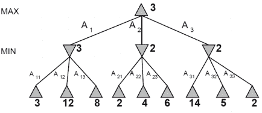
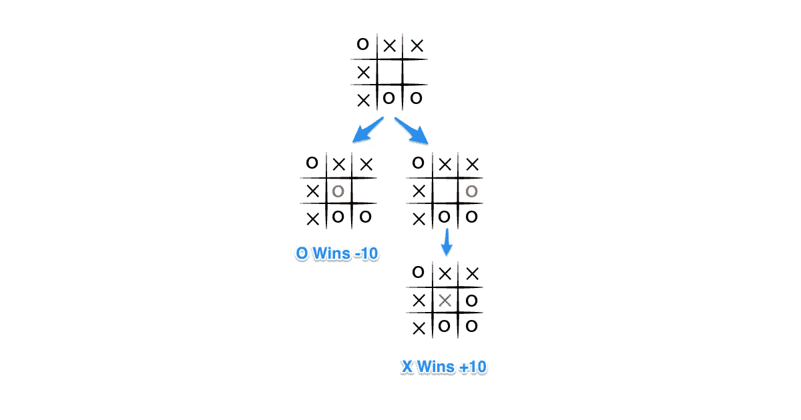

# 在双人游戏中人工智能如何决定

> 原文：<https://medium.datadriveninvestor.com/how-ai-decides-in-a-two-player-game-a51bc21b7fe7?source=collection_archive---------2----------------------->

瑞恩·尼尔·卢斯

在过去的几十年里，**人工智能** (AI)一直统治着双人游戏的世界。1997 年，第一台打败当时的世界象棋冠军加里·卡斯帕罗夫的计算机是 IBM 的深蓝。这场胜利震惊了世界；卡斯帕罗夫甚至想要重赛，但 IBM 拒绝了这个想法。

接着，DeepMind 的 AlphaGo 在 2016 年 3 月以 4 比 1 的比分击败了世界顶级围棋选手之一的李·塞多尔(Lee Sedol)。当年晚些时候，一位名叫“*大师*的神秘在线围棋选手连续几周击败了世界上最好的围棋选手。神秘玩家赢了 51 场比赛中的 50 场。由于连接问题，第 51 场比赛甚至不是失败，而是平局。官方证实，“大师”实际上是 AlphaGo 的最新版本。

 [## 算法诱人的商业逻辑|数据驱动的投资者

### 某些机器行为总是让我感到惊讶。我对他们从自己的成就中学习的能力感到惊讶…

www.datadriveninvestor.com](https://www.datadriveninvestor.com/2019/03/22/the-seductive-business-logic-of-algorithms/) 

在我们发现 AI 如何在游戏中工作之前，我们首先需要记住，我们正在谈论确定性、两人、零和以及完全信息游戏。如果没有随机因素，游戏就是确定的。给定先前游戏状态和玩家行为的知识，接下来的事件应该是完全可预测的。零和游戏包含纯粹的竞争。一个玩家的损失就是另一个玩家的收益，反之亦然。一个玩家试图最大化一个值，而另一个玩家试图最小化它。如果每个玩家都知道之前发生的所有事件，那么这个游戏就提供了完美的信息。例如，国际象棋中的每个玩家可以随时看到棋盘上的所有棋子。国际象棋、跳棋、井字游戏和围棋是确定性的、两人博弈、零和以及完全信息博弈的完美例子。

当前最先进的双人游戏实现是复杂的。但是都涉及简单的盲目计算。决策过程使用博弈树，其中每个组成部分代表一些东西。树节点代表游戏状态(*，例如棋子在棋盘上的位置*)；根节点是当前状态，而叶节点是最终状态(*赢、输或平*)。同时，边代表玩家的移动，而层反映了可供选择的移动。为了模拟为玩家找到最佳移动的决策，我们需要一个算法来计算计算机玩家所有可能的移动，并使用度量来确定最佳选择。为此，极小极大成为完美的解决方案。该算法有两个角色:最大化器**和最小化器**。最大化者选择得分最高的节点，而最小化者选择得分最低的节点。下面是**极大极小算法**的示例说明:

Source: AI: A Modern Approach Book

看图，极小化器会选择得分最低的子节点 **[min (3，12，8) = 3]** 。另一方面，最大化器将选择最高分 **[max (3，2，2) = 3。]** 然而，生成整棵树是极其昂贵的。以国际象棋为例，当宇宙估计只包含全部原子时，也有可能出现国际象棋的结果。换句话说，象棋中可能的走法比整个宇宙中的行星、恒星甚至原子都要多。去每一个叶节点(*终端状态*)计算其效用几乎是不可能的。因此，我们不会探索所有可能的树，而是搜索有限的深度。我们将使用一个计算启发式条件的评估函数来代替终端工具。如果最大深度是 **N** ，我们会在 **N** 移动后评估每一种可能的游戏状态，根据是最大化还是最小化来选择节点。评估函数用于从玩家的给定状态估计期望的效用数值。

为了形象化，我们将以**井字游戏**为例。x 玩家是最大化者，而 O 玩家是最小化者。下图显示 O-player 只剩下两种可能的走法。如果 O-player 将标记放在左边的框中，O-player 获胜，评估分数将为-10。但是如果 O-player 把标记放在右边的框上，玩家 change 会改变回合，X-player 会标记最后一个空格并赢得游戏。玩家选择了左边的盒子，因为它会产生一个-10 的分数。选择右边的盒子会给它+10 分。

Source: [*https://www.neverstopbuilding.com/blog/minimax*](https://www.neverstopbuilding.com/blog/minimax)

了解人工智能如何制定战略和做出决策是一件有趣的事情。我们可以说，人工智能的优势在于它能够预见和记忆多种可能的结果，并从中选择最佳结果。如果你想建造一个无与伦比的人工智能玩家，这将非常有帮助。

**立即获得免费的机器人过程自动化(RPA)软件！**

[在此下载](https://www.raxsuite.com/freedownload?utm_source=Medium%20Post&utm_medium=medium&utm_campaign=medium_footer)

资源:

 [## 人工智能|对抗性搜索-Java point

### 对抗性搜索是一种搜索，在这种搜索中，我们检查当我们试图提前计划世界和…

www.javatpoint.com](https://www.javatpoint.com/ai-adversarial-search)  [## 从头开始为你自己的棋盘游戏创造人工智能——Minimax——第 2 部分

### 用 Minimax 算法实现 AI 到 EvoPawness(暂名)，一个来自我的想法的棋盘游戏。

towardsdatascience.com](https://towardsdatascience.com/create-ai-for-your-own-board-game-from-scratch-minimax-part-2-517e1c1e3362)  [## 井字游戏:理解极大极小算法-永远不要停止建设-手工木材与…

### 为了使井字游戏不可战胜，有必要创建一个算法，可以计算所有的…

www.neverstopbuilding.com](https://www.neverstopbuilding.com/blog/minimax)