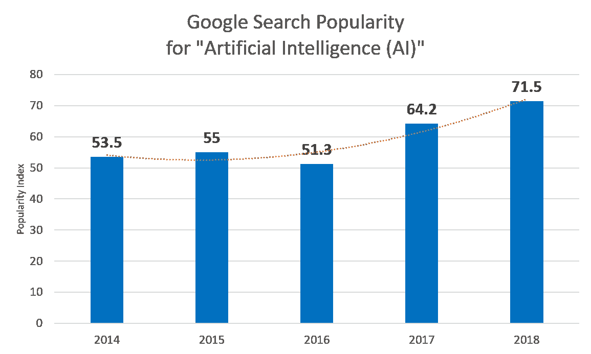
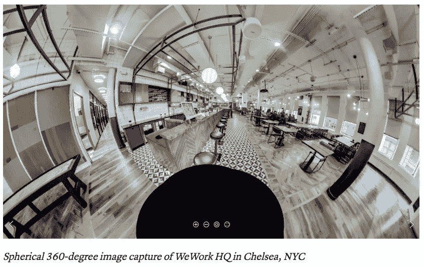

# 人工智能如何改变(或不改变)工作场所

> 原文：<https://medium.datadriveninvestor.com/how-ai-is-and-is-not-transforming-the-workplace-f3499e41e1db?source=collection_archive---------16----------------------->

Ali Ghodsi, CEO of Databricks, outlines the concept of “boring AI”

在 [Sapphire 的 2018 CIO 峰会](https://medium.com/sapphire-ventures-perspectives/3-ways-cios-stay-on-the-front-lines-of-innovation-takeaways-from-the-2018-cio-summit-2c8695c38e55)上，Databricks 的首席执行官 Ali Ghodsi 指出，AI 的最大收获是相当无聊的。无人驾驶汽车、Google Home 和 Alexa 等闪亮的解决方案可能会占据头条，但企业的真正机会在于自动化平凡、低价值的任务。能够在数据输入、[簿记和税务准备](https://www.teampay.co/insights/finance-jobs-taken-by-robots/)甚至建筑项目的监督方面节省时间和金钱，可以让员工专注于更具创造性、价值更高的工作。

对于首席信息官来说，他们越来越多地发现自己处于企业技术投资的前沿，随着以更具创造性和更高效的方式工作的压力加剧，知道人工智能在哪些方面有所作为可能是一项巨大的资产。

近年来，公众对人工智能的兴趣激增，自动驾驶汽车等图像进入了公众的意识。看看谷歌趋势，自 2014 年以来，“人工智能”的平均搜索流行指数增长了 30%以上。

*来源:* [*谷歌趋势*](https://trends.google.com/trends/?geo=US)

《连线》*杂志*前主编、3DR 现任首席执行官克里斯·安德森在峰会开幕主题演讲中指出，我们远远没有进入人工智能的“替代时代”,在这个时代，人形机器取代了人们坐在办公桌前、管理装配线或提供食物。

很明显，许多人仍然有疑问。这篇文章为首席信息官和其他希望在工作场所保持人工智能前沿的人提供了答案。我们在很大程度上借鉴了 2018 年首席信息官峰会的讨论，专注于一些最具创新性的公司如何将人工智能融入他们的工作场所，并实现巨大的收益。

# 数据工厂的兴起

关于如何将机器学习技术应用于数据集可以挖掘出有价值的见解，有很多宣传。成功做到这一点的公司正在发现客户在其应用中的行为与他们何时购买之间的新联系，特定的入职实践与员工保留之间的新联系，甚至是天气和新建筑项目结果等变量之间的新联系。

然而，大多数公司面临的挑战是他们的数据是孤立的。大多数福布斯全球 2000 强企业都拥有大量信息，如购买历史、[产品分析](https://amplitude.com/blog/2017/01/25/hard-thing-product-analytics)和员工证书，但大多数时候这些信息都是分开存储的，并且格式不兼容。小样本很难发现有意义的结果。此外，如果一家公司试图用有限的信息训练机器，通常不足以提供准确的预测。

在 CIO 峰会上，Ali Ghodsi 指出，只有 1%的公司——主要是脸书、Twitter 和谷歌——拥有从其数据集获取重大价值的架构。对于首席信息官来说，这凸显了一个效仿的巨大机会。

好消息是，即使对于没有脸书、推特和谷歌资源的组织来说，新的解决方案正在出现，以帮助他们整合、清理和优化他们的数据集，并以有竞争力的速度运行测试。[举例来说，Databricks](https://databricks.com/product/unified-analytics-platform) 可以提供这种基础设施，代替那些不得不重建现有系统的组织。使用 Databricks 软件的公司可以花更多时间分析他们的信息，并将其转化为与客户更相关的产品和体验，而不是简单地存储信息。

# 利用自动化拉近与客户的距离

在个人层面上与各种各样的客户互动需要对细节的极大关注。在零售和企业软件等行业，越来越多的销售代表依赖细微的信息，如过去的应用行为、购买历史、兴趣和地理位置，来寻找新的线索，并以更有意义的方式推销产品。

人工智能提供了补充这一数据驱动过程的方法。在峰会上，脸书的[工作场所协作平台](https://www.facebook.com/workplace)的主管 Frerk-Malte Feller 强调了团队如何开始依靠情绪分析——从大块文本或长录音中自动得出观点和其他定性信息的过程——来获得客户电话的实时反馈，并提高复杂翻译的速度和质量。提高这些小任务的效率有助于客户支持和销售团队接触更多不同的受众，并确保他们的互动更有价值。

改进的机会是巨大的。在许多呼叫中心，代理仍然手动输入客户联系信息。通话后，代理收集的关于客户互动质量的信息，包括棘手问题、语气和解决方案(或不解决)很少是完整的。当代理人时间紧迫时，细节可能会被遗漏。情绪分析(或情绪人工智能)有助于实时监控客户互动的质量。这一过程足够先进，可以根据某些单词的流行程度来衡量沮丧或满意等情绪。而销售代表之前会将客户引导至售后服务“您的体验如何？”调查，他们现在可以立即得到结果。更快、更丰富的数据集有助于经理支持代理的发展。

此外，翻译费大约是一个单词 10 美分。随着许多团队试图进入新兴市场，成本会迅速增加。神经机器翻译(NMT)是一种先进的人工智能技术，允许团队更快、更好地将 Skype 通话、营销材料甚至社交媒体帖子从英语翻译成更复杂的语言，如乌尔都语和罗马尼亚语。2018 年，脸书能够与 NMT 一起将其翻译速度提高到[每天 4.5 亿次](https://research.fb.com/wp-content/uploads/2017/12/hpca-2018-facebook.pdf)。

# 用人工智能和机器学习改进项目序列

在峰会的开幕主题演讲中，克里斯·安德森描绘了人工智能与更传统的实体产业之间的联系。即使在建筑领域——数字化程度最低的领域之一——人工智能也在帮助公司实现项目序列自动化，从而变得更加安全和高效。

例如，工程巨头 Bechtel 通过将过去项目的数据输入人工智能算法，帮助他们根据恶劣天气、材料和劳动力短缺等风险，更好地预测新合同的结果，从而在新项目(如机场和电厂)上节省了数百万美元。

“人工智能——执行传统上留给人类的决策任务——不会让我们的知识工作者变得无关紧要。人工智能将使我们能够更好地预测结果，设计复杂的项目，并自动化日常决策任务。”——大卫·威尔森，柏克德首席创新官(来源:[柏克德博客](https://blog.bechtel.com/build-100/august-2018/artificial-intelligence-impact-construction/))

通过对十年项目数据的培训，Bechtel 已经能够加快发现过去项目之间相关性的过程，并选择未来风险较低的作业顺序。

WeWork 还开发了一种使用机器学习的更有效的办公室装修公式。他们首先使用现实捕捉来创建空白空间的高分辨率 3D 模型。

[[Image Source: WeWork blog](https://www.wework.com/blog/posts/why-reality-capture-matters-at-wework)]

从那里，他们[通过人工神经元](https://www.wework.com/blog/posts/designing-with-machine-learning)输入这些和其他建筑数据，人工神经元理解建筑布局的细微差别，以及员工如何根据先前的设计在空间中移动。该软件依赖于过去的布局来预测新空间需要什么样的变化才能成为一个功能性和生产性的工作场所。

随着 WeWork 从仅仅建造自己的办公室扩展到其他公司的办公室，如 [UBS](https://www.bloomberg.com/news/articles/2018-07-30/wework-will-renovate-ubs-office-in-its-biggest-design-deal) 和 [Pinterest](https://www.poweredbywe.com/member-stories/) ，它能够使用智能软件来创建设计，这些软件可以学习客户想要的“体验”，基于细节，如会议室与办公室的比例或电话室的数量；公共空间的布局；甚至是声学。考虑到预算限制，该软件还优化了材料，限制了更昂贵的玻璃和金属。最后，WeWork 预制好办公室，用卡车把零件运到建筑工地，然后像组装乐高积木一样以低成本组装起来。

建筑、制造、卡车运输和仓储——特别是因为这些行业的数字化程度较低，所以存在整合人工智能以获得竞争优势的巨大机会。

# 人工智能以微妙的方式释放价值

当今工作场所中最成功的人工智能应用是那些不可见的应用。就像洒水器或电灯开关一样，它们只是做好自己的工作，是非侵入性的，让生活变得更轻松。首席信息官们认识到了这一点，尽管他们面临着组织和 FOMO 的压力，要求他们专注于人工智能“闪亮”但更具实验性的应用。

人工智能远未取代整个职业，但它正在自动化和改善日常运营中的低价值细节，这些日常运营可能成本高昂、耗时甚至危险，使人类员工能够从事更有意义的工作，并直接有助于提高利润。

