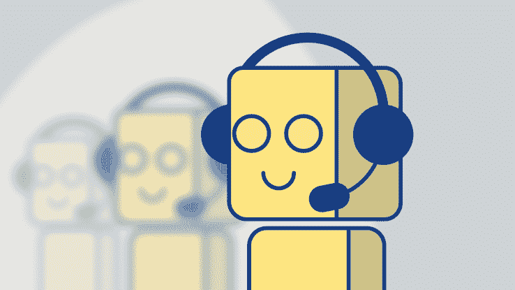
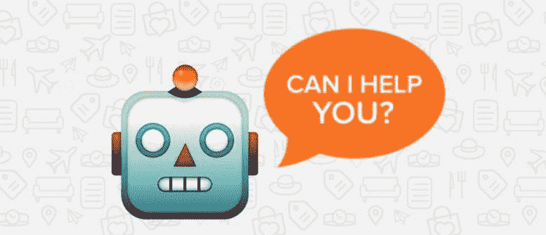

# 人工智能如何成为营销领域的游戏规则改变者

> 原文：<https://medium.datadriveninvestor.com/how-ai-is-becoming-a-game-changer-in-marketing-b80bdca160ad?source=collection_archive---------30----------------------->

市场营销是决定任何企业成败的最关键的环节之一。因为广泛的客户基础的重要性在决定任何组织的收入和成功方面具有首要意义，所以营销是一个重要的工具。但事实是，要让一家公司脱颖而出，这一过程需要大量的时间和智慧。有时候，在这个过程中投入如此多的时间和精力会令人望而生畏。自从人工智能和机器学习建立以来，这个概念变得更加深刻。事实上，[据 Salesforce](http://www.huffingtonpost.com/entry/2017-state-of-marketing-ai-is-highest-tech-investment_us_593eea47e4b014ae8c69e2fd) 称，3500 名市场营销负责人表示，人工智能是最有前途的技术之一，在未来两年有巨大的增长前景。64%的 B2B 营销人员认为[人工智能对他们的销售和营销战略](https://www.everstring.com/resources/report-the-state-of-ai-in-b2b-marketing/)很有价值。在这一点上，让我们深入研究人工智能如何有可能彻底改变营销的细节。

# 1.增强客户体验

如今，每个客户都希望获得定制服务和个性化体验。众所周知，高度满意的顾客几乎有百分之一的可能会再次光顾。这就是人工智能聊天机器人可以证明大有用处的时候。71%的 B2B 营销人员对使用[人工智能进行个性化](https://www.everstring.com/resources/report-the-state-of-ai-in-b2b-marketing/)以改善整体客户体验表现出浓厚的兴趣。通过高效、一致和相对便宜，这些机器人可以以互动的方式吸引客户，并传达公司总是在那里满足他们需求的信息。它还可以跟踪客户的行为并提供相关信息。他们全天候工作，根据客户的历史，为他们提供有价值的信息，解决他们的疑问，从而建立更好的企业与消费者的关系。事实上，根据大约 80%的 B2B 营销主管的预测，人工智能有潜力在 2020 年前彻底改变整个行业。

# 2.让谈话变得愉快

让我们面对现实吧。人工智能的概念，尤其是在营销领域是一个新的概念。普通大众一直在尝试和测试新事物。人工智能聊天机器人是一个相对较新的概念，肯定会引发人们一定程度的好奇心。聊天机器人是一种计算机程序，一种具有自然语言处理能力的机器学习算法。它由收集和分析数据的不同层组成。因此，事实仍然是，客户会增加他们与你的业务的互动，仅仅是出于对聊天机器人所能提供的体验的好奇。聊天机器人能够模仿真实的零售店体验，因为它与顾客的交流是直接的。正如我们已经见证的那样，微软的 Cortana、亚马逊的 Alexa、苹果的 Siri 和谷歌的 Assistant 都做出了成绩，并且在营销方面真的取得了回报。此外，对话是令人愉快的，因为机器人产生的类似人类的行为本身就很迷人。

# 3.高效解决问题

你还记得上一次你打电话给客户服务部，却不得不等一辈子直到你的电话被转接到负责人那里吗？随着[人工智能聊天机器人被用于客户服务](https://www.emarketer.com/content/few-marketers-are-using-ai-chatbots)，他们可以在几分钟内帮助客户解决任何问题，无论他们住在哪里。例如， [Erica](https://www.cnbc.com/2016/10/24/bank-of-america-launches-ai-chatbot-erica--heres-what-it-does.html) 是由美国银行开发的一个机器人，可以在众多平台上使用，如 Facebook Messenger 和 SMS 文本消息。人工智能机器人帮助客户根据他们的支出做出务实的决定。顾客不必在一大堆乱七八糟的东西中寻找他们想要的东西，因为机器人随时待命。再也没有陌生电话、各种营销团队的垃圾邮件、颠覆性广告，这一切都归功于 AI 在营销中的应用！

# 4.提供全天候客户支持

关于检查你的电子邮件、预约和预订的对话更新可以毫无瑕疵地进行。无论人类进步多少，他们在多任务处理方面永远不可能像机器一样出色。这就是 [AI 胜过](https://snaps.io/heres-chatbots-best-ai-marketing-automation-tool/)的地方。它可以帮助客户以惊人的速度和高效率执行任务，这是大多数人无法做到的。人工智能可以在一个地方促进你的数字生活的有效整合。 [Nanorep](https://www.nanorep.com/customers/featured-customers) 是 NLP 和聊天机器人的巧妙结合，用于促进电子商务和简化各种客户服务。宜家、沃达丰和联邦快递是使用 Nanorep 为客户提供高效服务的几家客户。此外，聊天机器人可以同时解决多个客户的问题。毕竟，我们早就该告别客服电话等待了，对吧？

# 5.伟大的成本削减解决方案

尽管人工智能不能完全取代人工干预，但它在削减组织成本方面发挥了巨大作用。在某些情况下，机器人可以做人类做的事情，甚至更好！因此，对人类劳动力的需求急剧下降。因此，该公司可以削减雇用多名员工完成一项任务的成本，而这项任务单个机器人就可以轻松完成。例如，公司让员工打电话获得客户反馈，而人工智能可以以更好的方式完成任务。

从提供有见地的数据到全天提供客户服务，就革新营销的[而言，人工智能绝对占有优势。随着人工智能技术的进步，世界实际上可以看到即将降临到我们身上的变化。大多数人对我们日常生活中的改变感到有点吃惊。](https://www.forbes.com/sites/forbesagencycouncil/2018/05/23/how-ai-will-change-marketing-as-we-know-it/#2e3c784778b7)

研究称，33%的营销人员认为将人工智能与他们目前的角色和工作流程整合是一个主要障碍。根据[的一份报告](https://www.everstring.com/resources/report-the-state-of-ai-in-b2b-marketing/)，只有 13%的 B2B 营销人员具备完善的人工智能知识，55%的人在某种程度上有信心，33%的人完全没有信心。但这并不意味着改变就一定是坏事，不是吗？一旦营销人员看到了大局，并意识到聊天机器人可以重塑整个企业的状态，营销部门将见证的巨大推动将值得称赞。凭借迷人的体验和提供最高水平客户满意度的目标，人工智能聊天机器人将带来人类几十年来一直努力实现的变革。

作者简介:

阿尼班·古哈是一名经验丰富的集客营销和沟通专家，目前在企业级聊天机器人平台 [Kore.ai](https://kore.ai/) 工作。他是最新技术趋势的敏锐观察者，喜欢写关于这些趋势的文章。你可以在 [Twitter](http://@anibeg25) 和 [LinkedIn](https://www.linkedin.com/in/anibeg25/) 上关注他。