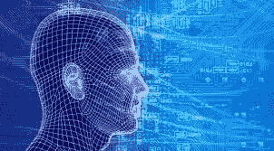

# 人工智能如何塑造赌博的未来

> 原文：<https://medium.datadriveninvestor.com/how-ai-is-shaping-the-future-of-betting-3480a50af677?source=collection_archive---------18----------------------->

不需要太多的技术知识就能明白，人工智能和相关的[技术将对我们社会在多个方面的工作方式产生重大影响](https://www.digitaltrends.com/cool-tech/ai-swarm-intelligence-and-the-future-of-sports-betting/)，我们已经非常接近这种情况了。观察事情在不久的将来如何发展将会很有趣，一些领域将会受到特别的影响。

Artificial Intelligence and Betting

对于那些对人工智能感兴趣的人来说，像 [sbobet88](http://www.sbobet88.us) 这样的赌博是一个值得关注的领域，反之亦然——狂热的打赌者可能希望熟悉这个技术领域的现代进步，以便为未来做好准备。

**更明智的见解**

人工智能系统能够比人类更有效地看待大局，在赌博的背景下使用它们的好处越来越明显。当你对情况理解不够深入时，或者在你可能有一些个人倾向的情况下，很难将一些点联系起来。一个人工智能系统在这方面可以不加选择，并产生合理、客观的结果。

**未来预测**

你也可以很好地了解事情的长期发展，尤其是如果你对过去有足够的了解。目前，许多人正在投入大量精力开发先进的人工智能系统来预测未来，看起来这将在不久的将来走得很远。当然，其中一些预测仍然是不正确的，但是观察进化出的通常更高精度的模式是很有趣的。

**正确利用数据集**

如果你能接触到大量的历史数据，你就能在赌博的世界中非常有效地利用这些数据，并得出各种准确的预测，如果你有正确的信息，这些预测几乎肯定是正确的。这就是为什么目前大力强调数据收集和保留如此重要的原因——在不久的将来，访问大量历史数据的好处将会非常显著。

**每个人都可以访问**

人工智能技术的另一个巨大好处是，它变得越来越容易被各种各样的人接触到，并且不需要先进的专业知识来正确利用。当然，深入了解这些系统到底是如何工作的，对于那些试图充分利用它们的人来说仍然有很大的好处，但这已经不重要了。

我们仅仅触及了今天可能发生的事情的表面。观察人工智能技术在不久的将来的发展将是令人兴奋的，因为它可能会为许多人带来相当多的好处，而那些积极参与赌博的人可能会受益匪浅。正如我们已经看到的那样，假设人工智能的整个子领域都将出现以满足这个市场的需求并不太牵强。