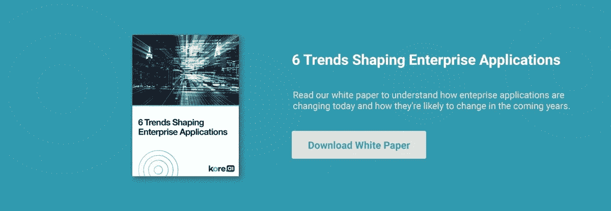

# 人工智能如何改变企业软件应用

> 原文：<https://medium.datadriveninvestor.com/how-ai-is-transforming-enterprise-software-applications-63f16ed57b0?source=collection_archive---------5----------------------->

计划实现企业应用系统现代化的组织应该考虑这些趋势。

企业 IT 正在经历有史以来最引人注目的变革。大约三分之一的工作负载现在运行在云中。对于许多组织来说，云计算(包括“云原生”架构的兴起)已经成为应用程序部署的默认模型。与此同时，移动设备已经成为员工和客户的首选平台——总是在手边，是商业和个人任务的首选。

另一方面，人工智能(AI)在全球企业中越来越重要。Gartner 预测，到 2021 年，服务提供商实施的 40%的新企业应用将包括人工智能技术。

为了了解企业应用程序目前正在发生怎样的变化，以及它们在未来几年可能会发生怎样的变化，我们来关注一下这六个主要趋势。

**趋势 1——越来越多的商业领袖正在拥抱对话式人工智能**

相当多的商业领袖和产品经理正在从数字巨头那里寻找线索，比如脸书、亚马逊、苹果、谷歌等。—并投入巨资部署人工智能驱动的对话机器人、语音搜索和 VPA 应用。这些企业正在采用人工智能来降低运营成本，减少消费者购买时的摩擦。对话平台的人工智能在许多方面利用了自然语言界面和前沿创新。随着人工智能领域的快速创新，对话平台正在开发巨大的潜力来满足企业用户的需求。

**趋势№2 —自然语言处理提升商业智能**

随着人工智能和自然语言处理技术的成熟，计算机将开始更好地理解查询，并开始提供答案而不是搜索结果。首先，数据聊天机器人会回答更复杂的问题，并返回几页数据供你分析。但是一旦它学习了问题的语义关系和推论，它将能够自动执行必要的过滤和组织，以提供一个可理解的答案，而不是简单地向你显示数据。

**趋势 3——移动设备成为应用界面的新标准**

说到移动设备，移动计算不再是销售团队、现场技术人员和高管们的特权。它现在是大多数办公室工作人员和其他专业人员的首选网络访问和应用程序使用模式。

[**亦读:Kore.ai 的 Bots 平台 6.1 对全球企业意味着什么**](https://blog.kore.ai/what-kore-ai-bots-platform-6.1-means-to-global-enterprises)

**趋势 4——信息正在成为在线交流的新标准。**

短信已经是最流行的移动活动之一。美国的典型移动用户将近 10%的设备时间用于发送消息(不包括另外 17%的时间用于脸书，后者类似于发送消息)。人工智能聊天机器人的崛起是由通讯平台的激增推动的，这些平台重新定义了与服务和企业的对话。聊天机器人正在成为一对一对话的工具。

**趋势 5——部门和员工个人正在推动新技术的采用。**

当软件在昂贵的本地服务器上运行时，员工无法在不通过 IT 部门的情况下购买和供应软件。员工也许能够将独立的应用程序偷偷放到他们的桌面系统上，但是多用户应用程序通常需要访问服务器，因此需要 IT 部门的批准和监督。

**趋势№6** **—安全性和合规性正融入企业 IT 的方方面面。**

随着微服务取代整体应用，IT 决策变得更加民主和分散，企业保持其对安全性和合规性的长期承诺变得非常重要。用由不同团队用不同语言创作的更加多样化的服务来取代单一的应用程序，扩大了企业的“攻击面”。

这六个趋势并没有完全改变企业软件应用程序。在未来几年，我们应该会看到应用程序变得更加分散，更加人工智能驱动，更加自动化，并且更容易通过一个通用的、安全的消息传递接口来访问。

**阅读我们的** [**白皮书**](https://info.kore.ai/wp-six-trends-shaping-enterprise-applications?hsCtaTracking=d6249725-4680-44f8-b176-14eabcf67f6b%7C8356a170-1c32-4741-a6cb-665286d42505) **了解企业应用程序目前的变化以及它们在未来几年可能会发生的变化。**

*原载于*[*blog . Kore . ai*](https://blog.kore.ai/how-ai-is-transforming-enterprise-software-applications)*。*