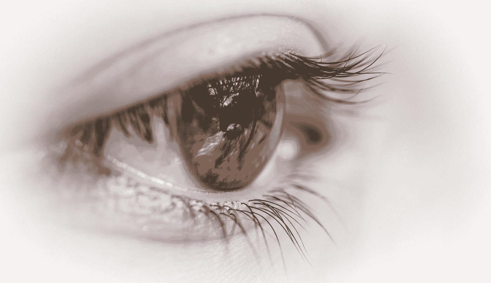
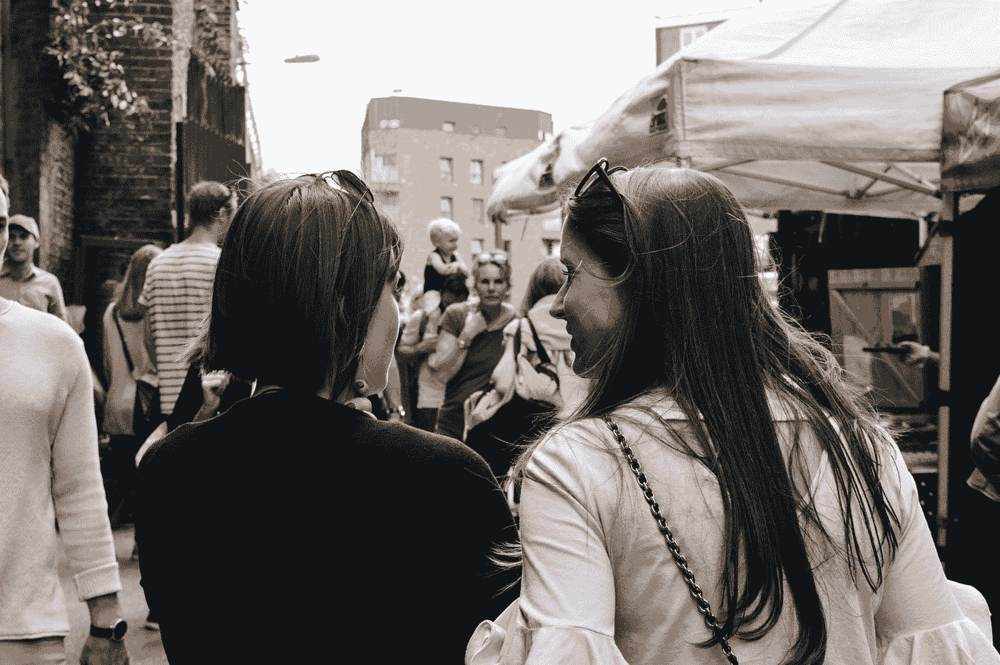
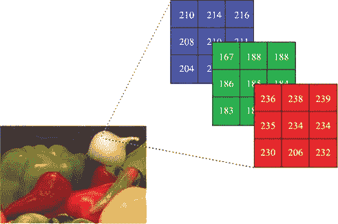
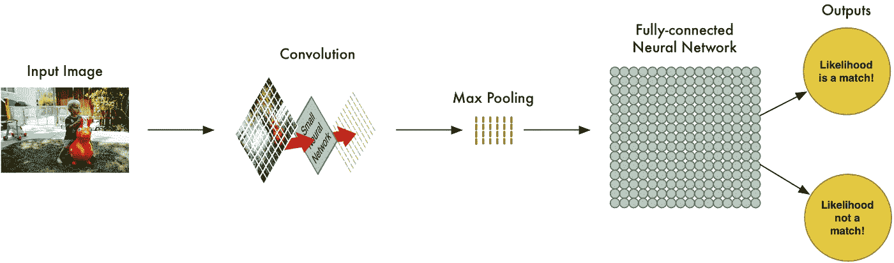
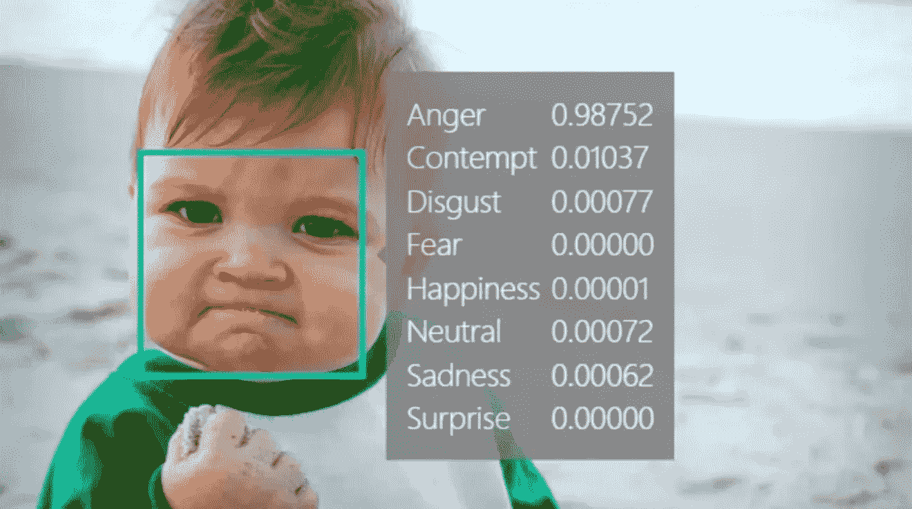
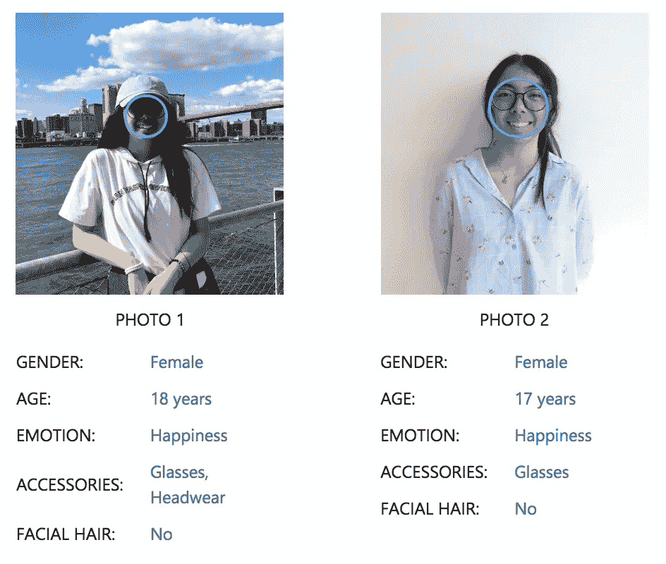
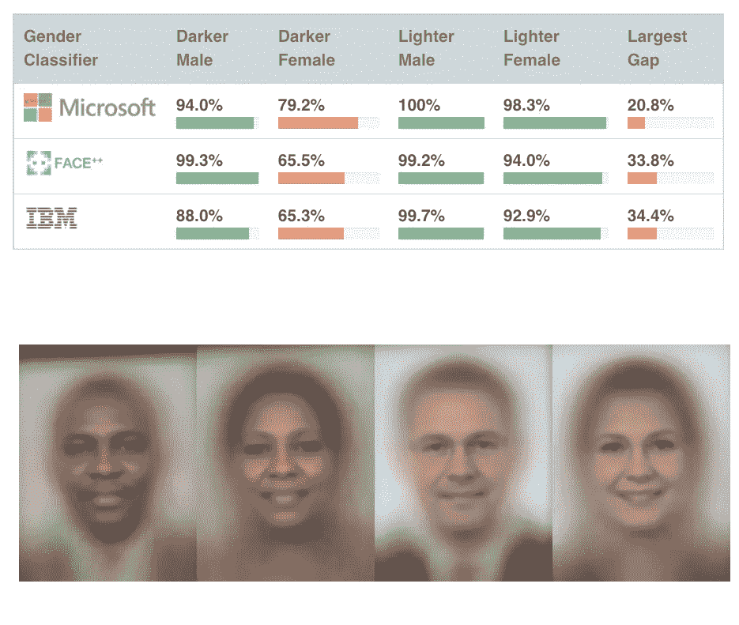

# 人工智能如何看待世界——图像识别和算法偏差

> 原文：<https://medium.datadriveninvestor.com/how-ai-sees-the-world-image-recognition-algorithmic-bias-653890019da0?source=collection_archive---------1----------------------->

人类低估了视觉的力量。比“眼睛”看到的要多得多(明白吗？)

Photo by [Patrick Brinksma](https://unsplash.com/@patrickbrinksma?utm_source=medium&utm_medium=referral) on [Unsplash](https://unsplash.com?utm_source=medium&utm_medium=referral)

好吧，忽略那个可怕的双关语。

人类从出生就能看见，所以我们常常认为这是理所当然的。然而，试图教一台机器从零开始看，完全是另外一回事。但是首先，到底什么是“看见”呢？我将**的真实视觉**分解为三个部分:

1.  能够实际“看到”你面前的物体
2.  理解和认识它是什么
3.  能够回应它

在人类中，这个过程相当于我们的眼睛能够看到我们面前的东西，然后我们的大脑识别它是什么。

Photo by [Alicia Steels](https://unsplash.com/@aliciasteels?utm_source=medium&utm_medium=referral) on [Unsplash](https://unsplash.com?utm_source=medium&utm_medium=referral)

例如，想象你看到有人走在街上。你的大脑接收并处理这个图像，最终识别出这是你二年级时的童年好友。从这个新信息中，你可以通过向你的朋友问好来回应。最终，你们俩一起喝了杯咖啡。很简单，对吧？

嗯，我们每天进行的这些简单的过程对于人工智能的正常运行非常重要。大约 200 年前的 1816 年，随着照相机的发明，我们很早就完成了第一部分。

 [## 挑战你对人工智能和社会看法的 4 本书|数据驱动的投资者

### 深度学习、像人类一样思考的机器人、人工智能、神经网络——这些技术引发了…

www.datadriveninvestor.com](https://www.datadriveninvestor.com/2019/02/28/4-books-on-ai/) 

下一步有点难。计算机可以捕捉图像，但不知道图像中发生了什么。没有任何意义上的**理解**或智力。

> “就像听不等于听，拍照不等于看，我们说的看，其实是理解。”
> 
> — [费李非，斯坦福大学人工智能实验室和视觉实验室主任](https://www.youtube.com/watch?v=40riCqvRoMs&vl=en)

然而，**图像识别** 的发展已经赋予了计算机这样做的智能。

但是，首先，让我们回到起点。

# 计算机真正看到的是什么？

Computers see images as a bunch of **numbers**.

让我们来看看计算机是如何看待正常的彩色图像的。本质上，计算机将其视为一堆像素。每个像素由一定量的红色、绿色和蓝色光组成，计算机将其量化为 **RGB 值**。

因为这是三原色，所以相对于所测量的 RGB 光量，可以产生任何其他颜色。因此，每个像素具有测量总 RGB 值的三个值。例如，红色在 RGB 中表示为(255，0，0)。它只包含红光，没有绿光和蓝光。

同样的方法也适用于黑白图片，除了每个像素只有一个**值**。这个数字本质上是衡量像素的暗度，0 代表白色，255 代表黑色。

好的，电脑可以给我们展示彩色图像。这是一个很好的进步，但是下一步呢？我们怎样才能让电脑*识别出*照片里是什么？这样下次你给一只可爱的猫拍照的时候，电脑实际上就能理解“好吧，那是一只可爱的猫！”

这就是人工智能的用武之地。

# 分解 CNN

图像识别技术利用**卷积神经网络****(CNN)**解读图片。

**神经网络**是一组用于识别数据集中的模式和关系的算法。这非常类似于人类大脑中神经元的功能和相互作用，使我们能够感知自然世界。

[A simple diagram of what happens in a CNN.](https://medium.com/@ageitgey/machine-learning-is-fun-part-3-deep-learning-and-convolutional-neural-networks-f40359318721)

首先，有一个**输入**——这将是图像。网络将图像分解成更小的部分，使其更易于管理和处理。

然后，每个部分经历一系列的回旋。**卷积**只是数学运算的一种花哨说法。这涉及到大量复杂的矩阵乘法、权重、偏差等。然而，这些卷积的最终目标是识别一个**特征**——比如边缘、阴影等。随着越来越多的简单特征被识别，这些特征可以被放在一起并被解释为更复杂的东西。所以，有了上面的图像，网络将首先识别边缘，然后逐渐识别头部、眼睛、耳朵，最终确定它是一个孩子。

[Diagram showcasing max pooling.](https://computersciencewiki.org/index.php/Max-pooling_/_Pooling)

**最大池**是一个通过从数组的每个子段中取*最大数*来缩减计算的过程。这种方法保留了数组中最重要的部分，并且使数据更容易管理。这可以在网络中的不同阶段进行多次。

最终的**输出**将是代表图像被训练网络识别的每个类别的概率的数字。同样，如果之前使用相同的图像，那么“孩子”类的可能性很高，而“锤子”类的可能性则低得多。然后，机器将选择编号最高的类别，将图像分组，瞧！简而言之 CNN。

哇，太多了。至少，现在计算机可以看到并真正理解它在看什么。这是真实视力检查的第一和第二部分。但是第三部分呢？它如何有效地利用这些信息，并在现实场景中对这些信息做出响应？

# 第三部分—应用

It’s NOT just for detecting emotions of popular memes!

问计算机为什么需要看就像问人类为什么需要看一样。想象一下如果你是盲人。不借助拐杖或狗的帮助，你无法在外面行走。你将看不到*任何东西*。生活变得更加艰难。

机器也是如此。AI 的很多功能都依赖于 being 来识别图像。这是一种在各种领域和行业中使用的工具。**执法部门**正在使用人工智能根据安全摄像头记录识别罪犯。在**医疗保健**中，医生使用人工智能检测脑瘤的早期阶段。

这项技术不再局限于大型科技公司和天才。微软有一个好玩又好用的人脸识别工具，可以检测不同照片中的两个人是不是同一个人。它甚至提供了一些额外的属性，如性别、年龄，甚至是人的情感。它们和我的照片完全吻合(即使它们让我看起来老了一两岁!)!)

[DISCLAIMER: I was actually 16 in these photos! Thanks, Microsoft.](https://aidemos.microsoft.com/face-recognition)

# 没有什么是完美的

但是当然，人工智能也不是没有问题。

有了 CNN，你需要一堆*标签数据。试想一下——网络需要**多样化的**数据集来适应它可能遇到的各种不同场景。在图像识别的情况下，尤其如此。毕竟不是每张猫图都一模一样。*

**因此，数据集越有限和同质，神经网络的能力和智能就越有限。**

它将只能识别具有相同姿势、光线的照片，对于人类来说，甚至还有*肤色*。明白我要去哪里了吗？这就导致了**算法偏差**的问题。

# “编码凝视”——对抗算法偏见

Joy Buolamwini’s TED Talk about “The Coded Gaze” in 2017.

2018 年，来自麻省理工学院媒体实验室的 Joy Buolamwini 注意到一个巨大的问题。人脸识别技术经常无法识别她的脸，尽管它对她的白人男性同事非常有效。

她决定研究这种偏见，她称之为“**编码凝视**”。他们与一个科学家团队一起，使用他们自主开发的试点议会基准(PPB)，组成了一个由 1，270 人组成的数据集。他们使用了三个欧洲国家(冰岛、芬兰和瑞典)和三个非洲国家(卢旺达、塞内加尔和南非)的议会工作人员的照片，然后根据性别和肤色对他们进行分类。这使得他们能够产生一个最终的数据集，该数据集由 **44.6%的女性**和 **46.4%的深色皮肤个体**组成。

他们有目的地选择那些议会中包含各种肤色的人以及性别比例更加均衡的国家。这项研究成为关于不同种族和性别的面部分类的第一个交叉研究之一。

之后，科学家们在一些迄今为止使用最广泛的分类器上运行他们的数据，这些分类器是**微软、IBM 和 Face++的**。他们发现，所有的分类器对深色雌性的分类准确率最低**，对浅色雄性的分类准确率最高，差异高达 **34.4%** 。**

****

**[The final results… Notice any trends?](https://dam-prod.media.mit.edu/x/2018/02/06/Gender%20Shades%20Intersectional%20Accuracy%20Disparities.pdf)**

**这对图像分类器在现实世界中的应用意味着什么？算法*已经*对有色人种女性有偏见和歧视了吗？随着我们越来越依赖人工智能来执行社会中的主要任务，例如识别罪犯，这是一个需要意识到的巨大问题。**

**我的想法是——即使是人工智能领域也不能幸免于植根于美国社会的历史性性别和种族不平衡。女性和有色人种仍然是最脆弱的，很可能是因为在技术领域缺乏代表性。黑人和拉丁裔技术工人占技术劳动力的 5%，而女性占 24%。代表性不足和缺乏多样性使得算法偏差更容易发生。**

**当然，这包括训练数据集。偏见可能来自于无意中向特定性别或肤色倾斜的训练数据集。毕竟，人工智能只与正在使用的数据一样好。这很有道理:听起来很明显，数据是数据科学的基础！如果数据有偏差，从数据中构建的算法也会有缺陷。去想想。**

## **伟大的想法**

**少数族裔更容易受到歧视，这并不是什么革命性的想法，科技行业也不例外。为了应对这一问题，企业必须认识到这一点，并确保在其培训数据集和劳动力中优先考虑多样性，以防止不幸的“编码凝视”。**

# **关键要点**

**■真正的视觉需要*视觉和理解力。听和听不一样！***

**■计算机将图像视为每个像素中的一串数字，称为 RGB 值。这些数字的范围从 0 到 255，取决于检测到的红光、绿光和蓝光的数量。同样的概念也适用于黑白照片。**

**■卷积神经网络(CNN)用于在图像识别中训练计算机。它检测图像的不同特征，并利用这些特征对图像进行分类。**

**■神经网络的好坏取决于它的训练数据——它越同质，网络的能力就越有限！**

**■在包括微软、IBM 和 Face++在内的主要图像分类器中,“编码凝视”或算法偏差已被证明是明显的。**

***P . S……我做了一个赞美这篇文章的视频，看看这里的***！****

****感谢阅读！欢迎在 Medium、*[*LinkedIn*](https://www.linkedin.com/in/alexis-wang-a50285180/)*上关注我，或者给我发邮件了解更多。下次见…****

***电子邮件:alexiswang55@gmail.com***