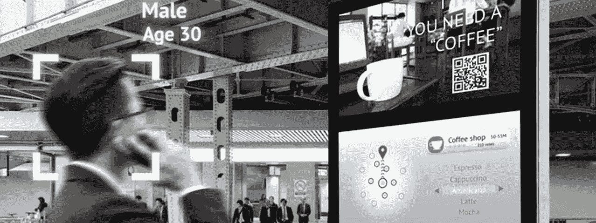
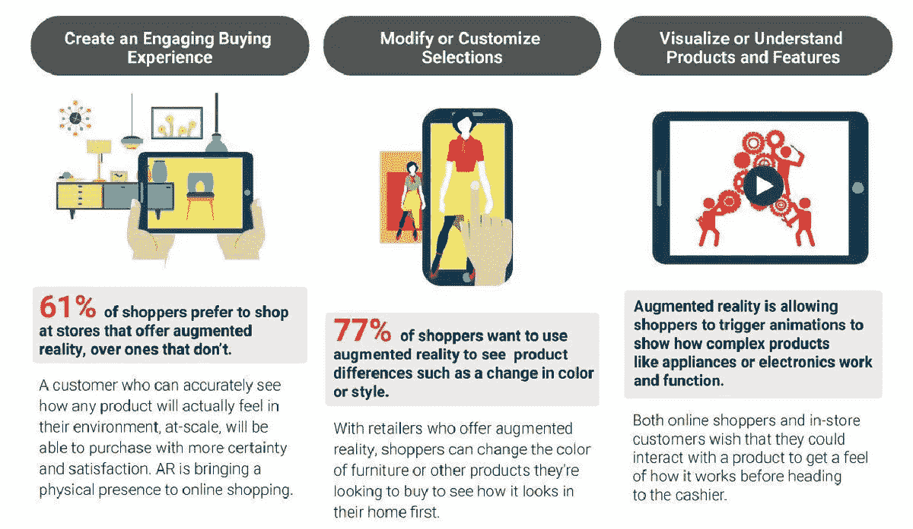
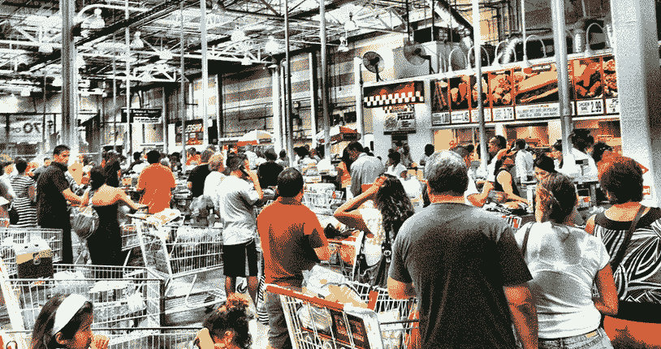

# 2019 年 AI 将如何改变零售业？

> 原文：<https://medium.datadriveninvestor.com/how-ai-will-change-the-retail-industry-in-2019-c817091c6306?source=collection_archive---------0----------------------->

> 人工智能是近几年来科技领域最热门、最有前景的发展。根据市场公司 Tractica 的数据，全球人工智能收入将从 2016 年的仅**6.437 亿美元大幅增长到 2025 年的超过 368 亿美元。**

几乎所有的细分市场、行业和商业领域都对人工智能感兴趣，并希望利用这项技术获得商业利益。人工智能为公司提供了降低成本的能力，并使最终消费者的购物体验更加愉快和高效。自然，零售部分如何远离有前途的技术？

**零售 AI 辛迪加**

根据[全球市场洞察](https://www.gminsights.com/industry-analysis/artificial-intelligence-ai-retail-market)，到 2024 年，零售部门对人工智能的投资将超过 80 亿美元。随着越来越多的机器学习、预测分析和深度学习技术的应用获得成功，零售领域的数字颠覆必将以更快的速度发生。

在全球范围内，人工智能专家认为，这项技术为零售领域提供了广泛的应用。在未来一年，零售业将在日常运营中看到更多基于人工智能的解决方案。人工智能肯定会改变零售业的客户服务周期，零售商和消费者都一定会从人工智能零售辛迪加中受益。

**人工智能影响**

人工智能可以为收集和拥有客户数据的零售公司带来福音。人工智能可以从大量数据中得出有意义的结论，并帮助公司通过高度结构化的网络商店、智能店内机器人和在线聊天机器人创造个性化的购物体验。让我们看看人工智能将如何在 2019 年改变购物者的零售体验。

*   **数码服装架&时尚产品**

在人工智能技术的帮助下，服装零售品牌可以通过手势墙和免触摸显示器创建虚拟货架和试衣间，以找到合适的风格，而不必在一堆衣服中洗牌。顾客可以立即看到一件衣服穿在他们身上的样子，并可以根据他们的喜好和风格商数浏览推荐。

所有这些不仅会增强购物体验，还会帮助顾客从数百万个选项中进行选择，这在目前是不可能的，因为实体店内的空间有限。有了人工智能，一家商店可以被转换成一个熙熙攘攘的设计和立体裁剪创意库，用户可以从中进行选择。此外，商店将能够更深入地了解消费者行为，优化其产品组合，以提供更好的零售体验。

*   **用于快速决策的虚拟审判室**

当购买一件新衣服或服装时，尝试不同的选择可能会非常令人沮丧和耗时。在装有数字镜子的虚拟试衣间的帮助下，顾客可以实际试穿礼服，而不必一次又一次地更换。

使用手势和基于触摸的界面，购物者可以混合搭配各种服装、配饰、鞋子等。很快就能完成完美的造型。不仅对服装品牌来说，虚拟镜子可以让化妆品公司和美容品牌更容易描绘出口红颜色或粉底在真实皮肤上的外观，而不会强迫顾客使用产品。

*   **机器人/数字辅助将成为现实**

使用人工智能、智能分析和自然语言处理技术，零售店可以让客户在店内获得即时支持。通过放置机器人和触摸面板，商店可以帮助顾客定位商品，获得问题的答案，并了解产品如何让他们的生活更轻松。

在人工智能支持的客户服务机器人的帮助下，商店可以降低人力成本，并为客户提供全天候的帮助。这不仅会提高客户服务水平，而且肯定会在 2019 年吸引更多买家到店。

*   **由人工智能支持的监控支持的行为分析**

使用由人工智能和计算机视觉技术支持的现代监控设备，零售商可以捕捉和研究商店内的顾客行为。这将帮助他们了解当前商店布局的参与度，并优化运营以提高参与度和收入。

视频分析还可以提高店内安全性，降低失窃几率。在人工智能的帮助下，可以实时监控监控录像，并向管理员和店主发送警报，以便立即采取行动。

*   **通过聊天机器人提供更好的客户支持**

人工智能聊天机器人使零售品牌能够高效地吸引客户。在聊天机器人的帮助下，品牌可以同时处理数以千计的查询，而不必雇用大量员工。

聊天机器人可以被配置为回答问题，提供购物建议并提供及时的支持。使用人工智能聊天机器人和人类的混合，品牌将能够有效地处理客户，并为用户提供更好的问题解决方案。当客户得到及时和个性化的关注时，他们会与品牌深入接触，为提高客户忠诚度铺平道路。

所有这些场景不仅仅是幻想，而是未来几年零售购物者将会经历的。人工智能将统治零售领域，并帮助品牌在零售运营中变得更加以客户为中心和高效。你的零售品牌准备好利用人工智能的真正潜力了吗？[咨询我们的专家](https://nurturingtechnolab.com/contact-us.html)，探索人工智能如何在 2019 年帮助您的品牌。

*最初发布:*[*https://www . tech 21 century . com/artificial-intelligence-in-retail-industry/*](https://www.tech21century.com/artificial-intelligence-in-retail-industry/)