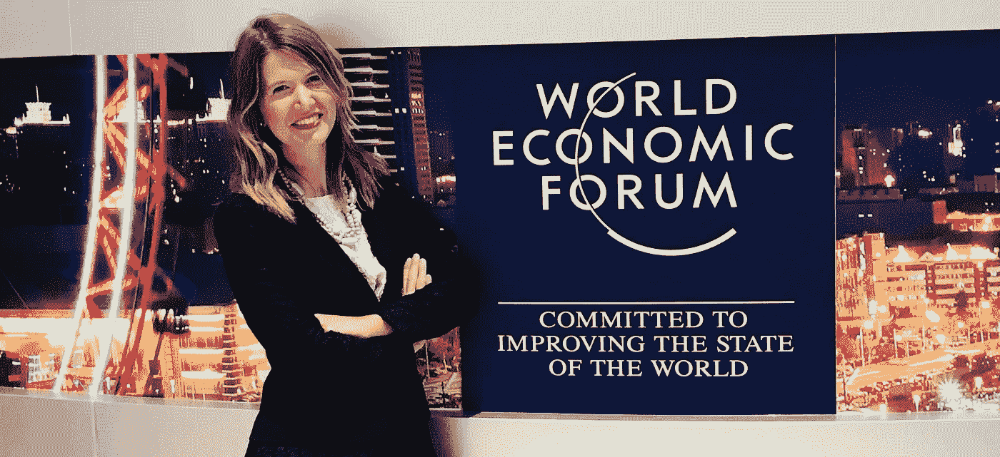

# 人工智能将如何改变你的生活:夏季达沃斯的三个教训

> 原文：<https://medium.datadriveninvestor.com/how-ai-will-change-your-life-3-lessons-from-summer-davos-15787ba6a474?source=collection_archive---------18----------------------->

我坐在连接北京和天津的高速列车上，时速超过 300 公里。我们刚刚在夏季达沃斯度过了令人鼓舞的一周，也就是新领军者年会 T1。在那里，我应世界经济论坛的邀请，自豪地代表全球塑造者社区和日内瓦中心。我们会见了 2000 多位最具创新精神的领导人、国家元首、科学家和首席执行官，谈论第四次工业革命和人工智能的未来。顶级会议让我们筋疲力尽，我们现在坐在这安静干净的未来主义列车上，有高速免费 Wi-Fi 和彩色液晶电视。

演讲者宣布旅程和规则:“确保你遵守规则，以免影响你的社会信用。”

等等。我困惑地看着我的造型伙伴，[杰玛](https://www.linkedin.com/in/gkmilne1/)和[吉奥](https://www.linkedin.com/in/giovanniporcellana/)，他们和我一起分享这次冒险。

是的——我理解正确。

[社会信用](https://theconversation.com/chinas-social-credit-system-puts-its-people-under-pressure-to-be-model-citizens-89963)。

你看过*黑镜*那集社会是基于等级制度的吗？我知道中国正在试点“社会信用体系”，但我不知道它已经在生活和工作！

在花了一周时间讨论人工智能的未来以及它将如何改变我们的生活之后，中国政府已经在实施大数据收集，以建立一个国家声誉系统。这让我想起了本周学到的一切，我将尝试列出我从夏季达沃斯学到的关于人工智能的三条主要经验。AI 将如何改变我们的生活？

# 1.人工智能正在增强我们对世界的理解

十年后，我们对世界的理解将会不同。随着大数据扩展到个人数据，免费数据的使用是一种前所未有的资源，从 2007 年开始呈指数增长。人们现在意识到传感器和设备正在实时收集大量个人信息，从我们的智能手机到汽车 GPS。退一步说，人工智能始于 1950 年，当时图灵发明了一项测试，以检查机器是否可以在人们没有意识到它们在与计算机对话的情况下与人类交流

那么，为什么现在对人工智能有很大的争议呢？在“[关于人工智能的全球对话](http://%20https//www.weforum.org/events/annual-meeting-of-the-new-champions/sessions/a-global-conversation-on-artificial-intelligence)”会议上，这个主题被剖析，其中强调的一个主要原因是计算机和存储变得越来越便宜，并正在走向实时。硬件增强使机器能够计算大数据并进行学习:这是深度学习的基础，无疑是人工智能从开发者实验室到实时应用大规模开发的背后原因。虽然我们仍处于真正应用的早期(86%的 AI 技术尚未成熟)，但我们知道 85%的 AI 技术将带来真正的变革。

# 2.人工智能正在改变权力结构

人工智能是带来平等和克服基础设施限制的独特机会。疫苗联盟 Gavi 的首席执行官 Seth Berkley 举了一个很好的例子:一家硅谷机器人公司与卢旺达政府合作，加快血液的输送。Zipline 也被称为“优步血液”，可以将偏远地区所需的血液运送到 T2，将运送时间从四个小时缩短到平均半个小时，大大减少了血液浪费。

我们如何才能使人工智能民主化，让许多人接触新技术？我们需要确保人工智能不会扩大高技能和低技能工人之间的差距，而是真正赋予更广泛的人群权力。这可以通过以下方式实现:

1.  开放数据访问:平衡数据保护和数据可用性非常重要。
2.  可访问和可信任的数据算法:透明度和可见性是建立对深度机器学习结果的信任的关键，深度机器学习通常被视为“黑盒”。
3.  降低能力设置的门槛:如果训练得当，普通公民仍然可以从人工智能中受益。

人工智能需要被积极地对待，否则它最终会带来灾难。谷歌前首席执行官埃里克·施密特最近预测，未来十年内，互联网将分为中国主导和美国主导两种版本。科技在新的治理中发挥着关键作用，科技公司变得比国家更大，新的防火墙和新的权力结构最终将重新定义地缘政治格局。AI 被国防部门高度使用已经不是什么新闻了；马云提醒我们，第一波技术是如何带来第一次世界大战的，第二波实际上导致了第二次世界大战。因此，我们真的需要非常谨慎地管理人工智能:杰克向我们保证，第三次世界大战将与贫困和地球的毁灭作斗争。但是，我们都有责任积极地推动这一进程。

# 3.人工智能世界中人类技能的重要性

这听起来可能有点违反直觉；当我和家人谈论人工智能时，每个人都开玩笑说终结者和机器将战胜人类，取代我们的工作并最终攻击我们的时刻。一方面，机器确实会在未来取代我们工作中的部分重复性工作；另一方面，不重复的和需要人类技能的任务是不可替代的。我与欧洲政治战略中心负责人[安·迈特勒](https://ec.europa.eu/epsc/team/ann-mettler_en)谈论了欧洲是如何减少对教育的关注而更多地关注技能的。那么，我们如何训练新一代学习新技能呢？

作为世界经济论坛(World Economic Forum)的全球塑造者(Global Shapers)社区的一员，我受邀参加了全球巨头阿里巴巴(Alibaba)创始人马云(Jack Ma)的独家会议。杰克最近宣布，他将在一年后离开阿里巴巴，重新专注于教学；他在教育的未来和终身学习的重要性方面给人以难以置信的鼓舞。所需的技能变化很快，最好的学习技能实际上是“学习的技能”。如果你想为将来的工作学点东西，你会失望的。你需要学习你喜欢的东西，并且不断地学习。很长一段时间以来，我们一直在谈论智商和情商——现在我们需要考虑 LQ，爱情商数！

30 分钟后我们已经到达北京，所有关于新领军者年会的记忆，所有我遇到的令人惊叹的人，都在我眼前闪现。

> 人工智能已经在改变我们的生活，我们会越来越认识到这一点。但有一个问题一直萦绕在我的脑海:“如果我有一个个人社会信用评分，我会像现在这样行事吗？”

# 愿意阅读更多关于新领军者年会的内容吗？

刚刚发生了什么？在天津赶上[非凡的一周。](https://weforum.us3.list-manage.com/track/click?u=79c86265202b9840297f805ad&id=3ef8528834&e=9036674f13)

全球化是不可阻挡的，我们必须修补它的缺陷。中国总理李克强[在天津](https://weforum.us3.list-manage.com/track/click?u=79c86265202b9840297f805ad&id=30d9e1e1bf&e=9036674f13)的演讲。

到 2025 年，机器可能会比人类做得更多。机器人时代[工人如何赢](https://weforum.us3.list-manage.com/track/click?u=79c86265202b9840297f805ad&id=e59327a17f&e=9036674f13)。

再见药物，你好电子药物。[十大新兴技术](https://weforum.us3.list-manage.com/track/click?u=79c86265202b9840297f805ad&id=0b1dccee5e&e=9036674f13)。

# AMNC18 #夏季达沃斯#世界经济论坛#全球塑造者#塑造世界#人工智能#中国#社会信用体系#企业家精神#动机#经验#创新

***关于作者:***[*Giulia Zanzi*](https://www.linkedin.com/in/giuliazanzi/)*热衷于将物联网和移动技术与科学相结合，改善人们的生活。作为* [*瑞士精密诊断*](http://www.clearblue.com/) *、宝洁合资公司&的营销生育主管，她领导推出了首个* [*联网排卵测试系统*](https://www.youtube.com/watch?v=7jDdbTc1bZs) *，该系统通过检测两种激素并与手机同步，帮助女性更快怀孕。Giulia 曾是欧洲青年议会***的成员，目前在* [*世界经济论坛全球塑造者*](https://www.globalshapers.org/) *的顾问委员会任职，她是*[*Lean In*](https://leanin.org/)*的合伙人冠军。朱利亚以优异的成绩毕业于米兰博科尼大学，并在上海复旦大学获得硕士学位。**