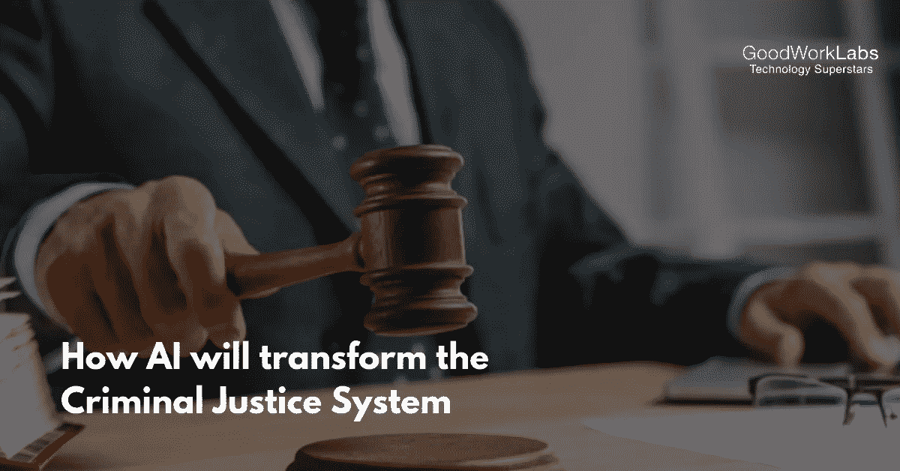

# 人工智能将如何改变刑事司法系统

> 原文：<https://medium.datadriveninvestor.com/how-ai-will-transform-the-criminal-justice-system-31b6f3e05b33?source=collection_archive---------7----------------------->

想象一个 AI 在司法生态系统中充当‘法官’的世界。到目前为止，[人工智能](https://www.goodworklabs.com/artificial-intelligence-solutions/) (AI)正被用于做出基本决定，例如为下一部电影、电视剧等提供建议。这和你的亚马逊 Prime 或网飞账户使用的技术是一样的。

但 AI 能在多大程度上影响人类生活？

人工智能可以被考虑到潜在的改变生活的场景中吗，比如对罪犯的罪行进行判决？

老实说，人工智能被用于刑事判决已经有好几年了，但让我们再次思考一下使用人工智能所涉及的风险和优势。

在做出从保释到刑事判决的任何司法决定时，要考虑的最重要的事情是[累犯](https://www.stand-together.org/what-is-recidivism-and-what-can-we-do-about-it/)(即再次违法的可能性)的危险。在 AI 做出这种决策之前，对复发和逃跑风险的判断依赖于各自法官的决策专业知识和直觉。

这种方法的问题是，每一个人的决定都容易受到偏见的影响，这就是为什么即使尽了最大努力，偏见也无法从系统中根除。

为了理解人工智能如何影响了整个司法过程，让我们理解没有人工智能的传统决策方法。

# 在 AI 之前

在欣赏人工智能在司法生态系统中的作用之前，让我们浏览一下当前的司法系统。

想象一下，你因持枪抢劫被捕，并被怀疑参与了抢劫，而你并没有参与其中，而且完全是无辜的。你被捕的原因是你与一名嫌疑犯相似，而且你居住在犯罪区域附近。另外，你的车与目击者的描述相符。

除了上面提到的，没有任何确凿的理由，你将在被登记后出现在法官面前。这位法官会在确定你的保释金数额之前对情况进行审查。将对你的逃跑风险甚至犯罪性质进行评估，这将取决于法官对接电话的看法。

上午的听证会通常会让法官们更加宽容。然而，你是在午餐前被介绍的。法官有点着急，给你定了一个你根本没机会负担的保释金数额。这会把你送上法庭，毫无疑问你会被送进监狱。这是无数案例中出现的最大讽刺。

你的罪行没有被证实，然而你发现自己无可救药地被限制在刑事司法机制中，几乎没有出路。这些影响已经开始在你的生活中显现出来。通常，从你被逮捕到定罪平均需要六个月的时间。你将不会有你的工作，安排保释的金额将会带来你的信用评级下降和许多这样的不利影响。

虽然你毫无疑问是无辜的，但你已经和惯犯关在一起了。不是什么好消息，对吧？

# AI 之后

现在让我们考虑同样的情况。如果人工智能被用于司法系统，它会在一开始就帮助你。让我们从另一个角度来证明这一点。你作为一名嫌疑人被逮捕，并在保释听证会上提供案件细节，包括以前的犯罪，指控和其他个人信息。

法官得到一份由人工智能软件生成的报告，并发现你的飞行风险很低。这将对你今后的案子大有好处。

第一个也是最重要的一个优势是消除了人为偏见。毫无疑问，将由法官宣布裁决，但现在有一个保证，这个人工智能生成的报告将作为一个基线，而不依赖于法官宣布裁决时的情绪状态。

不仅如此，人工智能报告还会提高效率。这是因为所有的细节都提前收到了，软件处理信息的速度永远比人脑快。人工智能将帮助法官审理更多的案件，人们也将不得不花更少的时间在监狱里等待他们的听证会。

然而，在使用人工智能时，有一些问题需要记住。

在相当长的一段时间内，随着人工智能准确性的提高，偏差将达到这样一个最小程度，在统计上表现为不相关。但是这个论点有一个很大的问题。偏见不是一件容易衡量的事情，[系统偏见](https://www.reference.com/science/systemic-bias-7b92c620981a2714)已经被考虑到目前正在使用的人工智能系统中。

另一个障碍可能是数据隐私政策。这些人工智能系统将由一些公司建造，为了确保人工智能模型得到足够的训练以做出正确的决定，算法需要访问犯罪数据。由于安全原因，测试和审查人工智能系统变得困难。

# 人工智能在司法系统中的未来

不可否认，这样的人工智能系统今天确实存在，并在人们的生活中发挥着重要作用。对专家数据科学家构建这种人工智能架构的需求越来越大。此外，需要更好地理解这些数据，以帮助决策者和公司做出更好的决策，并为人工智能模型提供支持。

未来是光明的，人工智能必将改变和增强政府对司法系统的看法。如果您正在寻找专业的人工智能架构师来帮助您为您的业务构建一个定制的解决方案，那么我们将很高兴赶上！

只需给我们留下[短信](https://www.goodworklabs.com/contact-us/)，一起用 AI 改造世界。

## 来自 DDI 的相关故事:

 [## 用 7 个步骤解释深度学习——数据驱动投资者

### 在深度学习的帮助下，自动驾驶汽车、Alexa、医学成像-小工具正在我们周围变得超级智能…

www.datadriveninvestor.com](https://www.datadriveninvestor.com/2019/01/23/deep-learning-explained-in-7-steps/)  [## 数据科学和软件工程哪个更有前途？-数据驱动型投资者

### 大约一个月前，当我坐在咖啡馆里为一个客户开发网站时，我发现了这个女人…

www.datadriveninvestor.com](https://www.datadriveninvestor.com/2019/01/23/which-is-more-promising-data-science-or-software-engineering/)