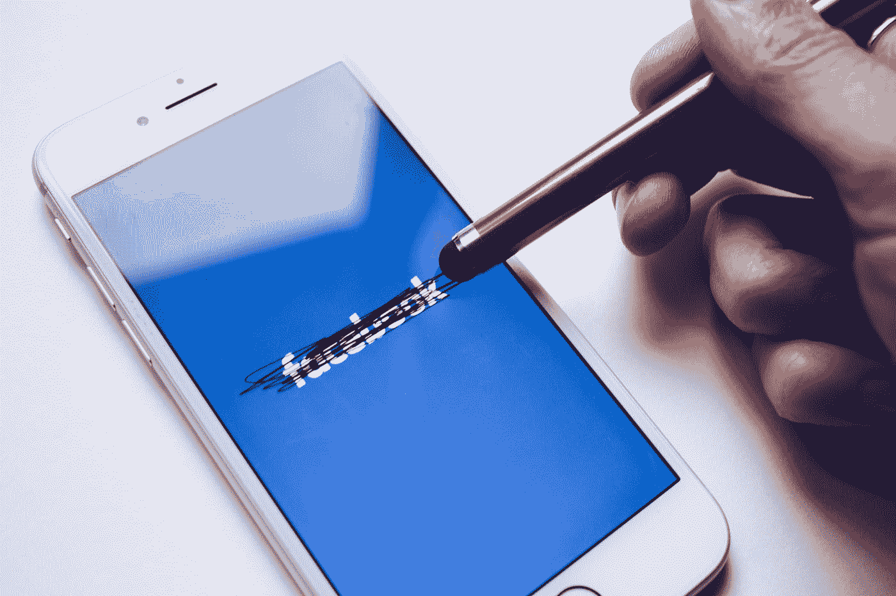
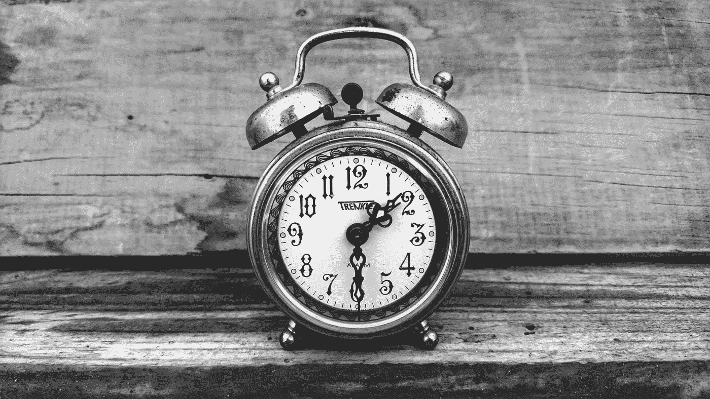

# 控制时间的 6 种方法。

> 原文：<https://medium.datadriveninvestor.com/how-an-alarm-can-help-in-digital-detox-c33b734eeb95?source=collection_archive---------17----------------------->

照片由[思想目录](https://unsplash.com/@thoughtcatalog?utm_source=medium&utm_medium=referral)在 [Unsplash](https://unsplash.com?utm_source=medium&utm_medium=referral) 上拍摄

我在媒体上写了我的[第一个故事](https://medium.com/datadriveninvestor/how-far-should-we-let-the-machines-touch-us-40acde5ba78)，以此来发泄我对智能手机&社交媒体及其对年轻一代的负面影响的不满，包括我的孩子。这个故事被添加到[数据驱动投资者](https://medium.com/datadriveninvestor)出版物中，媒体社区的反应出乎我的意料。我意识到有更多的人同样关心这个问题。我很高兴看到这个故事越来越受欢迎。在我发布故事后，我经常解锁我的手机，只是为了在 Medium 应用程序中查看故事的统计数据。这是我的第一个故事，我被视觉统计中的峰值迷住了。讽刺的是，这个故事是关于人类“感觉良好”的一面是如何被社交媒体滥用的。看着越来越多的点击量、阅读量和浏览量，我感觉很好。即使没有任何来自 Medium 应用程序的“推送”通知，我也开始依赖它来满足自己。

一年前，在不了解事物是如何连接的情况下，脸书、Twitter 和 Instagram 等应用程序的每一条通知都会提高我的多巴胺水平。我沉迷于智能手机，可以轻松地花几个小时从一个提要浏览到另一个。我费了很大的劲才走出恶性循环。今天，我感觉自己又滑回了“感觉良好”的陷阱。我知道我的问题的解决方法，并且毫不拖延地卸载了这个应用程序。app 没什么问题，只是暂时找不到针对我问题的更好的药。

# 实现的时刻

Photo by [Alessandro Erbetta](https://unsplash.com/@alessandroerbetta?utm_source=medium&utm_medium=referral) on [Unsplash](https://unsplash.com?utm_source=medium&utm_medium=referral)

> 定期停下来反思你的生活。按下暂停键来练习感恩，让它成为你生活中不变的一部分。
> 
> —高尔·戈帕尔·达斯的《生命的惊人秘密》。

在每个人的生活中都会有这样一个时刻，当你停下来，深呼吸，问自己“我的生活到底是怎么回事？”。对我来说，那一刻是我们的女儿开始模仿我们的时候。她开始重复我们说过的话，开始按照我们的方式做事，最后她开始要我们的手机。即使她没有从我这里学到任何好习惯，我最不想看到的就是她模仿我的坏习惯。没有捷径可走，唯一的办法就是改变自己，变得更好。

我反思了自己的日常工作，列出了一些需要“开始做”和“停止做”的事情。清单上的第一条是减少我的电话使用，至少当我的家人和朋友在的时候。我的第一印象是，这应该是相当容易的任务。但是不，我错了。这些智能设备和社交应用已经深深扎根于我们的生活中，完全的数字化戒毒几乎是不可能的。今天，我确实使用智能手机和社交媒体，但与去年不同的是，这是受管制的。根据我的个人经验，列出一些我开始做和停止做的事情，来摆脱上瘾。

## #1.买个报警器。

Photo by [mohssine chnaf](https://unsplash.com/@mohssinechnaf?utm_source=medium&utm_medium=referral) on [Unsplash](https://unsplash.com?utm_source=medium&utm_medium=referral)

把手机放在床边最常见的借口之一可能是手机是你的闹钟。如果这是你的借口，那么我会建议你买一个普通的闹钟。让我说清楚，在你的手机里设置叫醒闹铃没有坏处。这就成了一个问题，当你还在床上的时候，你开始浏览所有的通知，并一直挂在电话上，而不是打盹并把它放回去。

*   一个普通的闹钟花费你 10 美元，将会间接节省成千上万的健康费用。
*   我不打算重申智能手机辐射对人类的影响。你知道的！！
*   总有一个意外或不必要的通知可能会破坏你的睡眠。
*   如果你仍然不能让你的手机远离，那么启用“请勿打扰”模式，以避免在睡眠时间意外通知。

## #2.你还有爱好吗？

你曾经有过业余爱好吗？还是你没有时间来提高你的技能？说到底，这不是时间不够的问题，而是事情的轻重缓急。我有一些，但在疯狂使用智能手机和社交媒体期间丢失了。最近又恢复看书，拍照，学习新技能。出门的时候，我要么带着笔记本和笔，要么带着书看，要么带着相机。

*   根据统计，年轻一代使用社交媒体是抑郁症的主要来源。专注于你的爱好或技能发展，并想办法提高它。
*   如果你采取有计划的方法，你的技能可以引导你找到另一种收入来源。

 [## 在 Medium 的新合作伙伴计划中，我学到了如何赚钱

### 哦，从你的写作中获得被动收入的感觉真好

theascent.pub](https://theascent.pub/what-i-learned-about-making-money-in-mediums-new-partner-program-9a0b5f203059) 

*   如果你最后除了手机什么都没有，那就听听播客吧。有很棒的播客频道。我个人最喜欢的 app 是 [CastBox](https://castbox.fm/) 。

## #3.用餐时，远离手机

如果有一个地方，我会建议你不要把手机带到餐桌上。让“人”的对话流动起来。。

*   餐桌应被视为移动自由区。
*   让人类彼此交谈，而不是通过机器。

## #4.拔掉数据插头

没有数据的手机不再“智能”。睡觉时、工作时或与家人和朋友在一起时，请关闭移动数据。不要担心，你仍然会收到电话和短信，所以你不会与世隔绝。

*   更少的干扰，意味着更专注于手头的任务。
*   保存移动数据。
*   随时随地打开数据。但是记得在不需要的时候关掉它。

## #5.卸载社交应用。

这一次是逃不掉的。如果你想掌控一切，那么社交媒体应用必须离开你的手机。你不应该让这些社交应用决定什么时候让你分心，什么时候不让你分心。应该由你来控制社交媒体应用。几个删除应用的建议——脸书、推特、Instagram、新闻应用。由你来决定哪一个从你的一天中挤出时间。

*   每天或每周专门留出一段时间用于社交媒体。
*   使用笔记本电脑访问社交媒体，而不是智能手机。
*   掌握社交媒体的使用时间。规范和限制自己花在社交应用上的时间。
*   简而言之，你应该只在你想的时候访问社交媒体，而不是相反。

## #6.不要在电话上配置办公室电子邮件。

嗯（表示踌躇等）..这很棘手。我知道是时候从我的手机上删除我的办公室邮件了。但我手机里还有。对于那些可以从你的手机上删除办公室邮件的人，我强烈建议这样做。根据您的角色和职责，这可能是也可能不是。

有一次一个朋友告诉我，他已经把办公室的邮箱账号从手机里删掉了。我说“什么？?"。面对客户，他几乎不可能离开电子邮件。我问他，那么你如何处理客户和升级。他的回答很简单——“如果有人真的很担心，迫不及待地想引起我的立即关注，他们会给我发短信或打电话”。这提醒了我，毕竟，电话的主要用途是打电话和发短信。

# “现代”挑战

Photo by [rawpixel](https://unsplash.com/@rawpixel?utm_source=medium&utm_medium=referral) on [Unsplash](https://unsplash.com?utm_source=medium&utm_medium=referral)

在这个人工智能时代，很难保持人性。除非我们坚持我们的价值观，否则我们的孩子将很难在这个不断变化的数字世界中保持人性。让我们直接或间接地告诉我们的孩子，电话没有人际关系重要。

根据你对手机上瘾或依赖的程度，按照我的建议去做可能会有挑战。像任何上瘾一样，康复是一个乏味的过程。智能手机上瘾的情况也是如此，但许多人没有意识到他们已经上瘾了。选择任何一个建议，开始一次实施一个。

如果你有机会尝试这些建议，我很乐意听听你的反馈。如果你有更好的建议或不同意见，请随时发表评论。请务必阅读我以前的故事。

 [## 我们应该让机器“接触”我们多远？

### 上周末，我和我的家人一起参加了一个生日聚会。经过所有的乐趣，食物和饮料，三…

medium.com](https://medium.com/datadriveninvestor/how-far-should-we-let-the-machines-touch-us-40acde5ba78)