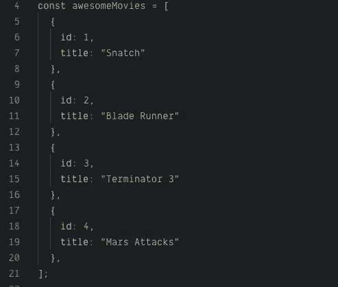
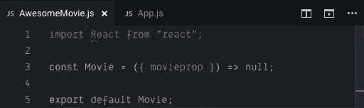
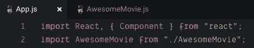
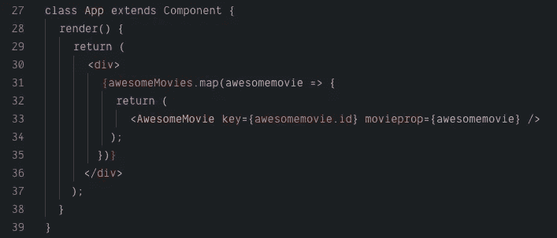
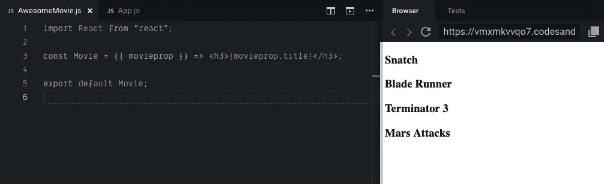
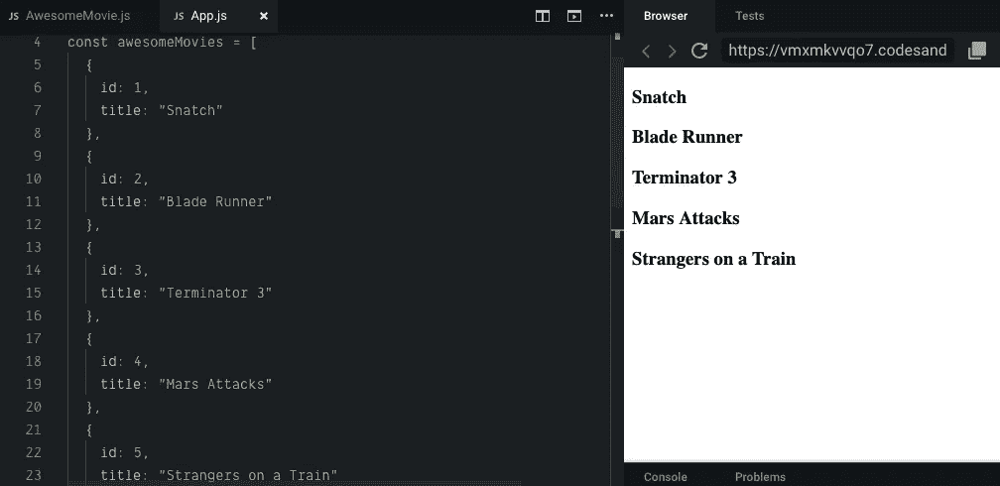

# 如何(以及何时)在 React 中使用 Array.map

> 原文：<https://medium.datadriveninvestor.com/how-and-when-to-use-array-map-in-react-802df01be99d?source=collection_archive---------1----------------------->

[](http://www.track.datadriveninvestor.com/1B9E)

**何时使用:**简而言之，只要您有一系列想要出现在 DOM 中的精彩内容:



**如何使用:**要使用`Array.map`，简单来说:

1.  创建一个新文件来存放一个组件，该组件将返回数组的每次迭代(即每段数据)。在我的例子中，我将从名为`awesomeMovies`的变量中获取电影标题，并在名为`<AwesomeMovie />`的组件中显示每个标题。

2.假设数据只包含文本，使用一个功能性的无状态组件来显示它。虽然这听起来很吓人，但实际上就像打字一样简单

`const FunctionName = ({ propName}) => null`。

返回`null`确保没有任何东西被破坏，避免了查看“`Invariant Violation`”错误消息的需要。你选择合适的名字并把它传入。为了清楚起见，我称我的为`movieprop`。记得导出函数。



3.回到 App.js，导入新组件



5.现在，在 App 组件的底部声明`Array.map`。

注意:使用你刚刚选择的属性名和你为每次迭代选择的名字。API 的每一次迭代都应该有一个键，这是 API 中的唯一标识符，通常称为“id”。

```
{**variableName**.map(**whatyoucalleachiteration** => {return <**Component** key={**whatyoucalleachiteration**.id} **propname** ={**whatyoucalleachiteration**} />})}
```



6.回到组件文件，告诉组件您想要使用 props 返回哪些属性。这里，我告诉组件返回标题(API 还包含许多我目前没有使用的其他数据)。

值将出现在视口中🎉

```
<h3>{**propname**.**desiredproperty**}</h3>
```



7.现在，当添加到数组中时，新值将自动显示在视口中🎉🎉



最后，是可以玩的沙盒:

 [## Array.map - CodeSandbox

### CodeSandbox 是一个为 web 应用程序量身定制的在线编辑器。

codesandbox.io](https://codesandbox.io/embed/vmxmkvvqo7?fontsize=14)