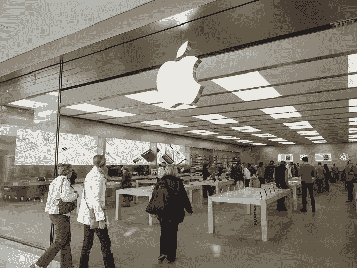
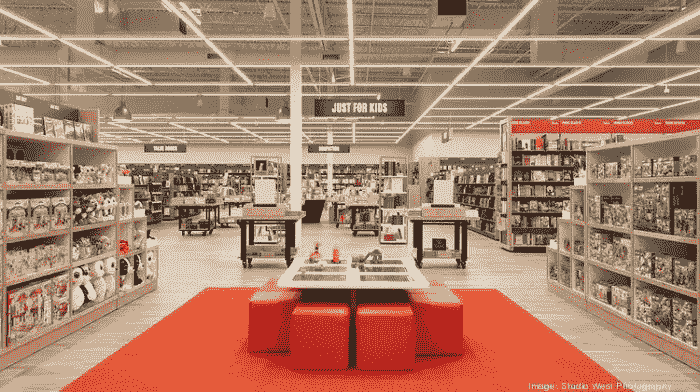

# 苹果技术是如何从维修心态走向零售氛围的

> 原文：<https://medium.datadriveninvestor.com/how-apple-technology-is-going-from-a-repair-mindset-to-a-retail-atmosphere-6078a72f8e54?source=collection_archive---------22----------------------->

这里的线索是 iPhone(其销量一直在下降)。

我们敢打赌，你们很多人已经注意到了苹果的一件事:*他们是真正的科技巨头，拥有自己的* ***零售店*** *。*

想想就知道这是惊人的成就。尽管技术令人惊叹，但我们已经享受了几代人的创新却从未见过它自己的实体建筑。很大程度上，当我们走进一家商店时，技术通常被归入它自己的“部门”甚至*百思买*也包含各种各样的技术相关产品，但或多或少*零售产品*是突出的，而不是它们背后的技术。

 [## 挑战你对人工智能和社会的看法的 4 本书——数据驱动的投资者

### 深度学习、像人类一样思考的机器人、人工智能、神经网络——这些技术引发了…

go.datadriveninvestor.com](http://go.datadriveninvestor.com/4AI1) 

# 然而，苹果是不同的——他们是一家科技公司，有自己定义的独立零售店

并且*没有其他人*这样做过。当然，亚马逊也有自己的实体店，但主要围绕书籍。谷歌没有这个。连微软都没有。你不可能走进一家“微软商店”去购买你自己的台式电脑。你走进一家*百思买*，里面有一大堆电脑*，包括*苹果产品。

因此，苹果将利用他们产品的独特性是一件大事，特别是自从 iPhone 继续下滑以来。因为他们在零售领域有业务，所以他们一直在将这个领域从你购买新 iPhone 和进行维修的地方转变为一个中心，在这里你可以“闲逛”，甚至“上课”，谈论和学习苹果将提供的最新技术。有点像巴恩斯·诺布尔现在的样子。

# 这是苹果将采取的一个方向，因为…

苹果零售主管安吉拉·阿伦茨在完成了五年的工作，按照苹果希望的方式改造零售业务后，将很快离职，现在该公司将要求人力资源主管迪尔德丽·奥布莱恩继续运营零售业务— *这是该公司迄今为止最大的转变*。这可能意味着很多事情——苹果员工可能不仅销售和维修产品，还会向客户展示和宣传订阅产品和服务，比如电视会播放一些[苹果的原创流媒体节目](https://vigyaa.com/@pierre/will-apple-be-the-new-netflix-707de562/)。一家*真正的零售店*。

有意思。的确非常有趣。

你认为这是苹果的盈利目标吗？还是他们只是在猎取假鱼？注册一个免费的 VIGYAA 账户，开始写下你的观点吧！

*原载于*[*vigyaa.com*](https://vigyaa.com/@pierre/how-apple-technology-is-going-from-a-repair-mindset-to-a-retail-a-707de562/)*。*